# Open Image Sensor

**Resume here:** [Project handoff — 2026-09-19 22:39 PDT](PICK_UP_HERE.md). Stock final-chip DC passes; complete-frame simulation and fabrication qualification remain open.

**Simulator comparison:** matched ngspice 46/47 controls pass, but both extracted stock-model tests fail at startup. Upgrade alone is insufficient; a separate v47 multiplier parser failure has a minimal public issue draft. [Results](docs/ngspice-version-comparison.md).

**Electrical qualification update:** Final-chip lumped capacitance and charge-preserving fill reduction are checked. Stricter pad-corner simulations still fail at the clamp load transition; complete-chip electrical qualification is **not yet passed**. [Results and next steps](docs/scaled-electrical-progress.md).

## Electrical qualification update — 2026-09-19 09:34 PDT

[New control-resolution and extracted-clamp results](docs/scaled-electrical-progress.md): matched capacitor controls pass the unchanged current limit; the isolated extracted clamp completes and passes 25 ns/tolerance voltage refinement. Both complete-corner capacitance placements now complete at 50 ns. These are diagnostic milestones, **not complete-chip qualification**. Final-GDS extraction and the [remaining electrical gates](docs/full-chip-electrical-plan.md) are open.

## Removable sensor tester — KiCad prototype

[KiCad projects and Windows instructions](hardware/carrier/README.md) · [Illustrated overview](docs/carrier-fixture.html) · [Download review ZIP](hardware/carrier/openimagesensor-kicad-review.zip)

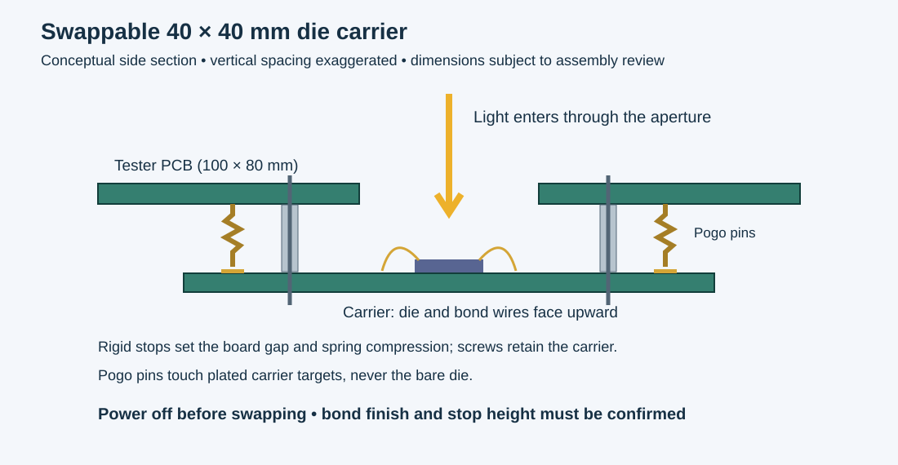

40 × 40 mm removable carrier, underside pogo contacts and an ADS1115 tester. Both PCBs pass the current native DRC and pin/net comparison. Electrical, mechanical and wire-bond reviews remain open; this is not a fabrication release.

**Path to a working camera — 19 September 2026:** [Finish the 3×3, characterize the photodiodes, then scale to 64×64](docs/path-to-camera.md). Carrier/interface and manufacturing planning can proceed alongside the clamp-model review.

## Current completion checkpoint — 19 September 2026

**First release: 3×3.** The core has earlier passing checks; the assembled chip is not fabrication-ready. A new evidence-backed numerical candidate passes isolated-clamp voltage refinement and completes both corner-placement transients; the final-chip electrical tests remain open. The working pad arrangement now has verified routing and central fill; density, antenna, main DRC and device LVS pass. Electrical and manufacturing qualification remain open.

**Electrical blocker explained:** [local clamp-model review](docs/clamp-model-review.md). The original failure and subsequent control-resolution findings are documented; the candidate is not yet an accepted full-chip fix. No external expert has yet reviewed the packet.

[Completion plan](COMPLETION_PLAN.md) · [Pins and board interface](docs/demonstrator-interface.md) · [Unsent expert-review package](docs/reviews/clamp-startup-review.md) · [Manufacturing questions](docs/manufacturing-review.md)

Historical diagnostic checkpoints below retain their original scope and limitations.

**MOS-capacitor diagnosis (2026-09-19 01:49 PDT):** 24/24 simple capacitor transients complete; 0/4 initial isolated-clamp transients complete. Integration follow-up: 1/2 complete; refinement: 0/2 pass. [Report and plots](docs/moscap-branch.md).

**Latest simulation check (2026-09-19 01:32 PDT):** DC/AC interface comparison: NOT VERIFIED. Full-corner ramp/load transients: NOT VERIFIED. [Details](docs/corner-interface.md).

An open monochrome image-sensor experiment using GF180MCU, Xschem,
ngspice, gdsfactory, Magic, KLayout, and Netgen.

**Project checkpoint: 18 September 2026** · [Changelog](CHANGELOG.md) · [Dated next steps and handoff](NEXT_STEPS.md) · [Engineering notebook](docs/overview.html)

## First release: a 3×3 monochrome demonstrator

The active target is **nine pixels with external timing and an external ADC**. The core layout and earlier electrical checks exist; functional signal-pad routing is implemented in a working candidate; full-chip verification and optical packaging remain open.

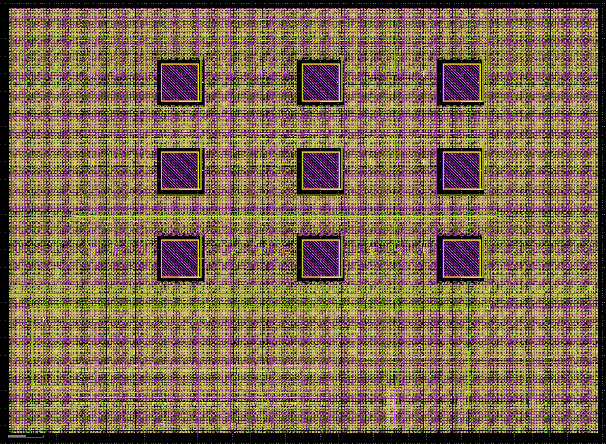

**Current plan:** [completion milestones and stop rule](COMPLETION_PLAN.md) · [logical pins and board interface](docs/demonstrator-interface.md) · [manufacturing questions](docs/manufacturing-review.md) · [simulator review package](docs/reviews/clamp-startup-review.md).

Signal path: light → pixel → column bias/multiplexer → shared buffer → signal pad → board ADC → controller. The earlier power-only vehicle is superseded by the separate routed working-layout checkpoint below.

### Filled layout: density and antenna checked

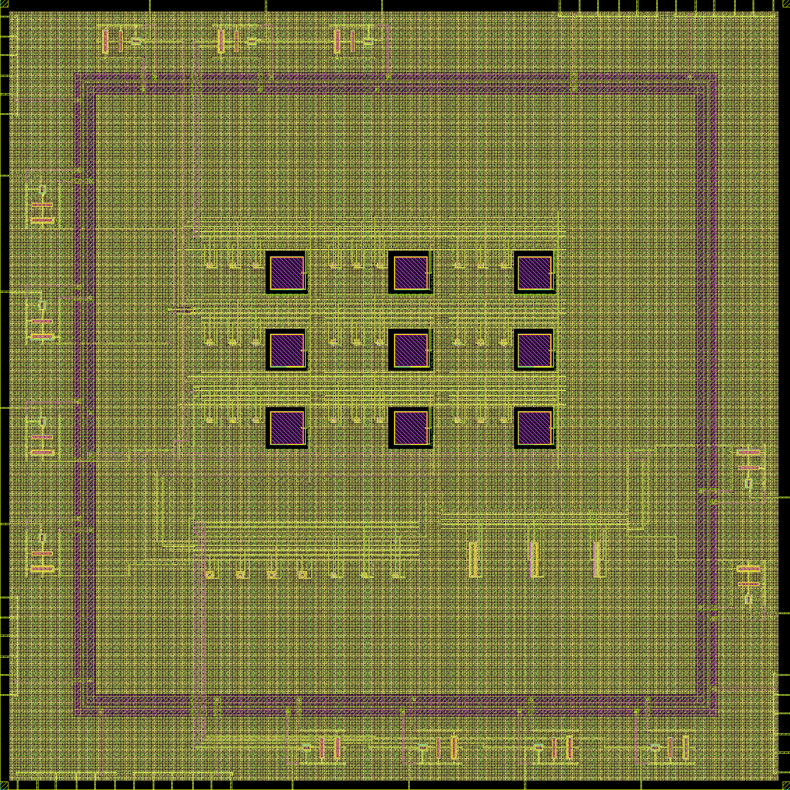

Regenerated central fill with all nine optical keepouts preserved. Density/antenna and main KLayout DRC report zero violations; device LVS matches uniquely; all 4,566 connectivity checks pass. [Verification report](docs/filled-demonstrator.md) · [HTML overview](docs/overview.html#filled-demonstrator). Full-chip electrical qualification and run-specific manufacturing checks remain open.

### Routed working layout

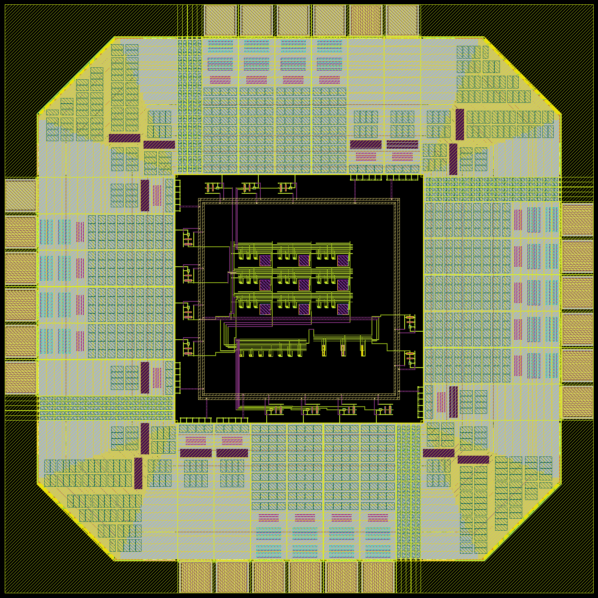

13 functional signal paths routed through local protection; seven supply/return pads connected. Metal connectivity: 4566 checks, PASS. Main KLayout DRC: 0 markers. Magic DRC: 0. Device LVS unique match: True. The four diagnostic signal paths remain disconnected. Final fill, manufacturing and electrical sign-off remain open. [Verification report](docs/routed-demonstrator.md).

### Provisional pad-placement review

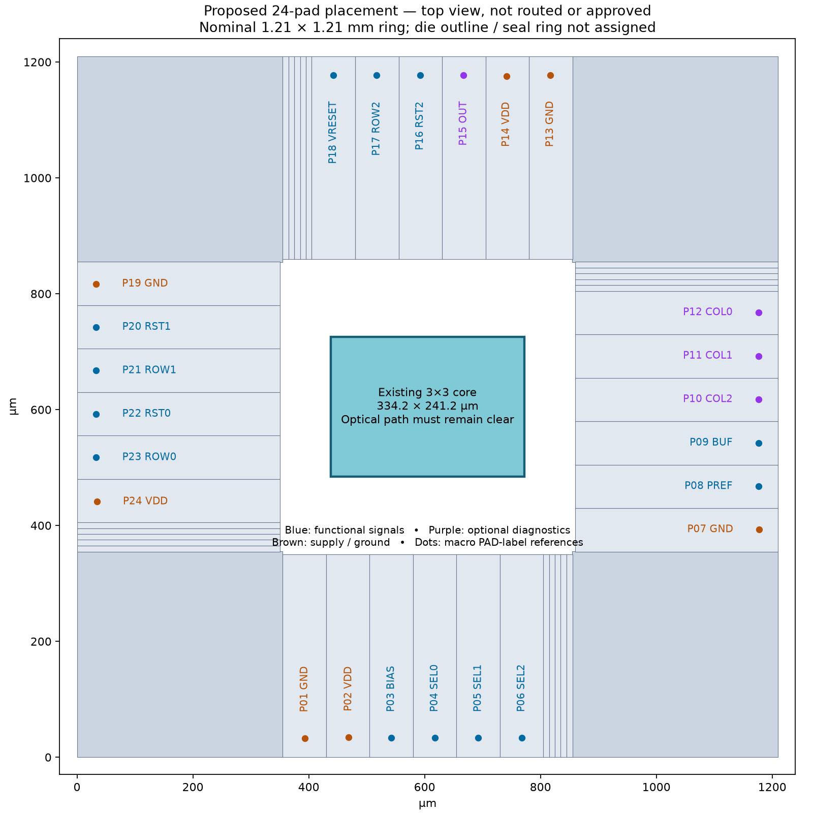

Original placement-only concept, now approved for local implementation: 19 core nets, 24 pads. See the newer routed checkpoint above. Die outline and optical packaging remain open. [Pad table and review gates](docs/pad-proposal.md) · [Coordinate CSV](docs/proposed-pad-map.csv).

### Later expansion: 64×64 camera concept

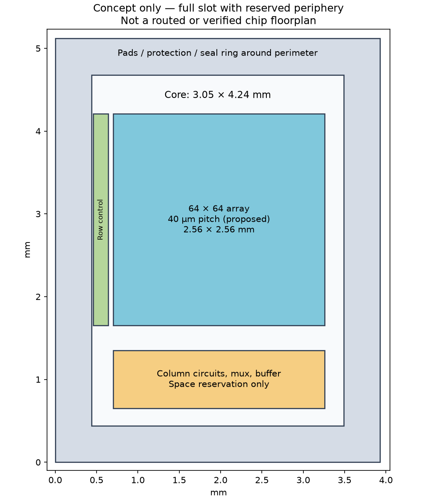

This is a future concept, not part of the first release or a routed and verified chip. Earlier area estimates do not establish manufacturing or packaging acceptance.

## 3×3 verification: reduced RC and placement sensitivity

Four resistor reductions pass numerical and DC checks. Full corner: 571,551 → 87,748 resistors; metal-only corner: 451,892 → 12. Placement sensitivity is now measured in coupon fixtures, with numerical and startup limits retained. [Results](docs/charge-reduction.md).

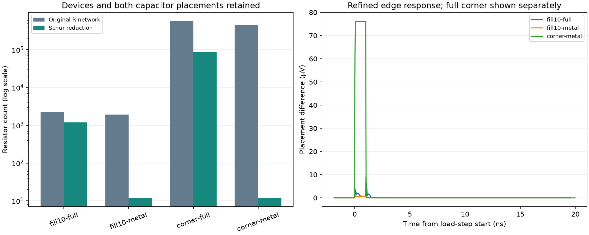

## 3×3 release: charge-conserving RC reference

The first finished chip will be the **3×3 demonstrator**. Eight reference models preserve the original capacitance matrix; 16 independent charge checks pass. Capacitance placement and integrated transient qualification remain open. [Evidence](docs/charge-reference.md) · [Completion plan](COMPLETION_PLAN.md).

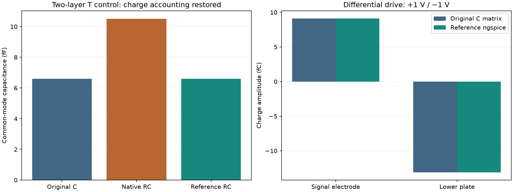

## Capacitance correction and path to completion

The area-sign patch removes negative capacitances in all four ring coupons; LVS and DC checks pass. A separate charge-accounting error remains, confirmed with small ngspice controls. [Evidence](docs/capacitance-candidate.md) · [Completion plan](COMPLETION_PLAN.md).

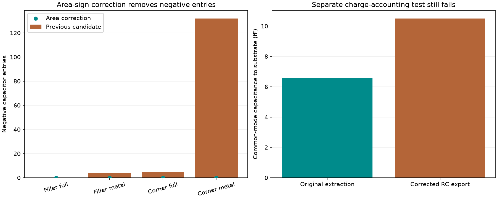

## Ring-section capacitance gate

Four device LVS checks and 32 DC rail solves pass with matched ring coupons. The combined extraction candidate still produces negative-energy capacitance nodes in the corner; transient acceptance remains blocked. [Audit and next work](docs/ring-candidate.md).

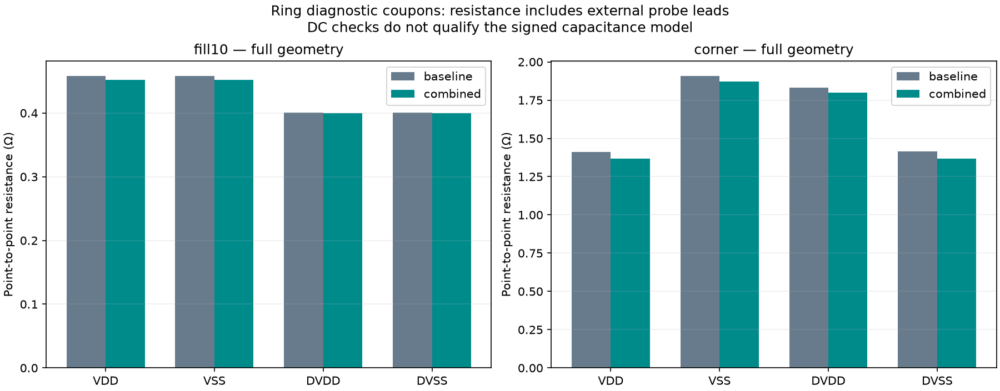

## Combined extraction regression

Four LVS comparisons and 80 block transients pass across five process corners and −40 to 125 °C. Largest sampled baseline/candidate difference: 0.02227 µV. Diagnostic candidate only; full-ring extraction remains open. [Report](docs/combined-patch.md).

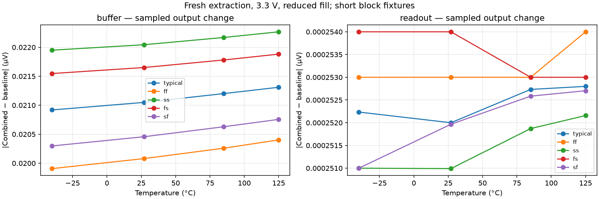

## Two-layer cause confirmed; device-aware patch tests

The two-layer discrepancy comes from **construction-time triangle reductions** in the tested Magic version. Removing six half-milliohm additions restores the unreduced network result: **0.093837 Ω** for the 300-via control, versus **0.118443 Ω** originally.

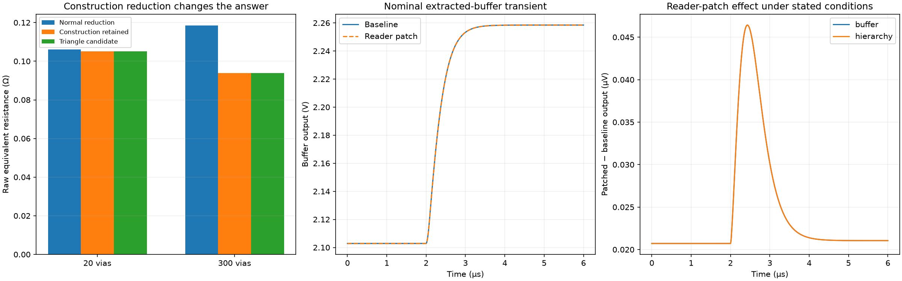

The separate reader patch preserves devices, capacitances and hierarchy. Four nominal buffer/hierarchy transients pass using the existing verified floating-fill reduction; direct raw-network attempts timed out. The patches remain diagnostic, with combined qualification still ahead.

[Results, source references and reproduction](docs/network-investigation.md) · [Notebook](docs/overview.html#network-investigation)

## Earlier export offset and two-layer via investigation

A controlled one-line reader patch removes the **0.0005 Ω per-resistor export increment** in all five test stacks. An unmodified build with the same configuration reproduces the installed behavior, and independent ngspice checks pass. The full-stack diagnostic export now matches raw resistance: **0.0891035 Ω** instead of **0.0990837 Ω**.

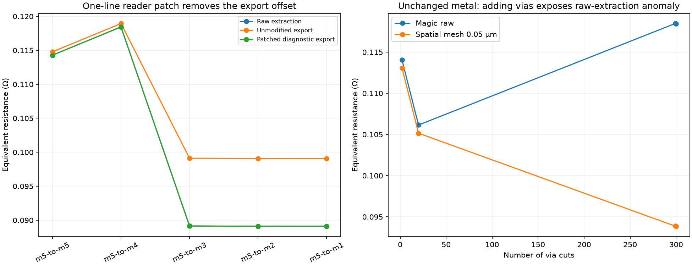

The two-layer problem remains in **raw extraction**: adding vias to unchanged metal raises Magic resistance while the spatial model decreases. The patch remains diagnostic; full RC qualification is open.

[Evidence, source reference and reproduction](docs/extraction-diagnostics.md) · [Notebook](docs/overview.html#extraction-diagnostics)

## Earlier full-width rail faces: separating rail and probe resistance

Measuring the M5 rail through its full-width ends gives **0.1142857 Ω**, matching the analytic value `0.04 × 20 / 7` and raw Magic extraction. This removes the large narrow-probe discrepancy in the M5 control. With three or more layers, raw Magic and the spatial model agree within **0.013%**. SPICE export adds about **11.2%** to this low-resistance network; that conversion and the exceptional two-layer Magic result remain under investigation.

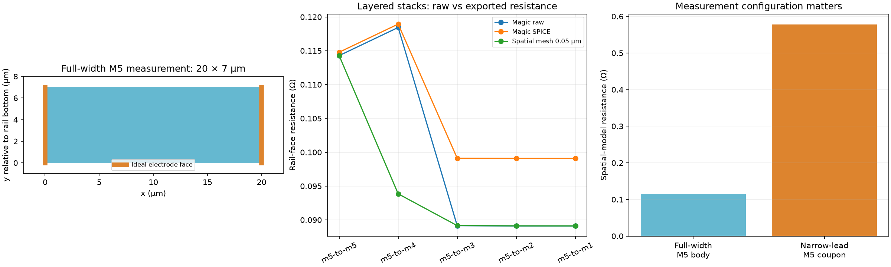

[Results and reproduction](docs/rail-faces.md) · [Living notebook](docs/overview.html#rail-faces)

## Earlier real rail isolation: probe-transition resistance

The disagreement already exists in the actual **M5 rail before vias are added**. Its narrow measurement leads widen into the rail: the spatial mesh settles near **0.5777 Ω**, while Magic gives **0.5143 Ω**, matching a simple series-strip approximation. Adding lower layers reduces the mesh resistance; one Magic stage instead increases, so absolute extraction accuracy remains open.

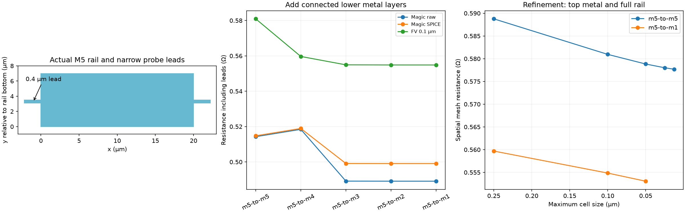

All five Magic exports pass independent ngspice checks. [Results, corrected extraction syntax and next experiment](docs/rail-isolation.md) · [Notebook](docs/overview.html#rail-isolation)

## Earlier matched terminals, bends and vias

Matching terminal positions closes the straight-strip resistance difference: **0.192 Ω** in the analytic, mesh and raw Magic models. Small bend/via controls now quantify the remaining differences. The real filler still differs by approximately **12–18%** under the matched-plane hypothesis, so full RC qualification remains open.

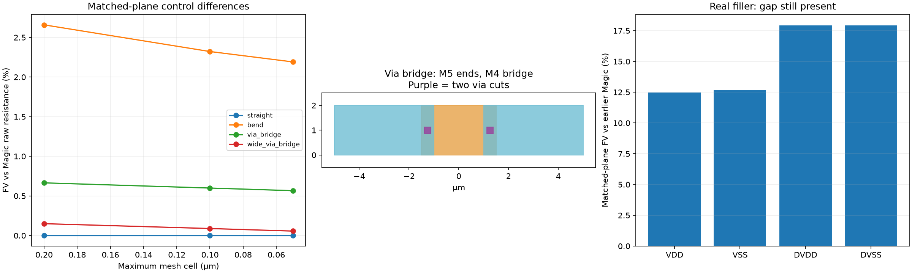

[Results and reproducible experiments](docs/geometry-controls.md) · [Living notebook](docs/overview.html#geometry-controls)

## Earlier terminal calibration update

Corrected ideal-electrode treatment now passes four analytic M5 strip controls at two mesh sizes. The corrected two-filler model passes DC stitching, including an independent ngspice check at 1 µm. **Absolute resistance remains unresolved:** the fine mesh is still about 10–15% above the earlier Magic control.

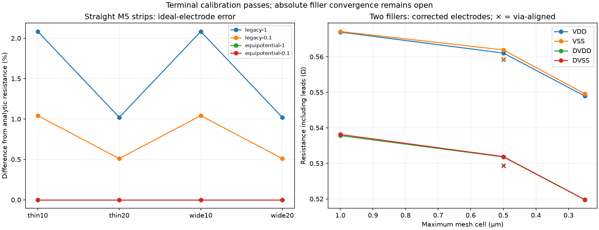

[Results, extraction selection pitfalls and reproduction](docs/terminal-calibration.md) · [Updated notebook](docs/overview.html#terminal-calibration)

## Earlier distributed boundary stitching benchmark

A conductor-only DC benchmark now preserves all **81 metal intervals** between two fillers. The stitched and combined models agree below the **1e-8 relative screen** across four meshes; the exported two-part SPICE model passes an independent ngspice check at the 1 µm mesh.

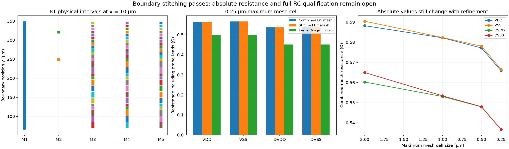

**This is not yet a stitched Magic RC model.** Absolute resistance remains mesh-sensitive and differs from the earlier Magic extraction. The finer simulator attempt timed out; matrix checks are recorded separately. [Method and remaining work](docs/filler-stitch.md) · [HTML results](docs/overview.html#filler-stitch).

## Small ring-section extraction

Four small coupons now extract in under 29 seconds: one filler, two fillers, a corner, and a corner joined to a filler. Device LVS and the documented DC terminal/current-balance checks pass. The corner checks use our tied analog supply domain.

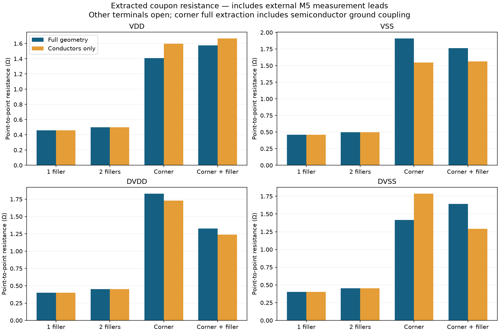

These measurements include external probe leads. Corner substrate coupling, negative capacitance entries, and consistent multiport boundaries still need resolution before full-ring camera simulation. [Experiment notes](docs/ring-sections.md) · [HTML comparison](docs/overview.html#ring-sections).

## Physical supply ring checkpoint

The unchanged 3×3 sensor now sits inside a **1.110 × 1.010 mm foundry-macro supply ring**, with routed power and ground. Ring device LVS matches uniquely; configured KLayout DRC reports zero violations on the ring and assembly, and 10,948 physical continuity probes pass.

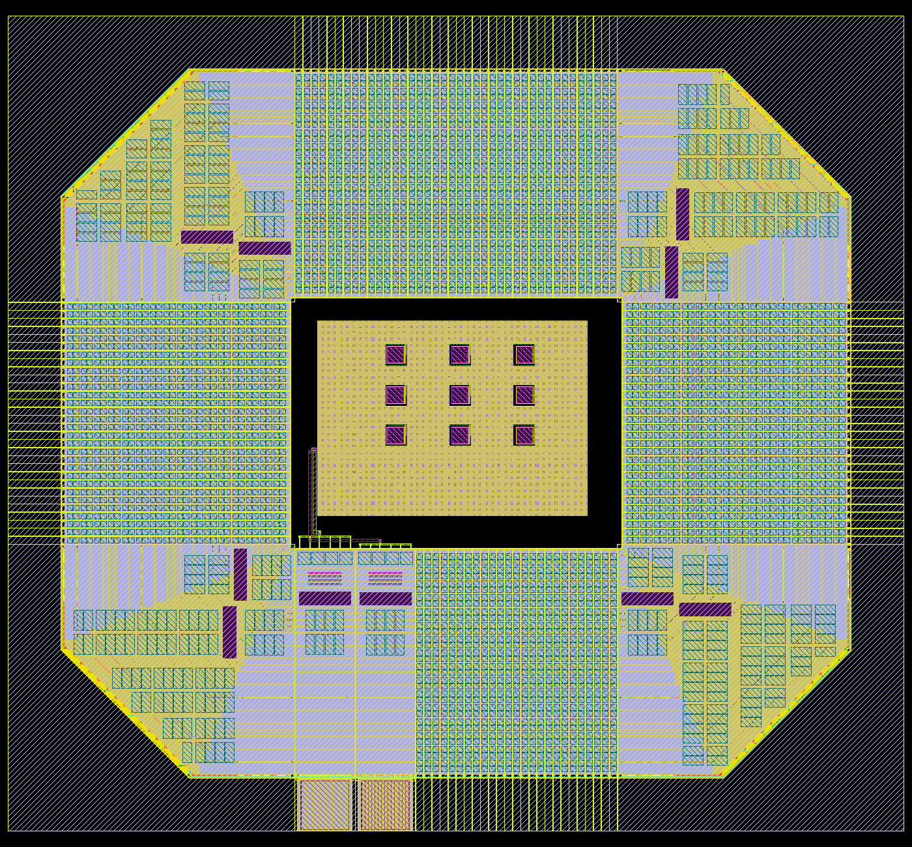

Extracted connecting-wire resistance is **5.147 Ω on VDD and 7.195 Ω on ground**. Nominal and hot load tests pass the 1% rail screen using foundry schematic ring models plus those wire parasitics. **Full-ring distributed RC extraction remains unfinished.** Signal pads, complete camera simulation with ring RC, and fabrication qualification remain to be done.

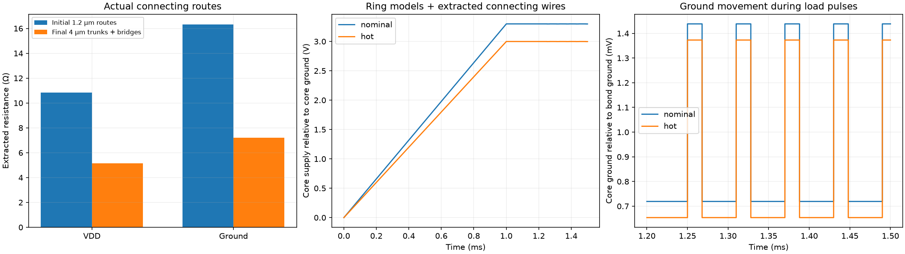

The plot uses ring schematic devices plus extracted connecting wires. It does not include full-ring metal RC. Ring DRC uses `all,-antenna,-density,-cup`; these results are development checks, not complete die signoff.

[Results and plots in the running notebook](docs/overview.html#power-ring) · [Reproduction and limitations](docs/power-ring.md)

## Board supply simulation

The extracted 3×3 camera and foundry supply clamps are now tested with an assumed board RLC supply and local decoupling. See the [running notebook](docs/overview.html#board-supply) for nominal/hot results, a weak-supply sensitivity case, and numerical checks. [Reproduction instructions](docs/board-supply.md) identify the model assumptions and remaining regulator/package/pad-ring work.

## Earlier checkpoint: pad checks and supply-clamp evaluation

The unchanged analog-pad interface has **zero main, density and antenna DRC
markers** using wafer.space's published rule selection. That selection excludes
CUP; the earlier unfiltered report retains its 87 CUP.3 findings. This is a
coupon-level check, not a full die submission precheck.

A foundry VDD/VSS clamp pair is now modeled on the 3.3 V analog supply. Across
324 DC cases, modeled pair leakage is **0.146 nA nominal, 76.19 nA maximum**.
Fast ramps activate the clamps strongly. A **1 ms soft-start plus 200 µs reset
hold** is the current candidate: all 18 finite-source follow-up cases settled,
including six 1 ms cases. High-voltage MOS models remain typical; this is not
complete ESD or transistor-corner qualification.

**The full three-frame camera-plus-clamp simulation is now verified** at
nominal and hot conditions. All 27 samples per run pass, with worst sampling
error **0.221 mV**. The direct connection uses a 1 pA absolute-current
tolerance and a 1200 s watchdog; independent strict-tolerance and finer-step
checks corroborate the results. See the [convergence report](docs/overview.html#clamp-convergence)
and [reproduction instructions](docs/clamp-convergence.md).

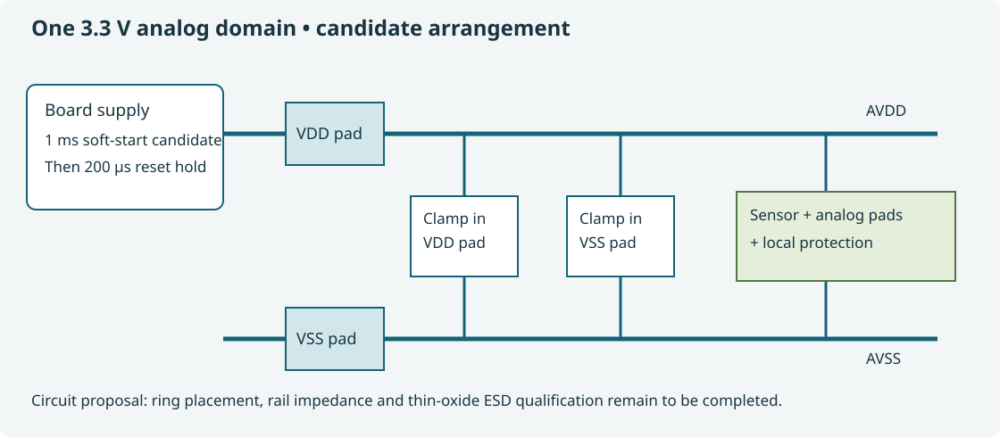

See the [running notebook](docs/overview.html#pad-closure) and
[reproduction notes](docs/pad-closure.md) for comparison plots, numerical
failures and follow-ups, exact rule selection, and qualification limits.
This earlier simulation uses a supply-pad pair. The physical ring above adds corner clamps and filler decoupling; its full RC camera simulation and stress qualification remain open.

## What increasing resolution looks like

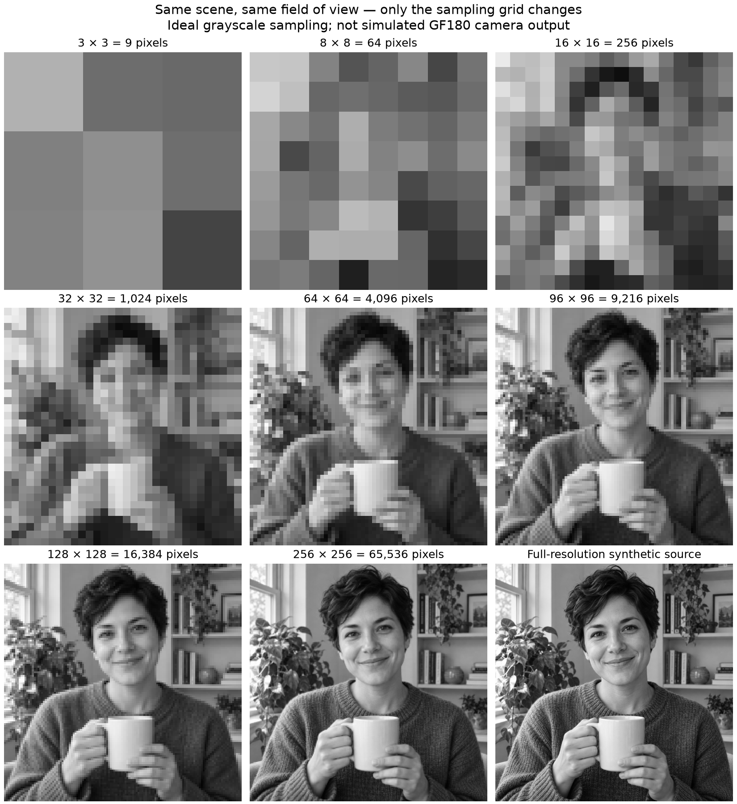

The same synthetic scene is sampled at each resolution with a fixed field of
view. This illustrates ideal sampling, **not predicted GF180 image quality**;
noise, optics and detector efficiency are not modeled, and higher resolutions
shown here are not claims of fitting this die.

The [HTML notebook](docs/overview.html) includes an **interactive resolution
slider**, manufacturing and packaging research, and the full design history.
Clone or download the repository and open `docs/overview.html` in a browser to use the slider offline. Keep the adjacent `docs/assets/` folder for the newer layout and result images. The images above provide the README preview.

## Earlier milestone: standalone 3×3 array

A connected 3×3 physical array, matching hierarchical Xschem schematic,
row-scan simulation, zero Magic DRC errors, zero violations from the installed
full GF180MCUD KLayout DRC deck, and unique Netgen LVS matches.
The checked array contains 27 MOSFETs and nine physical diodes.
These are local core checks, not a completed camera or manufacturing signoff.

- [Living HTML notebook](docs/overview.html): report with
  schematic/layout captures, plots, measurements, limitations and history; keep `docs/assets/` beside it.
- [Layout implementation and verification](layout/README.md).
- [Simulation notes](simulations/README.md).
- [Original gdsfactory prototype](test.py), preserved unchanged.

## Labeled 20 µm pixel layout

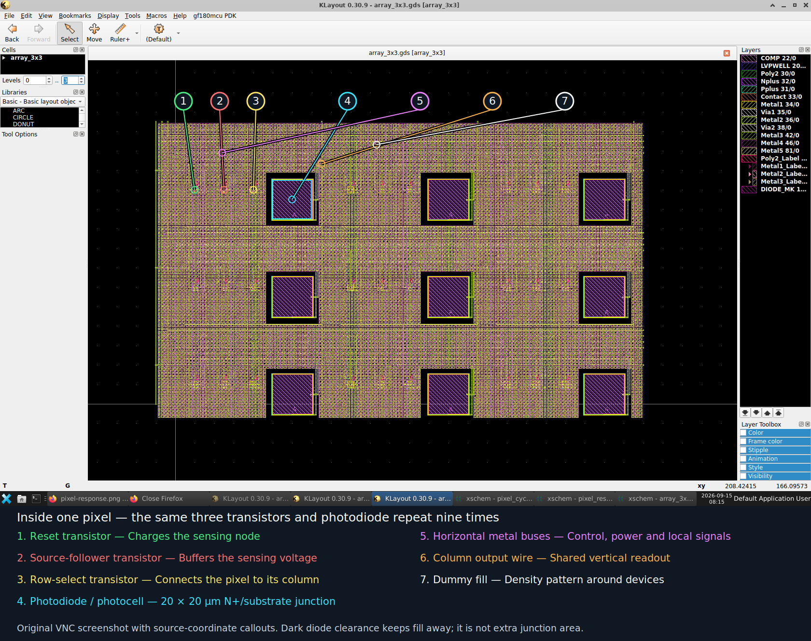

The larger variant has nine **20 × 20 µm photodiode junctions** at an
80 × 50 µm pixel pitch. Labels identify one representative pixel; its three
transistors and photodiode repeat nine times. Callouts use source coordinates
over the original VNC screenshot. [Open the scalable image](docs/assets/large-pixel-labeled.svg).

## 3×3 array schematic

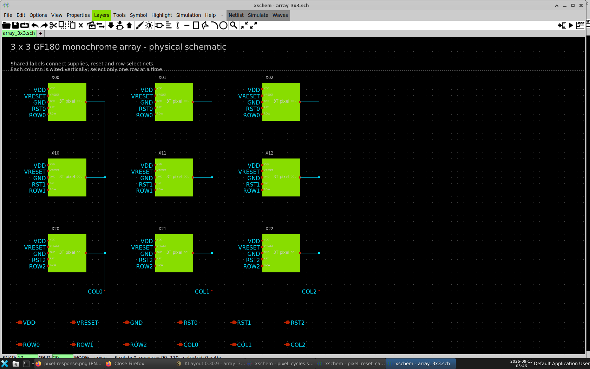

Each block contains a reset transistor, source follower, row-select transistor
and photodiode. The rows share reset/select controls and the three columns provide
separate outputs. This hierarchy is shared by all three diode-size variants.
[Open the Xschem source](xschem/array_3x3.sch).

## Checkpoint and workstation setup

- [Docker/VNC setup, checkpoint restore and full reproduction](docs/docker-setup.md).
- [Saved generated checkpoint](checkpoints/README.md).
- [5/10/20 µm diode-size comparison](docs/diode-size-study.md): all three layouts pass local DRC/LVS; the HTML includes electrical response plots.

## Tools

No host `.venv` is required. The scripts use the existing IIC-OSIC-TOOLS Docker
image pinned in `scripts/run-tools.sh`, which contains gdsfactory 9.44.0 and
all currently required EDA tools. Set `IIC_OSIC_IMAGE` to override the image.
The old prototype's `gf180mcu` Python package is not installed; the new layout
imports checked PDK-generated primitive GDS into gdsfactory instead.

## Reproduce

With Docker Desktop/WSL integration available, run from this directory:

```sh
python3 scripts/make-array-schematics.py
bash scripts/verify-array.sh
bash scripts/run-tools.sh python3 scripts/build-overview.py
```

The existing report also incorporates prior single-pixel experiments. Their
reproduction commands are listed in `docs/README.md`; on a clean checkout,
regenerate those baseline waveforms before rebuilding the complete notebook.

Results include `build/array_3x3.gds`, reports under `build/array-check/`, and
machine-readable measurements under `simulations/`. Share the `docs/` directory together so the notebook and its linked assets open offline.

## Extracted array electrical comparison

The 20 µm 3×3 array now has extracted resistance and capacitance models,
with schematic, C-only and RC scan comparisons. See the
[HTML notebook](docs/overview.html#parasitics) and
[reproduction method](docs/parasitic-extraction.md).

## Revised buffer and startup sequence

The latest candidate uses a 40 µA buffer reference and an all-row startup reset.
See the [updated notebook](docs/overview.html#buffer-hardening) and
[diagnostic/reproduction notes](docs/buffer-hardening.md). The standalone
three-PMOS buffer layout passes Magic DRC, KLayout DRC and Netgen LVS.

## Buffer parasitic extraction

The buffer now has an extracted RC model connected to the separately extracted
array and readout. See the [latest notebook section](docs/overview.html#buffer-pex)
and [reproduction notes](docs/buffer-pex.md). This earlier experiment used ideal
inter-block wiring; the connected layout below supersedes that geometry.

## Connected 3×3 test core

The pixel array, column bias/multiplexer and output buffer now share physical
signal, supply and ground routes. The filled layout passes Magic DRC,
KLayout DRC and Netgen LVS (37 MOS devices and nine photodiodes).

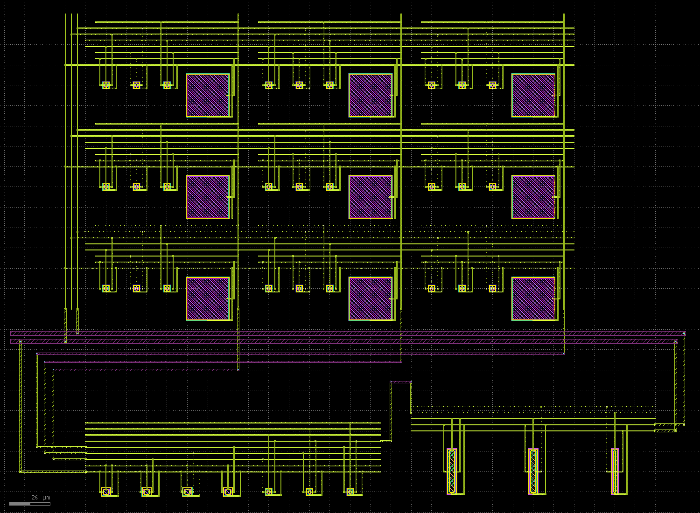

See the [connected-layout notebook](docs/overview.html#integrated) and
[reproduction and extraction notes](docs/integrated-layout.md). This is a test
core without pads/ESD or physical reference/control generators.

The [connected-layout process/temperature matrix](docs/overview.html#integrated-corners)
extends the initial three checks to 24 conditions. See the
[scope and reproduction instructions](docs/integrated-corners.md).
All 24 RC cases pass the 0.5 mV sampling screen; the worst error is 0.207 mV.
This uses fixed nominal wire R/C, ideal reference currents and the generic ADC load.

## Physical bias and startup candidate

Two external resistors now replace the ideal current sources in a separate
simulation checkpoint: 5.1 MΩ from VDD to BIAS and 49.9 kΩ from PREF to ground,
feeding the existing on-chip mirrors. All 84 DC cases converge and all 18 selected
startup/imaging cases pass; worst sampling error is 0.216 mV.

See the [startup plots and comparison table](docs/overview.html#bias-reference),
[component and scope notes](docs/board-bias.md), and
[Xschem interface](xschem/board_bias.sch). This is a board-bias candidate;
pad/ESD leakage, resistor TC/noise and actual reset-supply generation remain ahead.

## Analog pad evaluation

The installed GF180 analog pad plus a candidate local protection network passes
five selected extracted-core imaging checks with a finite-transition ADC load:
worst HOLD error **0.217 mV** against the **0.5 mV** screen. Both candidates
converge across 84 matched DC cases each; the secondary network changes core
reference currents by less than **0.18%**.

See the [pad evaluation and plots](docs/overview.html#pad-evaluation) and
[reproduction/evidence notes](docs/pad-evaluation.md). The original ideal-switch
secondary-protection runs fail numerically and are preserved. These are
functional model results; pad layout, thin-oxide ESD protection and package
qualification remain outstanding. The core GDS is unchanged.

## Earlier checkpoint: physical analog-pad interface

A routed local protection cell now passes Magic DRC, the full installed KLayout
DRC deck and unique Netgen LVS. Its physical poly resistor is **149 Ω nominal**;
five selected imaging checks with local extracted capacitance pass, with a worst
sampling error of **0.221 mV**.

The combined single-pad wrapper matches LVS and is Magic-clean. KLayout reports
**87 CUP.3 findings**, identical to the untouched library pad, in the unfiltered deck. The later coupon checks described above use the published selection excluding CUP. Neither result establishes ESD qualification or complete-die readiness.

See the [layout views and results](docs/overview.html#pad-layout) and
[reproduction and verification scope](docs/pad-layout.md).
