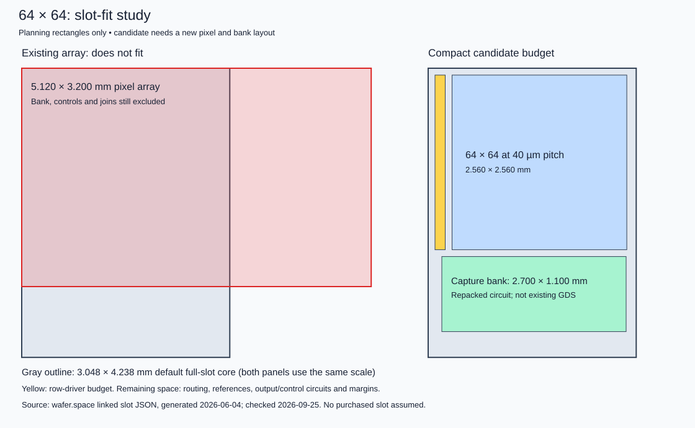

# 64×64 wafer.space slot-fit study — 2026-09-25

**The current pixel and bank layouts cannot fit a standard full slot.** This is
now the first physical implementation constraint in [the plan](../COMPLETION_PLAN.md).
The user confirmed GF180 through wafer.space, with working first silicon taking
priority over frame rate. A full slot is a planning assumption, not a purchase.



## Measured geometry and provider envelope

The provider-linked [slot JSON](https://mith.ro/gf180mcu-project-template/slots.json),
generated 2026-06-04 and checked 2026-09-25, gives these full-slot dimensions:

| Region | Dimensions | Area |
|---|---|---|
| Whole die | 3932 × 5122 µm | 20.140 mm² |
| Inside seal | 3880 × 5070 µm | 19.672 mm² |
| Default pad-ring core | 3048 × 4238 µm | 12.917 mm² |
| Existing 64×64 array, pitch arithmetic | 5120 × 3200 µm | 16.384 mm² |
| Selected bank, saved verification bounding box | 5198 × 945.04 µm | 4.912 mm² |

The array alone does not fit inside the seal in either orientation. Neither does
the bank. Their areas sum to **21.296 mm²**, so rearranging the unchanged blocks
or using a custom pad ring cannot solve the area constraint. These checks even
exclude array feed extensions, controls, spacing and pads.

The bank dimensions are from `build/capture-bank-c64-v5-20260925/verification.json`,
bounding box `(-84,-267;5114,678.04)`. The original v2 bank had a different height;
do not reuse that earlier height for the reinforced v5 layout.

## Candidate implementation budgets

The [machine-readable configuration](../layout/64x64-floorplan-budget.json)
checks these non-overlapping rectangles inside the default core:

| Block | Origin x/y (µm) | Size (µm) | Status |
|---|---|---|---|
| 64×64 array | 350 / 100 | 2560 × 2560 | Requires 40 × 40 µm repacked pixel |
| 64-column capture bank | 200 / 2760 | 2700 × 1100 | Requires repacked cells and shared routing |
| Row drivers/decoder reservation | 100 / 100 | 150 × 2560 | Area reservation, no implemented decoder |

The rectangles total 9.908 mm², leaving **3.010 mm²** for routing, references,
output/control circuitry and margins. That remaining area is fragmented; it is
not proof that every macro can be placed. The bank's existing 66.4 µm-wide column
cannot simply be abutted at the proposed pitch. Repack storage plates, transistor
placement and bank organization while retaining the tested electrical circuit.
Check optical junction/metal keepouts, wells, isolation, taps and local power.

This drawing is an arithmetic budget, not GDS, DRC/LVS or electrical evidence.
Preserve the existing 20 × 20 µm junction and device sizes as the first compact
layout attempt. Re-extract and compare before committing a full 64×64 assembly.
Confirm the selected run's MIM density: the current 2 fF option is still a
conditional development choice and the budget must change if that option differs.

The default core is a conservative starting envelope, not a frozen pad map.
The [project template](https://github.com/wafer-space/gf180mcu-project-template)
allows changing signal pad types while retaining bond positions and power pads.
Allocate the required analog reference/output pads explicitly, regenerate the
pad ring, and check the resulting core. Optical encapsulation compatibility remains
unconfirmed even if default chip-on-board bonding is selected.

## Reproduce

```sh
python3 scripts/budget-64x64-floorplan.py --out build/slot-fit-new
```

The script uses standard-library Python, recorded provider dimensions and the
saved bank verification bounding box. It checks both rotations, block containment,
pairwise overlap and areas, and writes `budget.json` plus `floorplan.svg`.
Published results are in `simulations/64x64-slot-budget.json`; no new EDA check
was possible because Docker WSL integration is unavailable.
