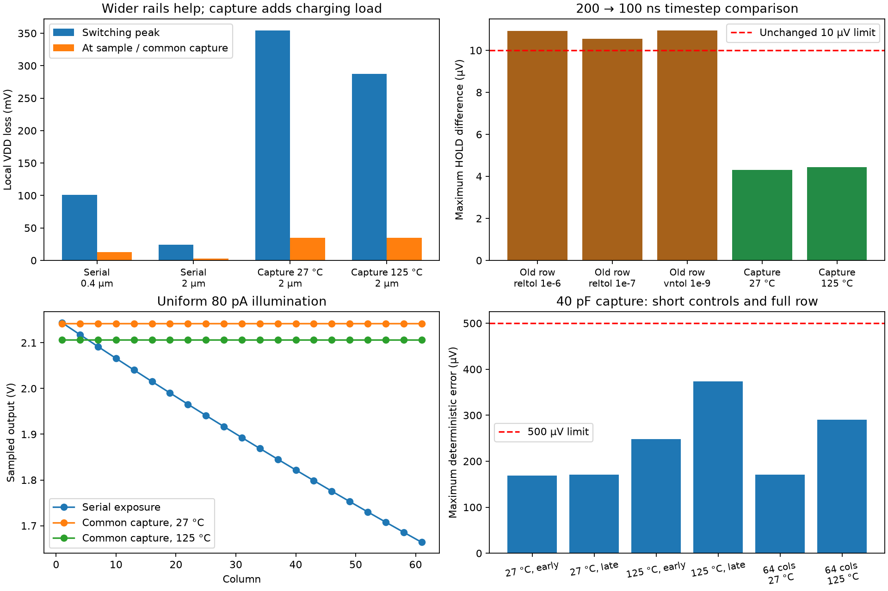
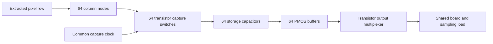

# 64-column capture and power-routing recovery

**The revised 64-column capture circuit passes the selected deterministic accuracy and timestep tests at 27 °C and 125 °C.** The earlier serial-integration architecture remains unsuitable for a wide row because it keeps exposing pixels while reading them. Its separate numerical-refinement issue is not closed. The target remains **64×64; frame rate undecided**.

| Typical process, 3.3 V | Matched outputs | Worst total error (µV) | 200→100 ns difference (µV) | Selected screen |
|---|---:|---:|---:|---|
| 27 °C | 64/64 | 171.295 | 4.317 | Pass |
| 125 °C | 64/64 | 289.919 | 4.439 | Pass |

Limits remain **500 µV total deterministic capture-to-output error** and **10 µV timestep agreement**. All 128 sampled control-state checks pass. These are electrical tests with **extracted pixel-row wire resistance and capacitance**, nonlinear transistors/diodes, and **schematic storage/readout periphery**. They are not full-chip PEX or tapeout qualification.

## What changed

The physical routing candidate widens VDD, VRESET and GND M2 rails and M3 supply trunks from 0.4 µm to 2 µm. It preserves pixel devices, signal rails, column wires, pitch, ports and original via connections. Separate 1×64 and 64×1 GDS candidates pass zero-error Magic DRC, direct-device LVS and resistor-collapsed RC LVS. Release GDS and the carrier remain unchanged.

The readout candidate adds a transistor transmission gate, **40 pF ideal storage capacitor**, PMOS source follower and transistor output mux for each column. All stores capture together; buffered values are then read serially. BIAS is **500 kΩ**, PREF **12.4 kΩ**, acquisition **10 µs** and column slots **20 µs**. The fixture retains 100 pF board load, 20 pF ADC sampling capacitance, 100 Ω isolation, 1 Ω/5 nH bond abstraction and 2 Ω source impedance. This is a generic sampling fixture, not an actual ADC model.

Reset releases at 220 µs. The row turns on at 1.2 ms and captures at 1.4 ms, after 200 µs tracking. The row turns off at 1.402 ms and resets at 1.403 ms. Serial reads begin at 1.41 ms; all 64 samples finish before the 2.7 ms endpoint. At each sample, the actual saved controls confirm capture switches open, row off/reset, one selected output and active ADC acquisition.

## Exposure and storage results

The earlier row continues integrating across 3.15 ms of serial readout: ten late bright pixels forward-bias, and identical 80 pA illumination gives about 2.144→1.664 V across the row. The new circuit associates each column with the common capture event.

| Measured quantity | 27 °C | 125 °C |
|---|---:|---:|
| Minimum diode voltage at capture | 1.031305 V | 0.979767 V |
| Same-light output spread, 0 pA | 12.658 µV | 141.468 µV |
| Same-light output spread, 80 pA | 5.408 µV | 133.514 µV |
| Same-light output spread, 240 pA | 2.048 µV | 118.363 µV |
| Maximum stored-voltage change after capture+1 µs | 2.270 µV | 174.154 µV |

All captured diodes remain reverse biased. The reported output spreads exclude random mismatch and noise; they are not a measured fixed-pattern-noise specification. Capture switching pedestal, acquisition lag and hold drift are included in the total output-error comparisons, not silently subtracted or calibrated away.

## Power routing: improvement and remaining requirement

In a matched **original serial-circuit** comparison, wider rails reduce row peak/sample local VDD loss from **101.162/12.661 to 24.213/2.628 mV**. Maximum ground excursion falls from 20.787 to 5.834 mV. Maximum extracted VDD port-to-device resistance changes from 1176.5 to 259.6 Ω in the row and from 751.2 to 174.5 Ω in the column.

The wider column completes with peak/sample loss **8.599/0.0893 mV**, versus the earlier 35.717/0.3844 mV control. That older column used reltol=1e-5, versus 1e-6 here; the row comparison has matched 1e-6 settings. The column's audited negative-reset-shunt consolidation remains a model limitation, and no new wider-column placement-sensitivity test is claimed.

**The capture circuit is a larger load.** Its 64 stores charge when the row turns on, and all 64 buffers draw current:

| Capture-circuit supply metric | 27 °C | 125 °C |
|---|---:|---:|
| Peak local VDD loss at row enable | 354.350 mV | 287.731 mV |
| Worst local VDD loss at capture | 34.522 mV | 34.526 mV |
| Minimum local VDD–GND at capture | 3.248662 V | 3.249141 V |
| Mean modeled Vsource current, 1.2–2.7 ms | 8.066 mA | 7.839 mA |
| Peak modeled Vsource current | 11.002 mA | 10.232 mA |

The peak occurs about 11 ns after row enable, approximately 200 µs before capture. The accuracy tests pass despite this modeled transient; that does **not** qualify the supply grid. Distributed physical power/ground feeds, peripheral supply routing, clock loading and electromigration review remain necessary. Independent behavioral clock-driver power is outside Vsource current. The 2 µm strips are not a complete camera power design.

## Reference and numerical validation

`check-column-capture-reference.py` freezes each **diode's differential voltage at capture−1 ns**, closes capture switches, and solves settled column targets. It does not use already stored values as the target. Matched output references then clamp all stores to those independent targets and select each of the 64 outputs. This exposes capture acquisition error as well as final output settling.

The default ngspice 46 transient-assisted operating-point fallback is 10 µs, verified in local `optran.c`. An early reference falsely suggested 15.38 mV error because its ADC capacitor was still charging. That reference is retained and excluded. Accepted references allow 200 µs and require ADCIN–HOLD DC residual below 10 nV. Full-row captured-state targets are identical at 200/400 µs for both temperatures. Doubling three nominal full-row output references, covering all illumination levels, changes HOLD by at most **0.0000398 µV**; ADC residual remains below 0.24 nV. The selected hot late-read short control also agrees at 200/400 µs.

The final full-row evidence uses the **unreduced RC model and KLU**, reltol=1e-6, abstol=1e-16 A, chgtol=1e-18 C, default vntol=1e-6 V, trapezoidal integration and 200/100 ns maximum steps. `finish-column-capture.py` reconstructs saved settings and requires exact normalized transient-deck equality before reusing a completed trace. Model/deck hashes, simulator hash and executed runner snapshots are retained.

The legacy serial row still fails the unchanged 10 µV screen: **10.920 µV** at reltol=1e-6, **10.548 µV** at reltol=1e-7, and **10.947 µV** at reltol=1e-6 plus vntol=1e-9. Tightening the absolute-voltage floor did not establish a solution. Earlier combined tighter-tolerance runs were stopped for excessive cost. Further qualification of that exposure-skewed mode is deferred; its old tracking figures remain provisional.

## Rejected controls and retained diagnostics

| Candidate/control | Finding |
|---|---|
| 20 pF, original weak column bias | 617.188 µV total short-control error; fails |
| 10 pF, original weak bias | 129.176 µV nominal short-control error, but 755.594 µV when all three signals are read near maximum hot hold; rejects candidate |
| 10 pF, 3.2 ms hot readout span | Up to 1.577 mV stored-voltage drift |
| 10 pF, 5 µs acquisition | 12.593 mV error; settling failure |
| 20 pF, 1 MΩ BIAS, hot late read | 516.707 µV; fails |
| 40 pF, 1 MΩ BIAS, hot late read | 349.437 µV; late-control result only |
| 32 pF, 500 kΩ BIAS | All four early/late nominal/hot small controls pass; worst 427.296 µV |
| Selected 40 pF, 500 kΩ BIAS | Four small-control errors: 169.233, 170.821, 248.077, 373.363 µV; then full-row tests above |

Early KLU capture-edge attempts, Gear/slew/pivot/initial-seed probes and a looser-current-tolerance diagnostic are retained. Their aborted or partial traces do not establish accuracy. The nominal 40 pF KLU 200 ns run initially hit its 1800 s watchdog; the accepted fresh identical-deck run uses a longer wall-time budget. The 100 ns nominal run also has a recorded bounded external watchdog intervention: only the waiting Python parent was suspended, ngspice ran uninterrupted, and the supervisor resumed the parent on exit. It ultimately finished within its original 3000 s allowance. No stimulus, circuit, timestep or accuracy setting changed.

Exact resistor-only star-mesh elimination was also audited independently: the compact row removes 983 internal nodes, preserves every capacitor/device record, and matches per-terminal currents within 3.7e-14 relative on deterministic random boundary probes. A separate serialized-netlist check confirms equivalence. These are algebraic network checks. Six slower SPARSE compact/unreduced full-transient diagnostics were deliberately stopped after the unreduced KLU nominal run completed, to prioritize its full refinement and references; no full compact-network/solver waveform pass is claimed. Three-output SPARSE and direct-optran initialization probes timed out and are excluded. A small 20 pF KLU/SPARSE transient control agrees within 4.247 µV.

## Area and timing budgets for 64×64

Forty picofarads per column means **2.56 nF** in the 64-column storage bank. The installed MIM model area coefficients imply these conditional area-only estimates:

| Capacitor model class | 64-store area estimate | Equivalent depth across 5.12 mm |
|---|---:|---:|
| 1 fF/µm² | 2.594 mm² | 0.507 mm |
| 1.5 fF/µm² | 1.741 mm² | 0.340 mm |
| 2 fF/µm² | 1.286 mm² | 0.251 mm |

These exclude edge capacitance, spacing, shielding, routing and active circuitry. The installed MIM rule limits individual plates to 10,000 µm² and calls for parallel cells for larger capacitors. The process option and physical capacitor cells are not selected. Local source snapshots/hashes and arithmetic are saved in `build/array-strip-storage-area-20260924/budget.json`. The current transients use ideal linear capacitors, not these physical models.

This is simultaneous capture **within a row**. A multirow camera would still have rolling exposure unless additional frame-wide storage or shuttering is provided. At 20 µs per sample, 4096 outputs consume 81.92 ms of serial slots (12.21 frames/s arithmetic ceiling). Adding 200 µs tracking and 10 µs guard per row gives 95.36 ms/frame, about **10.49 frames/s**, before other overhead. This is a planning budget, not measured full-camera performance or an agreed user specification.

## Next physical stage and open gates

1. Implement actual capacitor cells, capture switches, buffers and clock distribution on a routed intermediate tile, with distributed supply/ground feeds sized for the measured charging pulse and static buffer current. Re-extract that geometry and repeat capture/error/refinement checks.
2. Exercise repeated captures and multiple rows, including target-height column loading, changing illumination and exposure range. Add scalable addressing; direct 64×64 control would otherwise require 192 nets.
3. Validate the chosen storage/readout implementation across capacitor/device process, voltage, temperature, mismatch/noise and realistic ADC/load conditions. The present temperature runs retain nominal extracted wire resistance, without RC/TCR corner modeling.
4. Close full-chip distributed R+C, nonlinear startup/protection, pad/ESD, optical/package and run-specific manufacturing gates on the intended release design.

This stage supplies a measured capture architecture for continued scaling. It does not release the 3×3 or 64×64 chip. The existing carrier still uses its prior components and unused-pad arrangement; these schematic BIAS/PREF changes have not been adopted in hardware.

## Evidence and reproduction

- `simulations/array-recovery.json`: completed/failed runs, hashes, numeric checks, waveform metrics and explicit qualification scope.
- `scripts/prepare-array-strips.py`, `simulate-array-strips.py`, `finish-column-capture.py`, `check-column-capture-reference.py`, `analyze-strip-recovery.py`: physical/circuit preparation and accepted analysis path.
- `scripts/reduce-strip-resistors.py`, `verify-strip-resistor-models.py`, `budget-column-storage.py`: independent network and area audits.
- `scripts/report-strip-recovery.py`: rebuilds JSON, plot and overview fragment from retained evidence.
- `checkpoints/array-recovery/`: split archive and manifest; includes original/revised extraction, completed and excluded traces, DC references, runner snapshots and documentation. Restore into an empty scratch directory using its README. Earlier strip checkpoints remain separate and untouched.

Runners refuse to overwrite existing results. Use new output directories and the pinned tools container. The earlier [strip report](array-strips.md) retains its original scope. [Tapeout readiness](tapeout-readiness.md) lists the separate release gates.
