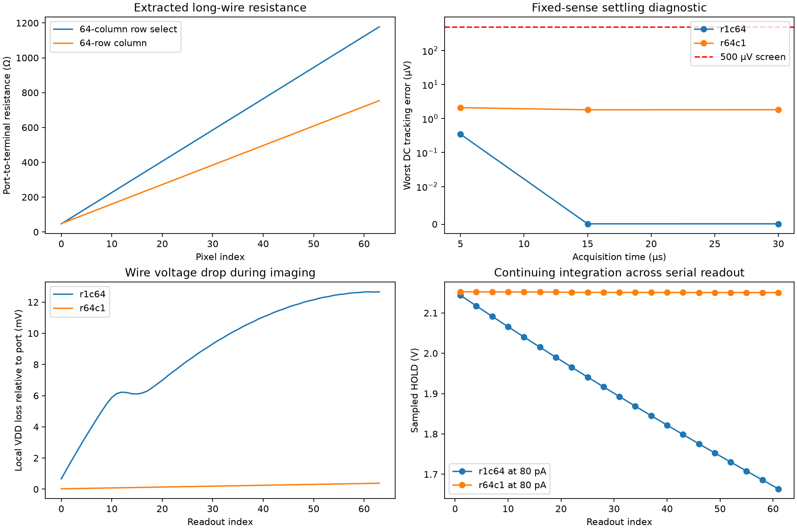

# 64-pixel row and column extraction tests

The next array target is **64×64; frame rate remains undecided**. These tests exercise physical 1×64 and 64×1 strips with 1×3 and 3×1 controls. They do not assemble the full camera.

## Physical checks and extracted wiring

All four unfilled layouts pass Magic DRC and two device-connectivity LVS checks: direct extraction and the independently resistor-collapsed RC model, each against an independent schematic. Each long strip retains 192 NMOS devices and 64 photodiodes. Pixel pitch is 80×50 µm; the nominal long dimensions are 5.12 mm horizontally and 3.20 mm vertically.

| Strip (rows×columns) | Resistors | Capacitors | Max ROW0 R (Ω) | Max COL0 R (Ω) | Max VDD R (Ω) |
|---|---:|---:|---:|---:|---:|
| 1×3 | 169 | 108 | 82.5 | 48.0 | 81.2 |
| 1×64 | 3829 | 2182 | 1177.8 | 48.0 | 1176.5 |
| 3×1 | 148 | 114 | 46.6 | 70.4 | 67.7 |
| 64×1 | 3015 | 2371 | 46.6 | 753.9 | 751.2 |

Resistance is effective port-to-device resistance, not a fitted lumped value. Coupling capacitance remains in the model. Extraction uses the installed nominal GF180 Magic technology, 1 Ω resistance threshold, 0.1 Ω minimum resistor and zero delay threshold. This is engineering PEX, not foundry signoff.

**Capacitance-placement limitation:** Magic emits one −0.30922 fF reset shunt per pixel in the narrow column strips. The main model consolidates each reset net's signed ground-shunt sum at its port; the alternate puts the same sum at its reset gate. All resistors, semiconductor devices and coupling capacitors remain. Every resistor-collapsed capacitance-pair sum is conserved. This is an explicit placement approximation, not complete distributed-capacitance qualification. Raw extraction and both placements are retained; neither is declared a physical worst-case bound.

## Fixed-sense settling experiment

The diagnostic holds each local diode voltage at one of 1.95, 1.75 or 1.30 V through an explicit 1 Ω source. This freezes exposure to isolate readout settling; it is not a pixel imaging simulation. The reference states are verified within 1 µV at sampling. Every sample has an independently solved matching DC reference.

The fixture uses 3.3 V through 2 Ω, a 2 V/1 Ω reset source, 100 Ω rail-referenced control drivers, the existing 100 kΩ control pulls, schematic column current sinks/multiplexer and output buffer, 49.9 kΩ PREF and 5.1 MΩ BIAS. The external fixture is 100 pF board + 20 pF sampling capacitance. Columns use 50 µs slots with acquisition from 2–32 µs after selection. This is a generic sample/hold load, not an actual ADC conversion schedule. Peripheral interconnect, pads, clamps, fill, package routing and addressing are not extracted.

| Strip | Model | Max 30 µs error (µV) | Max local VDD loss (mV) | Max gate 50% time (ns) | <500 µV |
|---|---|---:|---:|---:|---|
| 1×3 | devices | 0.000 | 0.000 | 5.006 | True |
| 1×3 | capacitance | 0.000 | 0.000 | 5.009 | True |
| 1×3 | rc-port | 0.000 | 0.071 | 5.010 | True |
| 3×1 | devices | 0.000 | 0.000 | 5.005 | True |
| 3×1 | capacitance | 0.017 | 0.000 | 5.007 | True |
| 3×1 | rc-port | 0.017 | 0.034 | 5.007 | True |
| 1×64 | devices | 0.000 | 0.000 | 5.013 | True |
| 1×64 | capacitance | 0.000 | 0.000 | 5.089 | True |
| 1×64 | rc-port | 0.000 | 19.124 | 5.279 | True |
| 64×1 | devices | 0.000 | 0.000 | 5.005 | True |
| 64×1 | capacitance | 0.049 | 0.000 | 5.007 | True |
| 64×1 | rc-port | 1.823 | 0.384 | 5.007 | True |

Gate time is measured from the start of the 10 ns source edge; about 5 ns is the driver's own half-rise time. Supply loss is measured at sampled pixel source-follower drains relative to the array supply port, separately from the external 2 Ω drop.

## Free integration

Each pixel begins held in reset. Reset is released about 1 ms before its row starts readout; photocurrents cycle through 0, 80 and 240 pA. All 64 pixels are read once. The long-row imaging timestep criterion remains unmet, as documented below; completion and tracking accuracy are separate from numerical qualification. The wide row's later columns keep integrating during its 3.15 ms first-to-last sample interval. The tall column uses staggered row resets, preserving the same nominal exposure age for each row. Consequently, a brightness-versus-position trend in the wide row is not automatically a settling failure. The DC reference freezes the actual sampled local sense voltages and reproduces the control states, including future rows still in reset.

| Strip | Samples | Max DC tracking error (µV) | Max local VDD loss (mV) | Max sampled source current (µA) | <500 µV |
|---|---:|---:|---:|---:|---|
| 1×64 | 64 | 189.827 | 12.661 | 146.1 | True |
| 64×1 | 64 | 226.992 | 0.384 | 2188.0 | True |

**Exposure limit found:** at 240 pA, 10 late samples in the wide row have sense-to-anode voltage below zero (minimum -0.256 V), indicating forward-biased photodiodes after over-integration. At the same 80 pA illumination, HOLD changes from 2.144 V at column 1 to 1.664 V at column 61. A readout tracking pass does not make this exposure schedule a usable uniform-exposure camera mode.

 Full readout-window (not only sample-time) maximum local VDD losses are r1c64: 101.164 mV, r64c1: 35.717 mV. These exclude power-up and do not include driver source power.

Source current includes the VDD-connected reset pullups and schematic readout. Behavioral control sources supply their output energy independently; their driver power is not charged to VDD, so this is not total interface or full-camera power. The 100 kΩ reset pullups draw current whenever reset is driven low, making direct-control replication particularly costly in the tall strip.

## Refinement and placement checks

| Strip | Comparison | Maximum sample change (µV) | Below 10 µV |
|---|---|---:|---|
| r1c64 | settling timestep | 0.000 | True |
| r64c1 | settling timestep | 0.000 | True |
| r64c1 | reset capacitance placement (imaging) | 0.032 | True |
| r1c64 | imaging timestep 100 to 50 ns | 20.350 | False |
| r64c1 | imaging timestep 200 to 100 ns | 5.527 | True |

The initial timestep ceiling is 200 ns. The long row's imaging comparison at 100 ns changed a sample by about 17.1 µV, above the retained 10 µV numerical screen; that failed comparison is preserved. The follow-up 100→50 ns row comparison changes a sample by about 20.3 µV and also fails that screen. **Long-row imaging numerical qualification remains open**; its tracking results are provisional. Other comparisons use 200 ns against 100 ns. Solver method and warnings are preserved per run. Some runs use ngspice's transient-assisted operating-point fallback; successful normal-operation traces do not qualify nonlinear power-up. Three selected tall-strip DC references are also checked with the independent SPARSE solver; terminal voltages agree within 1 µV. Very small printed tracking errors are numerical results, not a sensor noise-floor claim. Full waveforms, matching DC decks, runner snapshots, extraction settings, model hashes and failed fixture-development attempts are preserved separately from the accepted comparisons.

## What this permits next

Resolve the long-row imaging numerical refinement and use the clear exposure-skew result to design the 64×64 addressing and readout schedule, then test an intermediate tile with realistic shared routing. Fifty microseconds per pixel would consume 204.8 ms for 4096 pixels (4.88 frames/s before overhead), but this strip schedule is a diagnostic, not a selected frame rate or a demonstrated full-array throughput. A shorter acquisition result alone does not prove that all switching, reset, ADC and transfer overhead can be shortened by the same amount.

The full 64×64 still needs its own supply routing, long parallel-line coupling, fill, shared-readout extraction, operating corners, nonlinear startup and physical/manufacturing checks. The existing 3×3 release hardware is unchanged.

## Reproduce

Run the scripts inside the project's tools container with `OMP_NUM_THREADS=1 OPENBLAS_NUM_THREADS=1`. Use fresh output directories: `prepare-array-strips.py --output ...`, then `audit-array-strip-rc.py <extraction-directory>`, then `simulate-array-strips.py --source <extraction-directory> --output ...`. Default simulation arguments run the four fixed-sense strips in device/C-only/RC modes. Use `--cases r1c64 r64c1 --modes rc-port --fixture imaging --method gear` for free integration, `--step-ns 100` for refinement, and `--cases r64c1 --modes rc-gate --fixture imaging --method gear` for the placement check. Machine-readable run paths and exact runner snapshots preserve the executed versions. `--reuse-transients` is permitted only when the transient deck is identical after output-directory normalization; it recomputes DC references without changing the saved trace.

The earlier fixture-development failures are classified in the checkpoint's `build/array-strips-20260924/attempts.json`; they must not be used as physical pass/fail results. The corrected coarse imaging batch replaces the tall strip's initial DC references, which had incorrectly driven future row resets low.

Machine-readable results: [array-strips.json](../simulations/array-strips.json). See [tapeout readiness](tapeout-readiness.md) for the remaining release gates.
