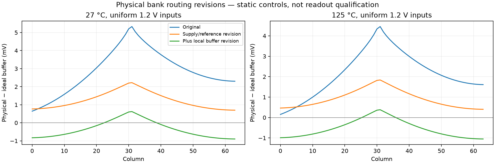

# Physical bank routing reinforcement — 2026-09-25

**The revised 64-column bank passes both main DRC checks and both LVS paths.**
Across the eight nominal/hot DC conditions, all 16 selected-bank runs complete.
Within the 1.2–2.0 V screen, the largest physical–ideal static buffer shift changes
from **5.330898 mV** to **1.320060 mV**. Full readout qualification remains open.



## Physical changes and checks

The supply/reference revision uses nine parallel 8 µm M5 straps per supply,
M4/M5 column supply uprights with distributed 3×3 vias, reinforced reference
source connections, and BIAS/PREF external feeds beside the reference devices.
This increases routing height by 80 µm. The final revision also adds a 2 µm M4
CBUF rail and parallel 1.2 µm M2 branches at each mirror drain/follower source,
with distributed vias. Existing signal/control wires and devices remain present.

Two-column controls and both 64-column revisions pass Magic/KLayout main DRC
and direct/resistor-collapsed LVS. An earlier two-column attempt failed M1/M2
spacing around the reference transistor; its geometry and reports are retained.
The selected bank retains 450 MOS devices, 512
MIM plates and 327 distinct connected ports.
Extraction contains 23883 resistors and
11779 parasitic capacitors. Device parameters and
schematic contracts match the original bank exactly. Main DRC still excludes
antenna, density and CUP; manufacturing qualification is open.

## Static electrical comparison

Each cell below is the largest absolute physical–ideal CBUF difference among
all 64 columns. Span is the range of those signed differences. Independent raw
readback verifies all 48 baseline/intermediate/selected DC records. Fixtures,
solver tolerances, loads and transistor models are unchanged; all ideal-wire
reference results reproduce exactly. Zero input is a separate reset diagnostic.

| °C | COL (V) | Original shift (mV) | Supply/reference shift (mV) | Selected shift (mV) | Selected span (mV) |
|---|---|---|---|---|---|
| 27 | 0 | 6.972838 | 2.928115 | 1.128072 | 1.537664 |
| 27 | 1.2 | 5.330898 | 2.222930 | 0.897858 | 1.518536 |
| 27 | 1.6 | 2.601725 | 0.899983 | 1.320060 | 1.219965 |
| 27 | 2 | 1.126052 | 0.710898 | 1.098596 | 0.757376 |
| 125 | 0 | 6.490186 | 2.745578 | 0.998328 | 1.492688 |
| 125 | 1.2 | 4.454401 | 1.839276 | 1.050599 | 1.431900 |
| 125 | 1.6 | 2.286727 | 0.765970 | 1.317788 | 1.154732 |
| 125 | 2 | 1.147936 | 0.702334 | 1.113297 | 0.766461 |

The external supply remains 3.3 V through 2 Ω; bias resistors remain
500 kΩ/12.4 kΩ. These imposed-column DC results are not matched camera output
errors, noise measurements, calibration evidence or full-row qualification.
Local VDD/ground measurements for every condition are in the JSON report.
The buffer revision improves the overall worst case, but the intermediate
supply/reference-only layout has smaller absolute shifts at 1.6 and 2.0 V.
Removing one offset can expose another of opposite sign; the changes are not
uniform improvements at every input. Residual spread and systematic shifts
still require investigation before any accuracy claim.

## Common-offset diagnosis

Thirteen baseline wire-contraction controls complete. After supply/reference
contraction, additionally contracting CBUF reduces the largest offset from
2.199456 mV to 0.015255 mV. Contracting COL instead leaves 2.214677 mV;
STORE/BUF contractions have negligible effect. Contracting all wire networks
matches the ideal reference within 0.9 fV. Device parameters are preserved.
This identifies the local buffer current path as the main remaining common
DC-offset contributor in the tested 27 °C / 1.2 V control. It is not a universal
correction or a transient accuracy result. The physical CBUF revision is tested
separately above.

## Coupled runtime and remaining gates

The selected bank's 27 °C / 200 ns coupled reset control requested 0.25 ms and used 180.0 s. Completed: **False**; timed out: **True**; complete readout samples: **0**. No complete transient records. This bounded control does not establish capture or output accuracy.

Raw negative substrate-shunt corrections remain archived. The derived port/far
placements conserve net totals and all resistors; their sensitivity requires new
qualification. The row/bank joins remain ideal terminal connections. Continue
with residual supply/reference spread and coupled solver behavior, followed by
independent capture/output targets, all 64 matched samples, nominal/hot timestep
and placement comparisons. Physical joining routes, multirow capture, real
drivers, wire/process corners, startup, noise and manufacturing gates remain open.

## Reproduce

Selected layout: `build/capture-bank-c64-v5-20260925`.
Intermediate layout: `build/capture-bank-c64-v4-20260925`. Use fresh output directories:

```sh
bash scripts/run-tools.sh python3 scripts/build-capture-bank.py \
  --columns 64 --reinforced-routing --reinforced-buffer --out build/bank-new
bash scripts/run-tools.sh bash -lc 'cd build/bank-new && klayout -b -r /foss/pdks/gf180mcuD/libs.tech/klayout/tech/drc/gf180mcu.drc -rd input=bank.gds -rd report=main-drc.lyrdb -rd topcell=capture_bank -rd variant=gf180mcuD -rd decks=all,-antenna,-density,-cup -rd threads=2 > klayout.log 2>&1'
bash scripts/run-tools.sh python3 scripts/verify-capture-bank.py --run build/bank-new
bash scripts/run-tools.sh python3 scripts/screen-capture-bank-dc.py \
  --bank build/bank-new --out build/bank-new-dc --levels 0 1.2 1.6 2 --timeout 60
```

Omit `--reinforced-buffer` for the intermediate control; omit both reinforcement
flags to retain the original routing configuration. Machine-readable results:
`simulations/bank-reinforcement.json`. Evidence: `checkpoints/bank-reinforcement/`.
Earlier checkpoints are unchanged. No release GDS, carrier, commit or push changed.
