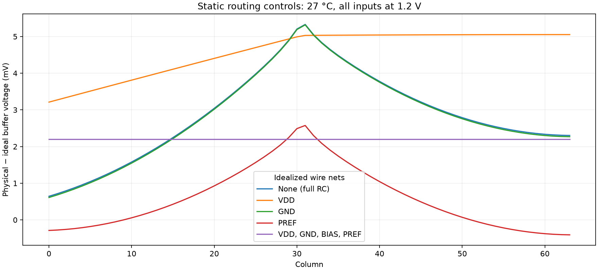

# Shared-bank routing diagnosis — 2026-09-25

Follow-up: [physical routing reinforcement](bank-reinforcement.md) implements and checks the supply/reference and local-buffer revisions. Earlier evidence below is unchanged.

**Eight controlled DC experiments identify VDD and PREF routing as contributors
to the nominal equal-input spatial spread.** Every experiment completes by
direct DC solution. All 16 earlier static raw records were independently read
back; repeating the unchanged full-RC control reproduces every saved value
exactly. No layout or transient accuracy pass is claimed.



## Measured local voltages

At 27 °C with every COL imposed at 1.2 V, the original physical bank has
up to **8.059 mV local VDD loss** and **9.023 mV follower ground rise**.
Both are smallest near the center supply feed. The BIAS gate line drops at
most 0.260 mV, while local bias gate–source voltage varies by 5.735 mV.
These are bank-only static measurements, with ideal column sources and the
previous 1 TΩ output load. They do not include the coupled row's switching load.

## Controlled resistance contractions

Each experiment shorts only the selected extracted resistor components, remaps
their device/capacitor terminals, and retains all other resistors and devices.
Capacitors across a contracted node are removed because their voltage is zero.
The 450 MOS and 512 physical MIM devices and parameters are preserved. The
fixture, solver and accuracy tolerances remain unchanged. These diagnostic
models are electrically altered controls, not proposed physical layouts.

| Idealized wire nets | Largest buffer shift (mV) | Shift span (mV) |
|---|---:|---:|
| None (full RC) | 5.330898 | 4.687586103 |
| VDD | 5.053017 | 1.841009803 |
| GND | 5.318377 | 4.707912452 |
| VDD, GND | 5.018439 | 1.839471362 |
| BIAS | 5.330941 | 4.687614531 |
| PREF | 2.574832 | 2.982738890 |
| BIAS, PREF | 2.574875 | 2.982742037 |
| VDD, GND, BIAS, PREF | 2.199456 | 0.000000027 |

The shift span compares the 64 physical-minus-ideal buffer voltages; it is not
a matched capture/readout error. VDD and PREF effects interact, so the changes
in these rows are not additive contributions. Shorting supplies and references
together makes the shifts uniform to about 0.03 nV but leaves a **2.199 mV
common offset**. Remaining local signal/output routing therefore still needs
investigation. The finite loaded output-0 fixture is not translationally
symmetric; this table does not establish calibration or noise performance.
These contraction experiments cover only 27 °C / 1.2 V. The saved local-voltage
analysis also covers all eight earlier temperature/input conditions.

## Coupled reset-edge controls

| Bank / integration | Complete to 0.25 ms | Last time (ms) | Runtime (s) |
|---|---|---:|---:|
| rc-port / gear | False | No transient data | 120.0 |
| reference / trap | True | 0.250000000 | 107.8 |

These bounded controls stop before the 1.4 ms capture event and cannot qualify
readout accuracy. Gear changes the integration method only; circuit sources,
loads and error tolerances are audited against the original fixture. The
reference control retains physical MIM devices with ideal bank wiring and
the full extracted row. Earlier aborted and timed-out runs remain preserved.

The ideal-wire bank crosses reset release and row enable to reach 0.25 ms in
107.8 s. The physical-bank Gear attempt times out after 120 s during operating
point initialization, with no complete transient records. It does not establish
whether Gear can resolve the later reset-edge slowdown. The earlier physical
bank with trapezoidal integration reached only 0.200255 ms in its 600 s budget.
These results narrow the runtime investigation but do not prove a circuit fault.

## Next experiment

Revise the shared VDD distribution and reference feed paths, including the
reference device supply connection and PREF path to the external resistor.
Re-run physical checks and compare the resulting extracted bank with these
static controls. Investigate the remaining common offset and coupled runtime
separately. Then retain the independent capture/output targets, all 64 outputs,
27/125 °C, timestep and shunt-placement gates before claiming qualification.
Row-to-bank joining routes, repeated/multirow operation and real drivers remain
open. No release GDS, carrier, commit or push changed.

## Reproduction and evidence

The diagnosis script uses the Python standard library; omit `--run` to audit
saved results and prepare decks without Docker. Use a fresh output directory:

```sh
bash scripts/run-tools.sh python3 scripts/diagnose-bank-routing.py \
  --bank build/capture-bank-c64-v2-20260925 \
  --dc build/capture-bank-dc-matrix-20260925 \
  --out build/capture-bank-routing-reproduce --run --timeout 60
```

Machine-readable measurements, control audits and exact reset statuses:
`simulations/bank-routing.json`. Evidence: `checkpoints/bank-routing/`.
The earlier [physical-bank checkpoint](capture-bank.md) is unchanged.
