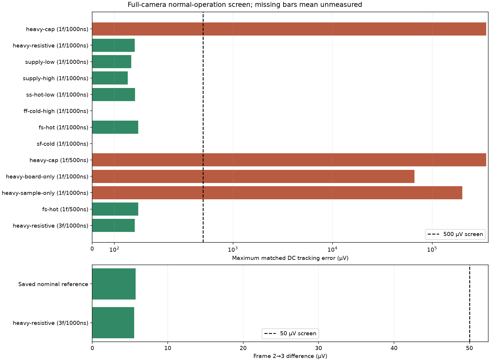
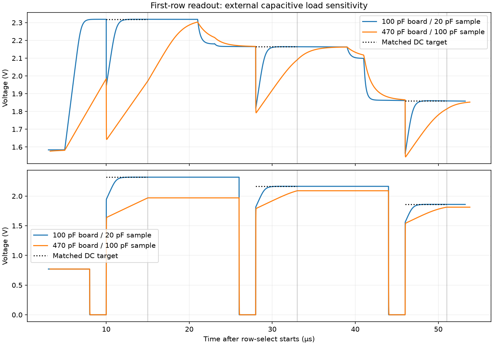

# Full-camera load and operating-corner screen — 2026-09-24

**Initial 8-case screen:** 5 pass, 1 completed accuracy failure, and 2 incomplete DC cases. Follow-up controls below distinguish load settling, numerical refinement and loaded repeatability.

This is a bounded engineering screen of the existing normal-operation candidate. The previous nominal case completed three frames with 27 samples, 5.733 µV frame-two/three drift and 167.766 µV maximum matched DC tracking error.

## Conditions and measured results

Process columns list MOS / diode / resistor / MOS-cap sections. Temperatures and 3.0–3.6 V endpoints are selected stress points, not a qualified product rating. Light currents remain fixed at 0, 80 and 240 pA. The external sample switch keeps its original 3.3 V control levels; chip row/reset/select drivers follow the changed chip supply. Board/sample capacitances and input resistance are external loads.

| Batch / case | Process sections | Supply (V) | °C | Board/sample (pF) | Input (kΩ) | Samples | Max DC error (µV) | Frame 2→3 (µV) | Result |
|---|---|---:|---:|---:|---:|---:|---:|---:|---|
| first-frame-20260924 / heavy-cap | typical/typical/typical/typical | 3.3 | 27 | 470/100 | 1000 | 9/9 | 348813.213 | — | screen fail |
| first-frame-20260924 / heavy-resistive | typical/typical/typical/typical | 3.3 | 27 | 100/20 | 100 | 9/9 | 191.297 | — | PASS |
| first-frame-20260924 / supply-low | typical/typical/typical/typical | 3 | 27 | 100/20 | 1000 | 9/9 | 175.660 | — | PASS |
| first-frame-20260924 / supply-high | typical/typical/typical/typical | 3.6 | 27 | 100/20 | 1000 | 9/9 | 160.635 | — | PASS |
| first-frame-20260924 / ss-hot-low | ss/ss/ss/ss | 3 | 125 | 100/20 | 1000 | 9/9 | 192.508 | — | PASS |
| first-frame-20260924 / ff-cold-high | ff/ff/ff/ff | 3.6 | -40 | 100/20 | 1000 | 0/9 | — | — | DC watchdog |
| first-frame-20260924 / fs-hot | fs/typical/typical/typical | 3.3 | 125 | 100/20 | 1000 | 9/9 | 207.923 | — | PASS |
| first-frame-20260924 / sf-cold | sf/typical/typical/typical | 3.3 | -40 | 100/20 | 1000 | 0/9 | — | — | DC watchdog |
| heavy-cap-refine-20260924 / heavy-cap | typical/typical/typical/typical | 3.3 | 27 | 470/100 | 1000 | 9/9 | 348811.913 | — | screen fail |
| load-isolation-20260924 / heavy-board-only | typical/typical/typical/typical | 3.3 | 27 | 470/20 | 1000 | 9/9 | 66277.920 | — | screen fail |
| load-isolation-20260924 / heavy-sample-only | typical/typical/typical/typical | 3.3 | 27 | 100/100 | 1000 | 9/9 | 201063.193 | — | screen fail |
| hot-corner-refine-20260924 / fs-hot | fs/typical/typical/typical | 3.3 | 125 | 100/20 | 1000 | 9/9 | 207.923 | — | PASS |
| loaded-three-frames-20260924 / heavy-resistive | typical/typical/typical/typical | 3.3 | 27 | 100/20 | 100 | 27/27 | 191.889 | 5.550 | PASS |

PASS requires completed requested frames, valid sampled controls, correct per-row brightness order, matched HOLD/ADCIN DC errors below 500 µV, sampled bias agreement within 1%, and capacitor approximation bounds below 0.1%. Three-frame cases additionally require frame-two/three change below 50 µV. A one-frame pass does not establish repeatability at that condition. Incomplete numerical runs are not electrical failures or passes.

## Capacitor approximation and provenance

- first-frame-20260924 / heavy-resistive: capacitor terminal range 3.297579–3.300488 V; worst relative capacitance bound 2.2e-13; stock/frozen DC voltage difference 6.68876e-06 µV.
- first-frame-20260924 / heavy-cap: capacitor terminal range 3.297579–3.300488 V; worst relative capacitance bound 2.2e-13; stock/frozen DC voltage difference 4.93516e-06 µV.
- first-frame-20260924 / heavy-cap failed or unestablished checks: brightness_order_pass, tracking_pass
- first-frame-20260924 / supply-low: capacitor terminal range 2.997791–3.000453 V; worst relative capacitance bound 8.49e-12; stock/frozen DC voltage difference 4.48308e-06 µV.
- first-frame-20260924 / supply-high: capacitor terminal range 3.597368–3.600522 V; worst relative capacitance bound 4.88e-15; stock/frozen DC voltage difference 5.38147e-06 µV.
- first-frame-20260924 / ff-cold-high: AssertionError('Stock nonlinear-capacitor operating point did not complete')
- first-frame-20260924 / ff-cold-high failed or unestablished checks: completed
- first-frame-20260924 / sf-cold: AssertionError('Stock nonlinear-capacitor operating point did not complete')
- first-frame-20260924 / sf-cold failed or unestablished checks: completed
- first-frame-20260924 / ss-hot-low: capacitor terminal range 2.997693–3.000512 V; worst relative capacitance bound 8.5e-12; stock/frozen DC voltage difference 1.00076e-05 µV.
- first-frame-20260924 / fs-hot: capacitor terminal range 3.297548–3.300508 V; worst relative capacitance bound 2.2e-13; stock/frozen DC voltage difference 2.47447e-06 µV.
- heavy-cap-refine-20260924 / heavy-cap: capacitor terminal range 3.297579–3.300488 V; worst relative capacitance bound 2.2e-13; stock/frozen DC voltage difference 4.93516e-06 µV.
- heavy-cap-refine-20260924 / heavy-cap failed or unestablished checks: brightness_order_pass, tracking_pass
- load-isolation-20260924 / heavy-board-only: capacitor terminal range 3.297579–3.300488 V; worst relative capacitance bound 2.2e-13; stock/frozen DC voltage difference 4.93516e-06 µV.
- load-isolation-20260924 / heavy-board-only failed or unestablished checks: tracking_pass
- load-isolation-20260924 / heavy-sample-only: capacitor terminal range 3.297579–3.300488 V; worst relative capacitance bound 2.2e-13; stock/frozen DC voltage difference 4.93516e-06 µV.
- load-isolation-20260924 / heavy-sample-only failed or unestablished checks: tracking_pass
- hot-corner-refine-20260924 / fs-hot: capacitor terminal range 3.297548–3.300508 V; worst relative capacitance bound 2.2e-13; stock/frozen DC voltage difference 2.47447e-06 µV.
- loaded-three-frames-20260924 / heavy-resistive: capacitor terminal range 3.297579–3.300489 V; worst relative capacitance bound 2.2e-13; stock/frozen DC voltage difference 6.68876e-06 µV.

Each condition first attempts a complete stock-circuit DC solve with all nonlinear MOS capacitors present. Only after that succeeds are the 1,680 capacitor values recomputed at that condition's settled terminal voltages, including PDK process multipliers (typical 1, fast 0.9, slow 1.1). Every other extracted chip record is preserved. A second DC solve verifies unchanged bias. The installed model formula has no explicit temperature coefficient; temperature still affects the DC operating point through the semiconductor models. Both C(V) and the differential d[V·C(V)]/dV are bounded across every captured point against the frozen values. The 0.1% approximation limit is an explicit engineering screening threshold, not foundry signoff.

Each readout reference holds all nine pixel charge-state voltages at their captured values, freezes the digital controls at the sampling instant, and solves the same loaded circuit at DC. These extra state-holding sources exist only in the DC reference, never in the transient or physical chip. Tolerances, equivalent reset source, 2 Ω supply resistance, acquisition timing, all fifteen clamp domains and nominal layout wiring capacitance are retained.

## Refinement and remaining qualification

- heavy-cap: first-frame-20260924 → heavy-cap-refine-20260924; sample difference 5.701 µV; <10 µV screen: True.
- fs-hot: first-frame-20260924 → hot-corner-refine-20260924; sample difference 0.303 µV; <10 µV screen: True.

This selection does not cover the full process/diode/resistor/capacitor cross-product, all load combinations, interconnect variation, external component tolerances, mismatch/noise or optical/dark-current behavior. Nonlinear startup and full distributed resistance-plus-capacitance qualification remain open. The fast generic sample/hold fixture is not an ADS1115 conversion model. First-frame results and selected repeat/refinement results must not be promoted into a full PVT qualification claim.

Exact decks, stock and frozen models, operating points, full transient waveforms, DC references, simulator/PDK hashes and failure logs are under `build/camera-operating-corners/`. Machine-readable results: [camera-operating-corners.json](../simulations/camera-operating-corners.json).



## Capacitive-load settling diagnostic

In the first heavy-capacitive-load acquisition, HOLD rises from 1.903714 V at 4 µs to 1.969918 V at 5 µs, still below its 2.318731 V DC target. The nominal load is already settled. The load-isolation cases vary each capacitor separately; the finer-step case checks numerical reproducibility of the combined-load failure.



## Isolated cold-pad DC control

The eight protection diodes attached to unused pad NC_P10 reproduce the cold singular-matrix warning with ideal rails. The isolated cold solves finish only after ngspice falls back to transient-assisted operating-point calculation; these are not accepted direct DC/camera results. The warm control and a cold control with an added 1 TΩ pad-to-ground path converge without that warning or fallback. The added path is diagnostic only and is not included in any full-camera transient. This supports further investigation of floating unused-pad conditioning; it does not qualify a cold operating corner or establish a hardware defect. Exact controls are in `build/camera-operating-corners/cold-pad-diagnostic-20260924/`.

## Reproduction

Run in the existing toolchain with a fresh output name; existing directories are deliberately never overwritten:

```sh
bash scripts/run-tools.sh python3 scripts/screen-camera-operating-corners.py new-first-frame-screen --cases heavy-cap heavy-resistive supply-low supply-high ss-hot-low ff-cold-high fs-hot sf-cold --workers 4
```

Use `--frames 3 --timeout 3000 --cases heavy-resistive` for the selected loaded repeatability test, `--step-ns 500 --cases heavy-cap fs-hot` for refinement, and `--cases heavy-board-only heavy-sample-only` for load isolation, each with a distinct run name. The evidence archive retains the exact executed runner snapshots and all per-case decks; simulator and PDK hashes are recorded in each batch summary.
