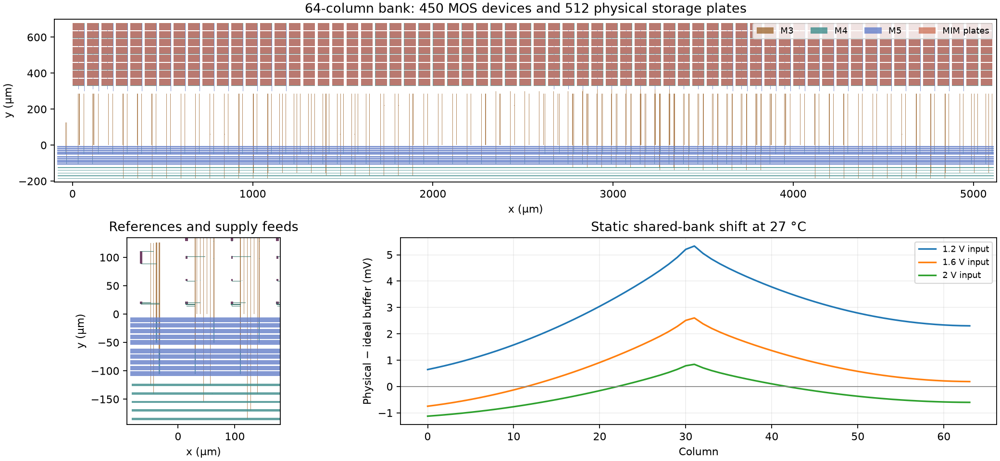

# Shared physical capture bank — 2026-09-25

Follow-up: [physical routing reinforcement](bank-reinforcement.md) implements and checks the supply/reference and local-buffer revisions. Earlier evidence below is unchanged.

Follow-up: [shared-bank routing diagnosis](bank-routing.md) identifies VDD/PREF contributions and records new reset controls. The physical baseline below is unchanged.

**The 64-column bank passes Magic/KLayout main DRC and both direct and
resistor-collapsed LVS.** Its 450 MOS devices and
512 MIM plates match the schematic contract exactly.
Full readout accuracy is not yet qualified.



## Physical implementation

The qualified isolated column is repeated at 80 µm pitch. Shared capture clocks,
BIAS/PREF reference lines and output bus use 4 µm M4 routing. Each supply uses
five parallel 8 µm M5 straps, joined by M4 crossbars and distributed 3×3 vias.
The two shared reference transistors are placed once to the left of the bank.
External 500 kΩ/12.4 kΩ bias resistors remain fixture components.

The extent is 5.198 × 0.86504 mm (4.49648 mm²) including routing and references.
All 512 storage plates retain separate M4 bottom islands. Their individual
64 × 38.88 µm areas match the conditional 2 fF model. No manufacturing capacitor
option is selected. The two-column control also passes both DRC/LVS paths.
The first control's unslotted 40 µm straps failed KLayout MSLOT5.1 (seven
markers); that rejected layout and its reports are retained.

## Extracted model

All 327 bank ports remain distinct and connected to their expected devices.
The raw extraction retains **8,941 resistors** and
**7,005 parasitic capacitors**, in addition to the
512 modeled MIM devices. Every resistor has positive resistance, and shorting
only those resistors reproduces the independent schematic devices and terminals.

Raw Magic capacitance corrections contain 384
negative substrate shunts across 66 nets. Derived near/far diagnostic
models preserve every resistor and each affected net's total shunt capacitance,
placing that total at either the port or the furthest node by shortest resistive
path. **Their placement sensitivity is not qualified.** This shared-bank
approximation needs its own test; the earlier isolated-column result does not
establish it. Raw extraction is archived without modification.

Magic's global substrate-capacitance node 0 is explicitly bound to the bank GND
feed in derived models. Ground-routing resistors remain present; substrate
spreading resistance is not modeled. Shortest resistive path lengths in the
machine-readable report are topology measurements, not effective network
resistances or supply-droop predictions.

## Coupled row diagnostics

The new runner replaces all 450 schematic peripheral MOS devices and 64 ideal
storage capacitors with one physical bank instance. It keeps the accepted row's
4,378 resistors, 2,353 capacitors, 256 pixel devices, stimulus, ADC loading,
500 kΩ/12.4 kΩ fixture and solver tolerances. Physical reference MOS devices
are included once. The fixture retains 100 Ω behavioral control drivers,
2 Ω supply impedance, 100 pF board and 20 pF sample loads.

Row and bank connect at ideal COL/supply terminals: joining routes have not
been placed or extracted. These are two extracted blocks electrically coupled,
not a completed physical camera tile.

| Condition | Requested analysis | Status | Readout samples | Last transient time (ms) |
|---|---|---|---:|---:|
| rc-port, 27 °C, sparse | DC operating point | Incomplete | 0 | 0.000000 |
| rc-port, 27 °C, sparse + nodesets | DC operating point | Incomplete | 0 | 0.000000 |
| rc-port, 27 °C, klu | DC operating point | Incomplete | 0 | 0.000000 |
| rc-port, 27 °C, klu + nodesets | DC operating point | Incomplete | 0 | 0.000000 |
| rc-port, 27 °C, sparse | 200 ns, 2.7 ms transient | Incomplete | 0 | 0.200255 |

Completed transient runs: 0. A completed trace alone is not a 500 µV
accuracy pass. Independent capture/output references, all 64 sample/control
checks, nominal/hot refinement and near/far placement comparisons remain open.
Incomplete runs retain exact decks, logs and available trace records and are
excluded from qualification. See `simulations/capture-bank.json` for precise
status, errors and measurements.

The unseeded SPARSE transient completes transient-assisted initialization and
then slows sharply near the 0.2 ms reset-release edge, before the 1.4 ms capture.
The watchdog keeps it incomplete. Shorter standalone coupled operating-point
controls also time out. The seeded KLU control aborts because it cannot create
a required matrix element for a nodeset; it is excluded, not a circuit failure.
No solver accuracy tolerance was relaxed, and no full readout sample is claimed.
An independent audit reads back all 16 static raw results, confirms direct DC
convergence without transient fallback for those isolated controls, verifies
retention of every bank resistor in both placement models, and checks the
unchanged coupled source/load/control/tolerance lines.

The isolated DC control imposes the same voltage on all 64 COL inputs, holds
capture on and selects only output 0. Its 1 TΩ output load and ideal input
sources make it a bank-only static diagnostic. The reference uses identical
physical capacitor devices and ideal wiring. It cannot replace camera accuracy
or switching/retention checks.

| Solver | Model | Temperature (°C) | COL input (V) | DC status |
|---|---|---:|---:|---|
| sparse | rc-port | 27 | 0 | Complete |
| sparse | reference | 27 | 0 | Complete |
| sparse | rc-port | 27 | 1.2 | Complete |
| sparse | reference | 27 | 1.2 | Complete |
| sparse | rc-port | 27 | 1.6 | Complete |
| sparse | reference | 27 | 1.6 | Complete |
| sparse | rc-port | 27 | 2 | Complete |
| sparse | reference | 27 | 2 | Complete |
| sparse | rc-port | 125 | 0 | Complete |
| sparse | reference | 125 | 0 | Complete |
| sparse | rc-port | 125 | 1.2 | Complete |
| sparse | reference | 125 | 1.2 | Complete |
| sparse | rc-port | 125 | 1.6 | Complete |
| sparse | reference | 125 | 1.6 | Complete |
| sparse | rc-port | 125 | 2 | Complete |
| sparse | reference | 125 | 2 | Complete |

Independent completed pairs report all 64 buffer-voltage shifts and the
equal-input spatial spread in `simulations/capture-bank.json`. Timeouts are
numerical/runtime outcomes, not demonstrated hardware failures.

| Temperature (°C) | Imposed COL (V) | Largest physical–ideal buffer shift (mV) | Equal-input buffer spread (mV) |
|---|---:|---:|---:|
| 27 | 0 | 6.973 | 5.256 |
| 27 | 1.2 | 5.331 | 4.688 |
| 27 | 1.6 | 2.602 | 3.350 |
| 27 | 2 | 1.126 | 1.967 |
| 125 | 0 | 6.490 | 5.085 |
| 125 | 1.2 | 4.454 | 4.302 |
| 125 | 1.6 | 2.287 | 3.160 |
| 125 | 2 | 1.148 | 2.004 |

These millivolt-scale static differences require shared power/reference routing
investigation. They are neither matched transient tracking errors nor an
established camera calibration/noise result. Zero input is a reset-state
diagnostic, outside the earlier 1.2–2.0 V isolated-column input screen.

## Next and reproduction

Investigate the shared power/reference contribution to the static spatial
spread and isolate coupled-bank reset-edge/runtime behavior before extending
the qualification. Nodeset diagnostics use only Newton initial guesses from
completed bank/row controls, without changing equations or tolerances; they do
not qualify power-up or select a unique operating point.
Then compute independent capture targets and all 64 matched output references,
repeat 27/125 °C and timestep/placement checks under the retained 500 µV output
and 10 µV numerical limits. Route the row-to-bank links, then test repeated and
multirow captures and real control drivers. Wire/process corners, startup,
noise, pads/fill/manufacturing gates and frame-rate selection remain open.

Selected layout: `build/capture-bank-c64-v2-20260925`. Use fresh output directories:

```sh
bash scripts/run-tools.sh python3 scripts/build-capture-bank.py \
  --columns 64 --out build/capture-bank-reproduce
bash scripts/run-tools.sh bash -lc 'cd build/capture-bank-reproduce && klayout -b -r /foss/pdks/gf180mcuD/libs.tech/klayout/tech/drc/gf180mcu.drc -rd input=bank.gds -rd report=main-drc.lyrdb -rd topcell=capture_bank -rd variant=gf180mcuD -rd decks=all,-antenna,-density,-cup -rd threads=2 > klayout.log 2>&1'
bash scripts/run-tools.sh python3 scripts/verify-capture-bank.py \
  --run build/capture-bank-reproduce
bash scripts/run-tools.sh python3 scripts/simulate-capture-bank.py \
  --bank build/capture-bank-reproduce --out build/capture-bank-new-run \
  --temperature 27 --step-ns 200 --timeout 600
```

Main DRC excludes antenna, density and CUP. This development bank is unfilled
and contains no optical array. No release GDS, carrier, commit or push changed.
Evidence and failed controls are retained in `checkpoints/capture-bank/`.
