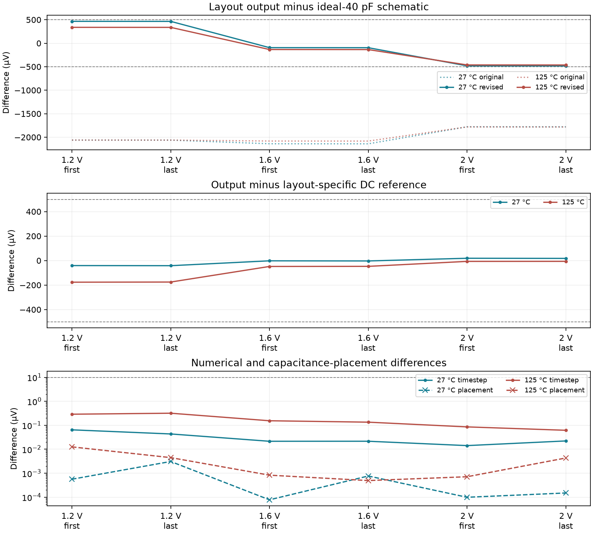

# Physical capture column qualified — 2026-09-25

**The isolated physical column passes the nominal/hot tracking, timestep and
capacitance-placement checks.** All 48 single-model transients finish through
2.7 ms. Worst tracking error is 176.560 µV against
500 µV; 100→50 ns difference is 0.318 µV
against 10 µV. This is a conditional single-column result, not full-array qualification.

| Temperature | Tracking error (µV) | Layout–schematic shift (µV) | Timestep difference (µV) | Placement difference (µV) |
|---|---:|---:|---:|---:|
| 27 °C | 41.826 | 482.228 | 0.064 | 0.0031 |
| 125 °C | 176.560 | 462.904 | 0.318 | 0.0125 |



## What resolved the transient blocker

The schematic column and the physical-capacitor schematic both finish in about
one second when tested alone. KLU completes the resistance-only control but is
very slow with the capacitance-only and full-RC controls. **SPARSE completes the
unchanged full-RC column**, with the original error tolerances. The accepted
workflow runs each model independently, with identical external input, supply,
control sources, reference fixture and ADC load. It does not combine four models
on a shared reference as the earlier failed fixture did.

This establishes solver/fixture sensitivity, not a proven KLU defect or a hardware
failure. The accepted runs retain every extracted resistor and the previously
documented COL-shunt capacitance approximation.
Schematic KLU/SPARSE controls agree within 0.1 nV at the checked nominal point.
Earlier incomplete and failed attempts are preserved separately.

## Physical routing and transfer fidelity

The revised column uses 2 µm supply rails, 1.2 µm current-carrying supply branches,
distributed contact/via landings, and 0.6 µm buffer/output rails. All seven MOS
devices and eight 64 × 38.880 µm MIM plates are unchanged: the direct-device
netlist is byte-identical to the original column. Magic and KLayout main DRC
report zero errors; both direct and resistor-collapsed LVS match uniquely.
The original cell's largest layout–schematic shift was
2140.397 µV; the selected revision's is
482.228 µV.

Tracking error and transfer shift are separate measurements. Tracking compares
the transient to an independently solved DC reference **for the same physical
column**, with the capture/mux/acquisition paths closed at the imposed input.
Transfer shift compares its transient output with the ideal-40 pF schematic under
the same external stimulus and bias fixture. The additional 500 µV schematic
comparison screen passes: **True**.

The supply-only revision's largest shift was 611.384 µV. A 2 µm output-rail
candidate reduced the high-input shift but raised the low-input shift to
580.851 µV. The selected intermediate width balances those measured deviations.
All three routing candidates pass tracking/refinement, but only the selected
revision passes this additional comparison band over the tested input levels.
Its margin to that band is limited; broader process/wire/load corners remain open.

Development routing revisions with DRC failures or an LVS-detected buffer-node
short were excluded. Passing DRC alone did not qualify those candidates.

## Checks and limits

- Typical process; device temperatures 27/125 °C; input levels 1.2/1.6/2.0 V.
- One simultaneous capture, followed by first and last readout slots. Capture at
  1.4 ms, 20 µs slots, 10 µs acquisition, 100 pF board and 20 pF sample loads.
- 500 kΩ BIAS / 12.4 kΩ PREF schematic reference fixture; 100 Ω behavioral
  control drivers. Actual driver and shared reference layout remain open.
- Four independently simulated models per condition: ideal schematic,
  physical-capacitor schematic, extracted RC with near/far COL shunt placement.
- Every transient is finite, time-monotonic and complete; sampled controls pass.
  The audit verifies the actual maximum timesteps and recomputes every sample.
- Thirty-six DC solves use 200/400 µs transient-fallback limits. They converge
  directly, so their equality is **not** a doubled transient-settling test.
- The raw extraction's negative COL-shunt corrections remain archived. Diagnostic
  models retain all 79 resistors, conserve total COL shunt
  capacitance and place its positive sum at either end. Worst sampled sensitivity:
  0.0125 µV. This checks these terminal conditions;
  it is not a general proof that distributed capacitance can always be lumped.
- MIM capacitance/leakage controls from the earlier stage still apply because the
  direct-device netlist is unchanged. The conditional 2 fF option remains
  unselected for manufacturing; its voltage-dependence expressions are inactive.

Both temperatures use nominal wire RC. There is no physical pixel attached to
COL in this fixture, no 64-column shared bus or peripheral supply grid, no
repeated/multirow capture, no noise/mismatch or full startup qualification.
Main DRC excludes antenna/density/CUP; no optical aperture is placed in this cell.
No release GDS, carrier, commit or push changed.

## Next and reproduction

Implement the 64-column bank with physical common supply/return, capture clocks,
bias/reference routes and output bus, then couple it to the already extracted
row. Recheck routing/loading, capture acquisition and all 64 outputs before
multirow operation and real drivers. Frame rate remains undecided.

Selected physical evidence: `build/capture-column-routed-v8-20260925`.
Selected electrical evidence: `build/capture-column-matrix-routed-v8-20260925`.
The earlier matrix remains in `build/capture-column-matrix-v2-20260925`.

```sh
bash scripts/run-tools.sh python3 scripts/qualify-capture-column.py \
  --extraction build/capture-column-routed-v8-20260925 --out build/capture-column-new-matrix
bash scripts/run-tools.sh python3 scripts/audit-capture-column-matrix.py \
  --run build/capture-column-new-matrix
```

Use a fresh output directory. All input models, runner snapshots, successful and
excluded experiments are retained in `checkpoints/capture-column-qualification/`.
Machine-readable results: `simulations/capture-column-qualification.json`.
