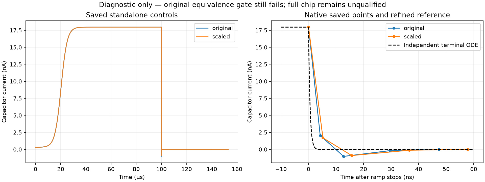
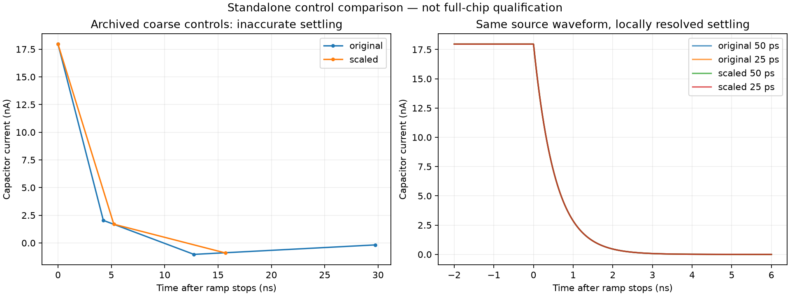

# Complete-chip electrical qualification: capacitor-control resolution audit

Recorded **2026-09-19 09:16 PDT**. **Full-chip qualification remains open.** No chip geometry or PDK file changed.

## What we learned

The previous 2.708 nA original/scaled control difference is concentrated just after the 100 µs supply-ramp stop. An independent stiff ODE integration of the exact standalone terminal equation shows native-point current errors of 2.033 nA (original) and 1.692 nA (scaled). This is not merely interpolation between different time grids. The capacitor's high-voltage RC time constant is only **0.544 ns**, compared with the archived maximum step of 100 ns.

The reference integrates `C(Vg) dVg/dt = (Vs − Vg)/1000`, using the actual typical-corner equation and unchanged source. Its state is the resistor voltage drop to avoid cancellation. Two reference accuracies agree to 0.0177 pA on the comparison grid. This is an independent numerical reference, not a foundry validation.



## Bounded new test and results

Inserted collinear PWL source points at **50 ps and 25 ps**, from 99.995 to 100.030 µs. These points preserve the original piecewise-linear waveform but give ngspice breakpoints around the short transient. Model equations, source resistance, simulator method/tolerances, and the original 100 pA current / 10 µV voltage comparison limits were retained. Exactly four controls ran; no retries or parameter search.

| Matched pair | Maximum pairwise current difference | Maximum native-point error versus reference | Existing current gate |
|---|---:|---:|---|
| 50 ps local spacing | 1.493 pA | 2.874 pA | Pass |
| 25 ps local spacing | 1.493 pA | 2.874 pA | Pass |

Original and scaled resolution comparisons are also checked against 100 pA. All edge samples remain included; the ramp-stop interval is not excluded from acceptance.



**Gated extracted-clamp result:** Completed; still requires refinement, equivalence and full-chip regression.

The clamp diagnostic used the prior 50 ns deck and the previously proposed internally rescaled capacitor. It did not inherit the standalone's added PWL points, change physical parasitics or relax tolerances. Its watchdog was 120 seconds. No further runs are authorized by this script after that bounded trial.

## Charge bookkeeping and limits

Integrating the source current from zero and comparing against the analytic integral of C(V) gives a maximum relative charge residual of 4.25e-08 across the four saved controls. This includes output-grid quadrature error and does not establish general terminal charge equivalence, other corners or full-clamp behavior. Exact values and waveform hashes are in [the JSON results](../simulations/clamp-control-breakpoints.json).

**No accepted full-chip fix.** Passing the standalone gate only removes a false lead from the earlier coarse comparison. Full-clamp completion/refinement, both parasitic placements, final post-fill extraction, startup, repeated frames, PVT and external-load qualification remain required. ESD robustness is not established by these transients.

## Next concrete gate

Review this new evidence with the existing extracted-clamp reproducer. If the gated clamp remains incomplete, do not treat the control success as a reason for additional blind solver sweeps. Obtain a specific supported diagnosis of the extracted fixture before promoting a model change. The independent reviewer has not been contacted; the public issue remains a local draft.

## Reproduction

```bash
bash scripts/run-tools.sh python3 scripts/audit-clamp-control-reference.py
bash scripts/run-tools.sh python3 scripts/check-clamp-control-breakpoints.py
bash scripts/run-tools.sh python3 scripts/report-clamp-control-breakpoints.py
```

The second command has the fixed five-run maximum described above. The first analyses saved traces only. [Archived evidence](../checkpoints/clamp-control-reference/evidence.tar.gz).

Background: [ngspice manual, transient options and PWL sources](https://ngspice.sourceforge.io/docs/ngspice-manual.pdf). The measured errors and conclusions above come from the local traces and independent terminal equation, not from a claimed upstream bug report.
