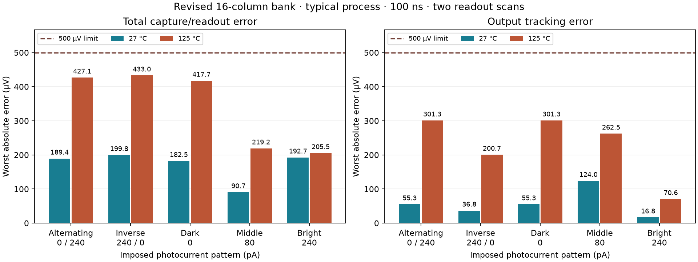

# Revised 16-column bank: thermal, pattern and selected sensitivity screens

**All selected checks pass:** 432.966 µV worst total capture/readout error and
301.658 µV output tracking, both below 500 µV. Alternating-pattern 100→50 ns
comparisons reach 0.220 µV nominal and 0.449 µV hot. Joint far-placement changes
remain below 0.122 µV at HOLD and 0.156 µV at STORE. Contrast and brightness
ordering also pass. The separate mixed-versus-uniform output response reaches
88.972 µV; it has no assigned acceptance threshold.

The [overview](overview.html#compact-bank-16-screen) and
[machine-readable report](../simulations/compact-bank-16-screen.json) record the
results and hashes of 2,453 evidence files. This continuation adds 13 new
transients and 528 new references to the retained nominal control.



The overview retains the [original failure and ground-bus correction](compact-bank-16.md)
as a separate, dated comparison. The physical layout remains
`build/compact-bank-c16-ground8-20260927`; both main DRC checks and both LVS paths
passed before these simulations.

This screen requires 14 complete transients, including the previously completed
nominal control. Twelve cases have 48 independent references each (576 total).
The selected scope is:

- Five imposed photocurrent patterns at 27 and 125 °C, using 100 ns steps:
  alternating 0/240 pA, inverse 240/0 pA, uniform dark 0 pA, middle 80 pA and
  bright 240 pA. Each case captures once and scans all columns twice over 3 ms.
- An additional 50 ns alternating-pattern run at each temperature for timestep
  comparison. Every new capture/output reference is independently simulated.
- Two alternating-pattern transients with all 19 audited shunts placed at their
  far nodes. These preserve each net's total capacitance. They measure placement
  sensitivity and do not carry independent accuracy-reference claims.

The circuit, devices, extracted positive parasitics, KLU/trapezoidal solver and
finite-resistance current-form drivers retain the previous settings. The accuracy
limits remain 500 µV for capture/readout and output tracking. The selected
timestep and placement comparison limit is 10 µV, matching the earlier bank
development criteria. Contrast and uniform-brightness ordering are also checked.
Pattern-dependent integrated response is recorded separately without assigning
an accuracy threshold.

## Sampling and evidence checks

`trace_sampler` locates the two saved records bracketing a requested time and
applies the same NumPy interpolation there. This avoids copying whole strided
waveforms for every signal. Two regressions compare nonuniform interpolation,
endpoints and every archived capture/readout/reset-window value from the nominal
16-column and hot two-column controls; all values match exactly. The first hot
100 ns and nominal 50 ns runs began before this optimization and retain their
original runner snapshots.

The report reopens each binary trace and checks finiteness, monotonic time,
duration, maximum timestep, model/deck hashes and every recorded capture/readout
value. It reopens all independent DC outputs and recomputes every error. The
evidence inventory includes the actual layout, models, decks, traces, logs,
runner snapshots and results. Full-trace VDD/BIAS/PREF port ranges are retained;
all local supply/reference-drop measurements remain a separate task.

## Reproduction

The sampling regression can be reproduced against the retained controls:

```sh
bash scripts/run-tools.sh python3 scripts/test-compact-bank-sampling.py \
  --run build/compact-bank-c16-ground8-nominal-20260927 \
  --run build/compact-bank-c2-hot-klu-20260927
```

Use fresh output directories; preserve the previous controls. Commands below
refer to the retained evidence set. To reproduce the illumination batch:

```sh
bash scripts/run-tools.sh python3 scripts/screen-bank-patterns.py \
  --layout build/compact-bank-c16-ground8-20260927 \
  --out build/compact-bank-c16-ground8-patterns-new --workers 3
```

Use `simulate-compact-bank.py` for each alternating case. Set `--temperature` to
27 or 125 and `--step-ns` to 100 or 50; use a distinct `--out` for every run:

```sh
bank_lights=$(python3 -c "print(','.join(['0','240']*8))")
bash scripts/run-tools.sh python3 scripts/simulate-compact-bank.py \
  --layout build/compact-bank-c16-ground8-20260927 \
  --out build/compact-bank-c16-ground8-alt-125-50-new \
  --lights-pa "$bank_lights" --temperature 125 --step-ns 50 \
  --solver klu --timeout 1200 --reference-workers 2
```

For each joint far-placement case, use `--step-ns 100 --model rc-far
--transient-only` at the matching temperature. These runs intentionally omit
DC references; the report compares their saved HOLD and STORE voltages with the
matching `rc-port` case.

Regenerate the report from the retained evidence:

```sh
bash scripts/run-tools.sh python3 scripts/report-bank-16-screen.py \
  --layout build/compact-bank-c16-ground8-20260927 \
  --run build/compact-bank-c16-ground8-nominal-20260927 \
  --run build/compact-bank-c16-ground8-hot100-20260927 \
  --run build/compact-bank-c16-ground8-nominal50-20260927 \
  --run build/compact-bank-c16-ground8-hot50-20260927 \
  --run build/compact-bank-c16-ground8-far100-20260927 \
  --run build/compact-bank-c16-ground8-hotfar100-20260927 \
  --batch build/compact-bank-c16-ground8-patterns-20260927
bash scripts/run-tools.sh python3 scripts/plot-bank-16-screen.py
python3 scripts/update-overview-sections.py
```

For a fresh reproduction, replace all directory arguments consistently. The
report requires the exact selected 14-case set and cannot turn missing cases
into a pass. The pattern batch gives each transient/reference a 1,200-second
watchdog and each whole case a 2,400-second process-group watchdog. Failures and
partial results remain in their directories. Accuracy failures are reported
separately from simulator completion.

## Remaining gates

This is a selected development screen, not full 16-column qualification.
Individual shunt placements, other-pattern timestep refinement, corresponding
schematic comparisons, process/wire/supply corners and remaining supply/reference
checks are still required. The joint far-placement result is not proof that
every individual placement is harmless.

The correction has not been applied to the 64-column bank. Full-bank checks,
real decoding/drivers, repeated-row operation, the assembled 64×64 layout and
manufacturing release gates remain ahead. Raw evidence is local under `build/`;
tracked hashes do not constitute a backup of those files.
