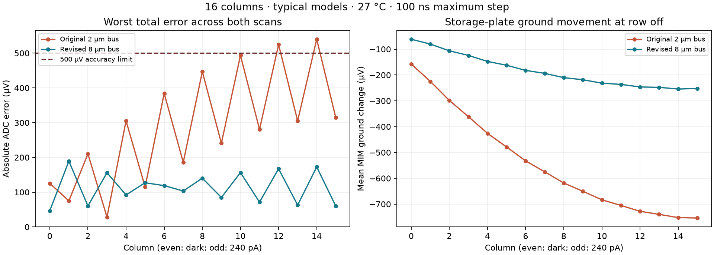

# 16-column trace reference qualification — 2026-09-27

The completed nominal transient in
`build/compact-bank-c16-complete-klu-20260927` is the source for a new
independent-reference pass. It uses the physically verified compact 16-column
bank, typical process models, 27 °C, alternating 0/240 pA illumination and a
200 ns maximum timestep. It captures once and reads each column twice, ending
at 3 ms. KLU, trapezoidal integration and the original finite-resistance
current-form drivers are retained.

The [overview](overview.html#compact-bank-16) and
[machine-readable report](../simulations/compact-bank-16-qualification.json)
record the final accuracy results and all 32 output samples.

## Revised physical ground bus

**The revised nominal screen passes:** 189.413 µV worst total capture/readout
error and 55.267 µV output tracking, both below the unchanged 500 µV limits.
All 48 independent references and the complete 3 ms, 100 ns transient finish.
Only the physical M4 ground bus is widened, from 2 to 8 µm. Both main DRC checks
and both LVS paths pass; a direct GDS layer-difference audit confirms the sole
rectangle change. The independent schematic and all devices remain unchanged.
The new layout is re-extracted; its parasitics are retained in simulation.



This dated checkpoint passes one typical-process, 27 °C alternating-pattern
screen. The [later thermal/pattern follow-up](compact-bank-16-screen.md) expands
the evidence to five patterns at 27/125 °C, including revised-bank alternating
refinement and joint far-placement controls. Individual placements, other-pattern
refinement, schematic/corner and remaining supply/reference checks remain open.
No 64-column routing change or full-chip qualification is implied.

## Accuracy result

The original 200 ns trace **fails** the 500 µV capture/readout criterion:
540.016 µV worst total error, at dark column 14 in the late scan. Columns 12
and 14 fail both scans. Output tracking passes at 54.198 µV worst error.
All 16 capture references and 32 output references complete successfully;
simulation completion is distinct from accuracy qualification.

Event windows show that row deselection at 1.402 ms is the largest storage
change, increasing along the bank. At column 14, STORE moves −788.750 µV
across the row-off window, compared with −56.444 µV around capture opening,
+0.852 µV around pixel reset and −0.953 µV between its two read samples.
The storage changes are port-voltage differences, not ADC errors; the
reference report computes the total ADC error separately.

Three selected reference solves were repeated with a 1 ms fallback endpoint,
extended from 400 µs: capture14, first0-output and last14-output. Their maximum
saved-voltage change is 0.000136241 µV. Capture14 converges directly; the
other two use transient operating-point fallback. This selected check does
not identify reference settling as the cause of the accuracy failure.

The independent 100 ns rerun confirms the original failure: **540.185 µV**
worst total error and 54.425 µV output tracking. The maximum change across
matching saved sample voltages is 0.185 µV. It completes 3 ms and all 48 references.
Physical probes at column 14 show the mean MIM ground dropping 752.243 µV when
the row turns off; voltage across the MIM plates changes only 36.507 µV,
while STORE moves 788.750 µV. This localizes most of the row-off port-voltage
change to ground movement rather than loss of voltage across the storage plates.
The numerical comparison samples the same terminals/times; it is not an
all-time waveform norm or a process/corner qualification.

## Audited reuse

`--reuse-transient` requires an existing evidence manifest. The helper verifies
previous hashes for the source result, model, simulator initialization, saved
runner/reader, transient deck, execution record, log and binary trace. It also
requires compatible settings and an identical regenerated fixture, allowing
only the output-directory-dependent tile include to change. Old reports that
predate the explicit method field retain their implicit trapezoidal default;
the exact fixture comparison remains mandatory.

The source run is untouched. Independent copies of its transient files retain
their original hashes; `regenerated-transient.spice` records the matching new
fixture. The trace is checked again for finite data, monotonic time, recorded
point count, start/end times, maximum timestep and valid sample-time controls.
The new run records the source manifest hash and every verified source hash.

Sixteen new capture references freeze the local pixel sense voltage just before
capture opens. Thirty-two new output references separately freeze the sampled
storage voltage at each readout instant. These use the same physical circuit
and the existing 400 µs transient-OP reference setting. Up to four independent
ngspice processes run concurrently; each retains a 180-second watchdog and its
own deck, log and DC trace. Progress is saved after each completed reference.
Parallelism does not enable multithreaded ngspice solves or change tolerances.

The report checks each reference deck hash and execution record, parses the
single-point binary DC output, compares every reported reference voltage to it,
and recomputes the signed capture/readout and output-tracking errors.

## Regression and limits

The previously qualified hot two-column case is reused as a control. Its saved
samples, capture state and six newly computed reference results match the
original exactly. Eight tests reject changed traces, missing prior hashes,
changed fixtures/models, mismatched settings and incomplete runs, and cover
legacy defaults. Four schedule tests and two partial-trace tests also pass.
The initial control attempt rejected a missing legacy method field before
launching references; it remains in the local build evidence.

This qualification attempt addresses **the nominal alternating-pattern trace only**.
It does not qualify hot operation, other illumination patterns, shunt
placements, process/wire corners, all supply/reference drops,
repeated rows or real decoding/drivers. A complete 64×64 assembly and exact-chip
manufacturing qualification remain separate gates. The 16-column physical
control has 162 MOS, 128 MIM plates and 16 diodes; its main DRC and both LVS paths
were checked before this reference pass.

## Reproduction

Use a fresh output directory. Keep the prior manifest and its source files;
hashes alone do not restore missing generated artifacts on a fresh clone.

```sh
python3 scripts/test-compact-bank-reuse.py
bank_lights=$(python3 -c "print(','.join(['0','240']*8))")
bash scripts/run-tools.sh python3 scripts/simulate-compact-bank.py \
  --layout build/compact-bank-c16-v1-20260927 \
  --out build/compact-bank-c16-references-new \
  --lights-pa "$bank_lights" --solver klu --step-ns 200 --timeout 180 \
  --reuse-transient build/compact-bank-c16-complete-klu-20260927 \
  --reuse-manifest simulations/compact-bank-solver-20260927.json \
  --reference-workers 4
```

Regenerate the current report from the retained evidence below. For a fresh
reproduction, also generate matching refinement, event, settling and revised
runs, then substitute their directories consistently.

```sh
python3 scripts/report-compact-bank-16.py \
  --run build/compact-bank-c16-references-klu-20260927 \
  --control build/compact-bank-c2-reuse-control-v2-20260927 \
  --original-control build/compact-bank-c2-hot-klu-20260927 \
  --refined build/compact-bank-c16-refined-klu-20260927 \
  --events build/compact-bank-c16-refined-events-20260927 \
  --settling build/compact-bank-c16-reference-settling-20260927 \
  --candidate build/compact-bank-c16-ground8-nominal-20260927 \
  --candidate-layout build/compact-bank-c16-ground8-20260927 \
  --candidate-events build/compact-bank-c16-ground8-events-20260927 \
  --geometry-audit build/compact-bank-c16-ground8-geometry-audit-20260927
bash scripts/run-tools.sh python3 scripts/plot-compact-bank-16.py
python3 scripts/update-overview-sections.py
```

Raw models, traces and reference outputs remain local in `build/`. Reports and
hash inventories are tracked source material; they are not an external backup.

The refined and revised runs are separate fresh transients (not reused from the
original). To reproduce them in fresh directories, run the same fixture with
`--step-ns 100 --timeout 900 --reference-workers 4 --save-mim-terminals` and
omit both reuse arguments. Use the original layout for refinement. Build the
routing revision with:

```sh
bash scripts/run-tools.sh python3 scripts/build-compact-bank.py \
  --columns 16 --ground-bus-width-um 8 --out build/compact-bank-c16-ground8-new
```

Then simulate its new layout directory. Analyze each completed trace with
`scripts/diagnose-compact-bank-events.py --run RUN --out NEW_EVENTS` inside the
tools container. The selected reference convergence control is reproduced with:

```sh
bash scripts/run-tools.sh python3 scripts/check-compact-bank-reference-settling.py \
  --run build/compact-bank-c16-references-new \
  --out build/compact-bank-c16-reference-settling-new \
  --references capture14-reference first0-output-reference last14-output-reference
```

The report's inputs must identify a matching original/refined/revised set.
Retain the old manifest unchanged: regenerating it would invalidate the
provenance attached to the reused trace.

Audit the original and revised GDS layer difference with:

```sh
bash scripts/run-tools.sh python3 scripts/audit-compact-bank-ground.py \
  --original build/compact-bank-c16-v1-20260927 \
  --revised build/compact-bank-c16-ground8-new --out build/ground8-audit-new
```

 It requires the exact intended M4
rectangle difference, identical labels/other layers and a byte-identical
independent reference netlist. The revised 16-column bounding box is
709.56 × 978.28 µm (1.8 µm wider); all devices, optical openings and storage-plate
geometry are unchanged. The 64-column layout has not been revised in this step.
