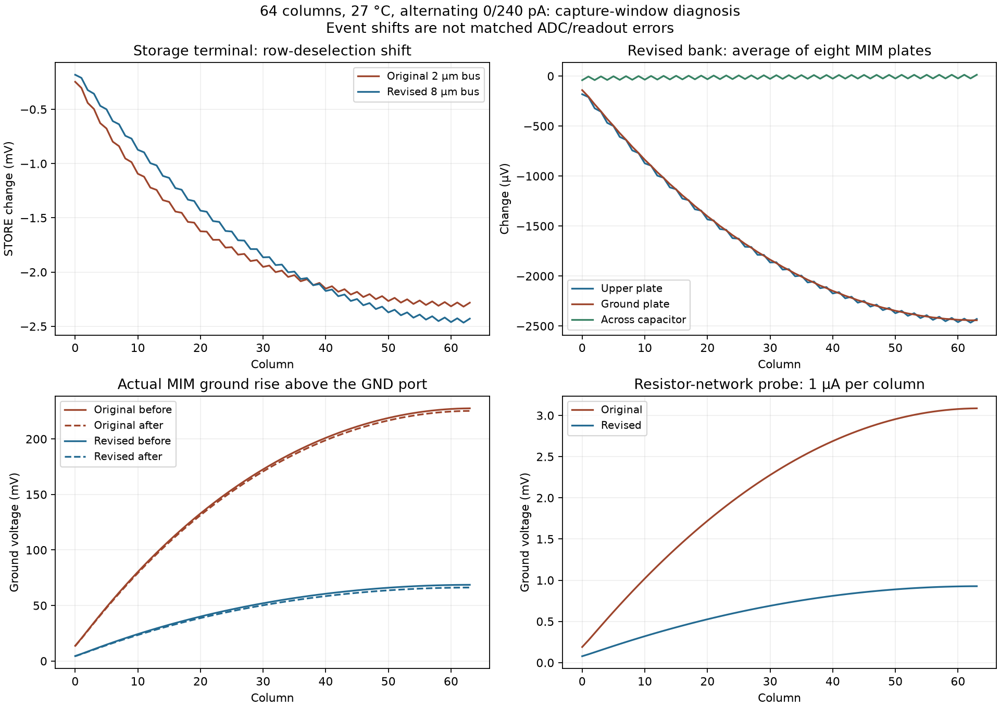

# 64-column 8 µm ground-bus candidate

Both main DRC checks and both LVS paths pass. The independent reference remains
byte-identical, and a complete GDS XOR audit restricts the change to the intended
M4 ground rectangle. Device census: 642 MOS, 512 MIM plates,
64 diodes. Size: 2629.56 × 978.28 µm,
within the 2700 × 1100 µm local budget.

The nominal alternating 0/240 pA capture diagnostic completes 1.405 ms with
200 ns steps in 262.4 s.
It saves actual MIM terminal voltages and stops before the first output selection.
The original 900 s full-run timeout is preserved. Its fully recorded early window
is used only for event diagnosis, after verifying all nine archived file hashes.

Worst row-off STORE movement changes from 2318.152 to 2465.987 µV.
At the revised worst column 62, average MIM ground/across-capacitor changes are
-2442.608/-23.379 µV. These are event shifts, not matched ADC errors.
There are no full-bank sample references or electrical accuracy claims here.

The 200→100 ns comparison changes common saved event terminals by at most
0.258784 µV (10 µV diagnostic comparison limit;
passes). A fresh original-layout capture
with physical probes reproduces its earlier prefix within 0.003237 µV.
The maximum actual pre-row-off MIM ground rise changes from 227.588
to 68.647 mV. The 64-column candidate is not established as an
electrical correction: the row-off STORE shift is slightly larger.

The separate [ground-network calculation](../simulations/compact-bank-ground-network-20260927.json)
shows that far-end self-resistance falls from 129.175
to 63.930 Ω. Uniform 1 µA-per-column probes give
3086.002/927.705 µV
maximum original/revised ground rise. These are artificial test currents,
not measured operating currents. Both 16- and 64-column network comparisons
pass residual, reciprocity and positive-energy checks; widening reduces
resistive energy for the sampled MIM terminal current basis.



## Reproduce with fresh output directories

```sh
bash scripts/run-tools.sh python3 scripts/build-compact-bank.py \
  --columns 64 --ground-bus-width-um 8 \
  --out build/compact-bank-c64-ground8-new
bash scripts/run-tools.sh python3 scripts/audit-bank-ground-scaling.py \
  --original build/compact-bank-c64-v1-20260926 \
  --revised build/compact-bank-c64-ground8-new \
  --out build/compact-bank-c64-ground8-geometry-new
bank_capture_lights=$(python3 -c "print(','.join(['0','240']*32))")
bash scripts/run-tools.sh python3 scripts/simulate-compact-bank.py \
  --layout build/compact-bank-c64-ground8-new \
  --out build/compact-bank-c64-ground8-capture-new \
  --lights-pa "$bank_capture_lights" --temperature 27 --step-ns 200 \
  --phase capture --solver klu --timeout 1200 --save-mim-terminals
```

Repeat the capture command with 100 ns and a separate output directory for
refinement. Repeat the 200 ns command using the original
`build/compact-bank-c64-v1-20260926` layout and another fresh directory for
the original-layout MIM-probe control. All three use the same illumination,
temperature, strict settings and physical terminal saves.

Audit and render the retained evidence:

```sh
bash scripts/run-tools.sh python3 scripts/report-bank-64-ground8.py \
  --layout build/compact-bank-c64-ground8-20260927 \
  --geometry build/compact-bank-c64-ground8-geometry-audit-20260927 \
  --run build/compact-bank-c64-ground8-capture-20260927 \
  --refined build/compact-bank-c64-ground8-capture100-20260927 \
  --original-probed build/compact-bank-c64-original-capture-probes-20260927
bash scripts/run-tools.sh python3 scripts/render-bank-64-ground8.py
python3 scripts/update-overview-sections.py
```

## Next full-run budget and limits

The original readout phase observed 14/128 scheduled readout instants. Extrapolating
that phase gives 99 minutes for a complete transient; allow a 10,800 s
watchdog and additional time for 192 independent references. Routing and
concurrency affect runtime, so this is a planning estimate only.

The [subsequent matched far-column readout](compact-bank-64-read-probes.md)
quantifies the output error and compares a distributed ground-return candidate.
The improved resistor network alone does not establish an electrical fix.
Complete the remaining 16-column scope and then qualify complete 64-column
readout, nominal/hot patterns, refinement, placements and local supply/reference
drops. Main DRC excludes density/antenna/cup; this is an unfilled development
block with external resistors, behavioral drivers and an external ADC fixture.
Exact-chip fit, real controls, repeated rows, final power/pads, optical packaging
and provider prechecks remain open. The bank already has one pixel row; add 63
rows for the 4096-pixel chip.

[Overview](overview.html#compact-bank-64-ground8) ·
[Evidence report](../simulations/compact-bank-64-ground8.json)
