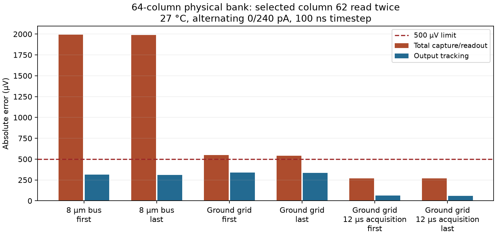

# Selected far-column readout with the physical 64-column bank

The 8 µm-bus control **fails** at 1994.440 µV total capture/readout error
(500 µV limit), while output tracking passes at 315.720 µV. Column 62 is
selected twice with every physical column and load retained. Three independent
matched-state references are checked; this is not the complete 128-read schedule.

The distributed-return candidate **fails the selected diagnostic with 10 µs acquisition**:
547.178 µV worst total error and 340.253 µV tracking. Both main DRC checks and
both LVS paths pass. The GDS audit restricts the change to 647 recorded ground
metal/via rectangles on layers 46/0, 41/0 and 81/0, including 192 via4 cuts.
Labels, reference circuit and device census are unchanged. Size is
2667.87 × 1069.80 µm within the local
2700 × 1100 µm budget. Optical apertures remain clear.

The extracted resistor-network diagnostic reduces far-column self resistance from 63.930 to 11.076 Ω. Artificial uniform 1 µA-per-column injection gives a maximum ground rise of 927.705 → 153.163 µV. These test currents characterize the wiring; they are not simulated operating device currents.

[Network evidence](../simulations/compact-bank-ground-grid-network-20260927.json).

Subtracting output tracking from total error leaves at most 207.745 µV between the matched stored-state output reference and the capture reference. This reference difference is separate from the 340 µV output-settling error; it is not a direct measurement of a single physical error mechanism.

With acquisition extended from 10 to 12 µs, the same ground-grid bank passes this selected diagnostic at 269.281 µV total error and 62.529 µV tracking. Only the ACQ falling edges move by 2 µs; samples move to 1.423999 and 2.683999 ms. Reset and selection windows, all physical loads, model parameters and tolerances are unchanged. Saved terminal comparisons before the first modified edge differ by at most 0.259454 µV. The 20 µs slot length is unchanged, but this is still a one-column diagnostic with behavioral ADC controls.

[Audited timing result](../simulations/compact-bank-64-acquisition12.json).



## Reproduction

Use a fresh directory for each experiment:

```sh
bash scripts/run-tools.sh python3 scripts/probe-bank-readout.py \
  --layout build/compact-bank-c64-ground8-20260927 \
  --out build/compact-bank-c64-selected-read-new \
  --column 62 --step-ns 100 --temperature 27 --timeout 1800
bash scripts/run-tools.sh python3 scripts/report-bank-far-read.py \
  --run build/compact-bank-c64-ground8-far-read-20260927
```

For the grid candidate, use `build/compact-bank-c64-ground-grid-20260927`
as the layout, a fresh run directory, and a separate audit `--out` path such as
`simulations/compact-bank-64-ground-grid-read.json`. Do not overwrite controls.

Build and check the distributed return:

```sh
bash scripts/run-tools.sh python3 scripts/build-compact-bank.py \
  --columns 64 --ground-bus-width-um 8 --ground-return-grid \
  --out build/compact-bank-c64-ground-grid-new
bash scripts/run-tools.sh python3 scripts/audit-bank-ground-grid.py \
  --original build/compact-bank-c64-ground8-20260927 \
  --revised build/compact-bank-c64-ground-grid-20260927 \
  --out build/compact-bank-c64-ground-grid-geometry-new
```

The rails are 24 µm wide, below the installed PDK's 30 µm unslotted-metal
threshold. Main DRC still excludes density, antenna and cup checks; no release
qualification is implied. The ground-plate connection location is specific to
the verified compact 40 µm-pitch column with 32 × 77.76 µm MIM plates.

Reference-generator regression:

```sh
bash scripts/run-tools.sh python3 scripts/test-bank-probe-references.py \
  --layout build/compact-bank-c16-ground8-20260927 \
  --run build/compact-bank-c16-ground8-nominal-20260927 \
  --run build/compact-bank-c16-ground8-patterns-20260927/inverse-125
bash scripts/run-tools.sh python3 scripts/render-bank-read-probes.py
python3 scripts/update-overview-sections.py
```

All 96 generated decks match the archived reference decks exactly. The readout
wrapper snapshots itself and records the modified schedule explicitly. The
independent auditor reopens all binary traces and DC outputs and checks the
reference clamp voltages and every recorded error. The selected transient has
a 1,800 s watchdog, as does each of its three references.

The complete 64-column schedule, 192 references, nominal/hot illumination,
refinement and placement/corner checks remain open. Bias/supply measurements,
repeated rows, real decoding/drivers, 64×64 assembly and provider release gates
remain necessary. Full-bank and manufacturing qualification flags stay false.

The 12 µs acquisition diagnostic uses the audited ground-grid run as its
source and proves that only the two ACQ falling edges and the include path
change. All three references are solved again at the new sample instants.
It rechecks the raw traces, reference clamp decks, source evidence hashes and
unchanged waveform prefix. Reproduce in a fresh directory:

```sh
bash scripts/run-tools.sh python3 scripts/test-bank-acquisition-deck.py
bash scripts/run-tools.sh python3 scripts/probe-bank-acquisition.py \
  --out build/compact-bank-c64-grid-acquisition12-new
bash scripts/run-tools.sh python3 scripts/probe-bank-acquisition.py \
  --out build/compact-bank-c64-grid-acquisition12-new --audit-only
```

Do not silently apply this fixture timing to the full-bank runner. Expose and
regression-check the timing option, then qualify the complete schedule with
its own references, refinement and pattern/corner coverage.
