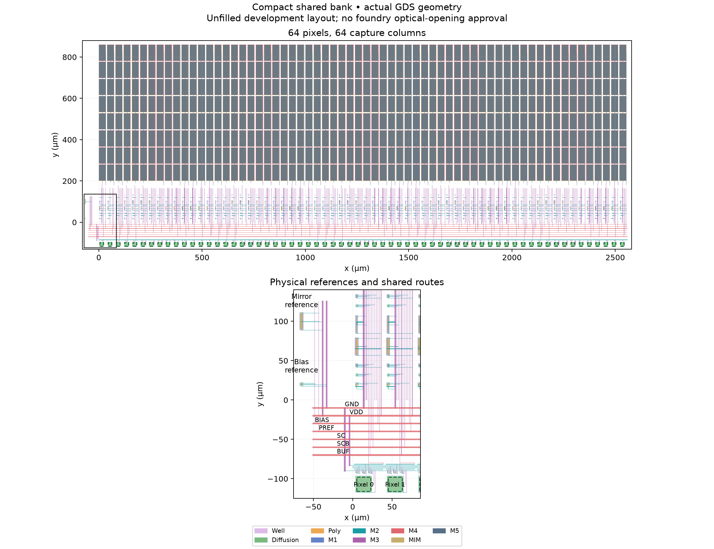

# Compact 64-column bank — 2026-09-26

**The compact 1×64 row and capture bank pass the scoped physical screen.**
Magic and KLayout main DRC each report zero violations, and both direct and
resistor-collapsed LVS match the independently assembled reference. Electrical
accuracy, full-bank supply sizing and repeated-frame behavior remain open.



The layout occupies **2627.76 × 978.28 µm**, including the joined pixel row,
shared buses and reference MOS. It fits the 2700 × 1100 µm bank planning envelope.
This is a local block fit, not a placed 64×64 chip or pad-ring fit. Each pixel
retains the geometric 18 × 18 µm metal-free aperture. Density, antenna, CUP and
run-approved optical openings are outside the main DRC screen; the MIM option
still needs run-specific confirmation.

The extracted device census is 642 MOS, 512 MIM and 64 diodes, with 9283
resistors and 7325 parasitic capacitors. The bank uses the unchanged compact
column and pixel cells at 40 µm pitch, with actual COL joins and shared
supply/reference/capture/output wiring. Reference resistors, control drivers
and the ADC fixture remain external. A passing connectivity check does not
establish acceptable voltage drops in these shared wires.

Audited shunt models conserve signed total capacitance on BIAS, all 64 COL
nets, SC and SCB. Every other extracted device/resistor/capacitor record is
retained. The raw negative-shunt extraction remains diagnostic; the existence
of 69 generated placements (all-port, all-far and each single-net-far) is not
an electrical placement-sensitivity pass.

## Readout schedule

The simulation runner now supports 2–64 columns. The first scan begins at
1.41 ms. At 64 columns the second scan begins at 2.69 ms, after the entire first
scan, and the transient ends at 3.98 ms. This fixes the overlap that the old
fixed 2.67 ms second-scan start would produce. Each scan uses 20 µs slots;
selection ends 16.01 µs after its slot starts. The schedule retains the existing
two-column times exactly.

Four standard-library tests cover every supported bank size, the 64-column
boundary, old two-column timing and invalid sizes. A hot two-column alternating
dark/bright transient completed with **zero difference in every saved sample**
against the previously qualified trace. This is a schedule regression, not a
64-column numerical qualification.

## Bounded electrical diagnosis

Two nominal 27 °C controls used alternating 0/240 pA pixels, a 200 ns maximum
step, unchanged solver tolerances and a 180-second watchdog each:

| Model | Complete samples | Last simulated time | Outcome |
|---|---:|---:|---|
| Extracted all-port shunts (`rc-port`) | 0 | — | Timed out during initialization after gmin/source stepping failed and transient OP started |
| Schematic (`reference`) | 76,919 | 1.785052 ms | Initialized and entered readout, but timed out before the 3.98 ms endpoint |

Neither attempt is an electrical pass. The physical log includes a singular
matrix warning on `selb19`; that is a diagnostic clue, not proof of the cause.
The schematic progress separates its run-time limit from the physical model's
initialization failure. No independent capture/output references were requested
for these incomplete controls. Do not increase the full-bank time limit without
a discriminating change: first localize initialization with smaller compact
banks or an audited algebraic resistor reduction of this new extraction.

Selected attempts: `build/compact-bank-c64-rc-port-screen-20260926` and
`build/compact-bank-c64-reference-screen-20260926`. The raw traces/logs and
model hashes are retained, including partial schematic progress.

## Reproduction and next step

Use fresh output directories. The selected geometry is
`build/compact-bank-c64-v1-20260926`.

```sh
python3 scripts/test-compact-bank-schedule.py
bash scripts/run-tools.sh python3 scripts/build-compact-bank.py \
  --columns 64 --out build/compact-bank-c64-new
bank_lights=$(python3 -c "print(','.join(['0','240']*32))")
bash scripts/run-tools.sh python3 scripts/simulate-compact-bank.py \
  --layout build/compact-bank-c64-new --out build/compact-bank-c64-screen-new \
  --lights-pa "$bank_lights" --step-ns 200 --timeout 180 --transient-only
```

Use `--model reference` with a separate output directory for the schematic
control. These are reproduction commands for the incomplete attempts above.

The two-column qualification matrix remains explicitly two-column. Do not use
it to claim the expanded bank is qualified. Next establish bounded full-bank
initialization/readout, then check all 64 matched capture/output references,
27/125 °C operation, 200→100 ns refinement, shared supply/reference behavior
and shunt-placement sensitivity. Repeated rows and real decoding/drivers follow.

Raw GDS, logs, models and waveforms are retained in local `build/` directories.
The [machine-readable report](../simulations/compact-bank-64.json) records their
hashes; this is not an external backup. Rebuild the geometry or obtain those
files separately on a fresh clone.

[Two-column electrical evidence](compact-bank.md) ·
[Completion plan](../COMPLETION_PLAN.md).
