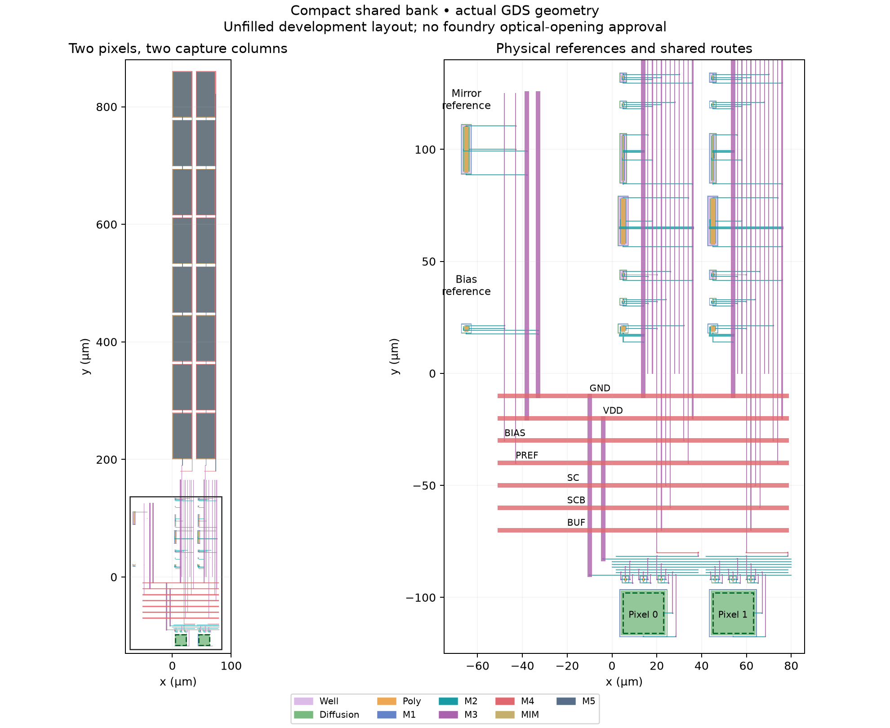

# Compact shared two-column bank — 2026-09-26

**The small shared-bank development screen passes.** Both main DRC checks and
both LVS paths pass, along with 100 transients and 240 independent DC references.
Worst capture/readout error is 419.033 µV
against the 500 µV limit. This establishes one simultaneous capture and two
reads per column on a two-column bank. The compact 1×64 bank remains next.



## Physical circuit

The unchanged 40 µm pixels and 40 pF compact capture columns now share actual
VDD/GND, BIAS/PREF, SC/SCB and BUF metal. Pixel row/reset/VRESET rails also
connect physically; each COL joins its own pixel to its capture column.
One diode-connected NMOS and one PMOS reference are placed outside the repeated
40 µm pitch. The reference resistors remain external fixtures.

Bounds: (−67.56, −117.8)–(80.2, 860.48) µm, or **147.76 × 978.28 µm**, including
reference devices, joins and both pixels. The independently assembled reference
matches 22 MOS, 16 MIM and two diode devices, including exact extracted device
parameters. The raw network contains 293 resistors and 257 capacitors.
Both Magic and KLayout main DRC report zero errors; direct and resistor-collapsed
LVS match. Each pixel's central 18 × 18 µm region is clear of M1–M5 metal.
Density, antenna, CUP and approved optical openings remain outside this screen;
the 2 fF MIM option still needs confirmation for the selected run.

## Shared capture and multiplexed readout

The matrix covers 27/125 °C, five imposed photocurrent pairs, 200/100 ns maximum
steps, and extracted/schematic controls. Patterns are dark/dark, dark/bright,
bright/dark, medium/medium and bright/bright (0/80/240 pA). Both columns give
the expected brightness order, including transitions in both contrast directions.
No measured optical response is assumed.

The fixture retains 3.3 V through 2 Ω, external 500 kΩ/12.4 kΩ bias resistors,
100 Ω behavioral control drivers, 100 pF board load and a 20 pF ADC sample
capacitor. Reference MOS are part of the physical bank extraction. Reset releases
at 220 µs; row selection starts at 1.2 ms and capture opens at 1.4 ms. Pixels are
deselected at 1.402 ms and reset at 1.403 ms. Column 0/1 first samples occur at
1.421999/1.441999 ms; late samples occur at 2.681999/2.701999 ms, with 20 µs
slots and 10 µs acquisition. The saved samples verify complementary controls
and that the other column is deselected.

| °C | Pixel photocurrents (pA) | Capture/readout (µV) | 200→100 ns (µV) | Placement (µV) | Layout–schematic response (mV) |
|---|---|---:|---:|---:|---:|
| 27 | 0, 0 | 102.086 | 0.199 | 0.0189 | 2.248 |
| 27 | 0, 240 | 148.353 | 0.203 | 0.0178 | 5.802 |
| 27 | 240, 0 | 144.916 | 0.142 | 0.0145 | 5.820 |
| 27 | 80, 80 | 24.799 | 0.294 | 0.0299 | 4.099 |
| 27 | 240, 240 | 147.729 | 0.090 | 0.0189 | 5.821 |
| 125 | 0, 0 | 419.033 | 0.424 | 0.0222 | 2.294 |
| 125 | 0, 240 | 418.107 | 0.431 | 0.0181 | 5.591 |
| 125 | 240, 0 | 324.723 | 0.369 | 0.0169 | 5.610 |
| 125 | 80, 80 | 203.554 | 0.394 | 0.0197 | 4.135 |
| 125 | 240, 240 | 170.524 | 0.202 | 0.0173 | 5.610 |

For each column, the capture reference freezes both pixels' local diode
voltages immediately before capture opens, closes row/capture and selects that
column's output, then solves DC. Separate output references freeze both STORE
voltages at each sampled time. Thus the total capture/readout metric and output
tracking metric use independently settled references for the same physical
circuit and imposed states. Worst output tracking is
281.163 µV. All 240 references complete;
0 require the available transient operating-point fallback.

The bare schematic's integrated response differs by up to
**5.821 mV**. Changing only the neighbor from
0 to 240 pA changes a selected physical output by up to
**26.670 µV**. These comparisons include shared bias,
supply and integrated pixel-state changes; they are separate from same-state
capture/readout accuracy and are not isolated capacitive crosstalk measurements.
Retain them in model/calibration and bank-scaling work. The first-to-late output
change reaches 125.861 µV over 1.26 ms. The observed
reset-window STORE change is at most 0.245 µV,
including natural drift rather than isolated causal reset feedthrough.

## Numerical and extraction limits

The raw extraction has 11 negative local shunt corrections. Audited models
conserve the signed total shunts on BIAS, COL0, COL1, SC and SCB while retaining
all resistors, devices and other capacitors. The collapsed capacitance matrix
is conserved within 1e−25 F. RST/VRESET need no negative-shunt approximation
in this two-column extraction. The raw model remains diagnostic.

Forty main transients include both timesteps and schematic controls. Sixty
additional 100 ns runs test all-five-far and each single-net-far placement.
Including the main all-port model, seven of the 32 binary placement combinations
are tested at each temperature/pattern. Worst output/storage placement changes
are 0.0299/0.0375 µV;
physical/schematic timestep differences are
0.431/0.409 µV,
all below 10 µV. Every transient and DC trace was independently read back;
completion, finiteness, maximum step, capture/sample values and reference
errors were checked. No UIC initialization or relaxed tolerances were used.

## Next and reproduction

Extend to a compact 1×64 row/bank with actual shared routing. Recheck supply
and reference drops, bus loading, all 64 outputs, independent references,
numerical refinement and shunt sensitivity before repeated multirow operation
and real decoders/drivers. This two-column initialization result does not resolve
the old full-bank timeouts or qualify full-bank loading, startup ramps, repeated
frames, process/wire corners or manufacturing release.

Selected layout: `build/compact-bank-c2-v1-20260926`.
Selected matrix: `build/compact-bank-c2-matrix-v1-20260926`. Use fresh directories:

```sh
bash scripts/run-tools.sh python3 scripts/build-compact-bank.py \
  --columns 2 --out build/compact-bank-new
bash scripts/run-tools.sh python3 scripts/qualify-compact-bank.py \
  --layout build/compact-bank-new --out build/compact-bank-matrix-new
python3 scripts/report-compact-bank.py \
  --layout build/compact-bank-new --matrix build/compact-bank-matrix-new
```

The builder accepts 2–64 columns; only the two-column geometry is qualified by
this evidence. The simulation driver supports 2–4 columns and the matrix above
is explicitly two-column. Do not label a larger generated bank qualified until
its corresponding physical and electrical checks have completed.

Docker Desktop was restored by launching its Windows application directly;
the CLI restart had waited for the active Ubuntu WSL processes and was cancelled.
The pinned container then completed these checks without changing Docker settings.

[Machine-readable evidence](../simulations/compact-bank.json) ·
[Checkpoint](../checkpoints/compact-bank/README.md) ·
[Single tile](compact-tile.md) · [Current plan](../COMPLETION_PLAN.md).
