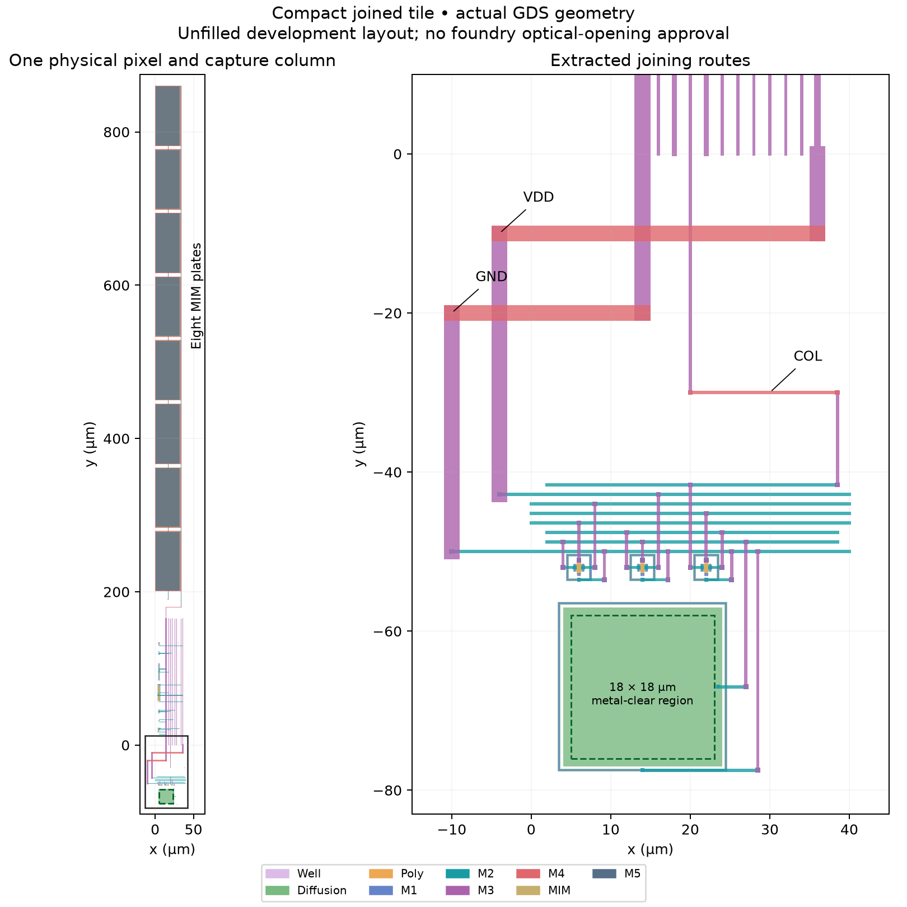

# Physically joined compact pixel/capture tile — 2026-09-26

**The first joined tile passes its scoped physical, capture/readout and numerical
checks.** All 54 transients and 72 independent DC reference solves complete.
Worst total capture/readout error is 419.404 µV
against 500 µV. This is one capture followed by two reads, not a demonstrated
64-column bank, repeated-frame camera or manufacturing pass.



## Physical evidence

The unchanged 40 µm pixel and selected compact 40 pF column are physically
connected through COL, VDD and GND routes. Their links are part of the same
flattened extraction, rather than ideal connections between separate models.
The tile contains 10 MOS devices, eight MIM devices and one 20 × 20 µm diode.
Both Magic and KLayout main DRC report zero errors; direct-device and
resistor-collapsed LVS match an independently assembled circuit reference.
The extraction retains all 133 resistors and the audited capacitance network.

Bounds are (−11, −77.8)–(40.2, 860.48) µm: 51.2 × 938.28 µm including
external feed trunks and the pixel. The building blocks retain their 40 µm
pitch; this single tile is not an implemented 64-column floorplan.
The central 18 × 18 µm pixel region remains free of M1–M5 metal. This geometric
audit is not foundry approval for passivation openings, optical fill or packaging.
Density, antenna and CUP decks are excluded; the 2 fF MIM option is conditional.

## Coupled electrical test

The fixture uses schematic shared references, 100 Ω behavioral control drivers,
a 3.3 V source with 2 Ω supply resistance, 100 pF board load and 20 pF ADC sample
capacitance. Typical device models use nominal wire RC at 27/125 °C. Imposed
photocurrents are 0/80/240 pA; no measured optical sensitivity is assumed.

Reset releases at 220 µs. Row selection starts at 1.2 ms; capture opens at
1.4 ms. The pixel is deselected at 1.402 ms and reset at 1.403 ms while the
column retains its captured value. Reads sample at 1.421999 and 2.681999 ms,
using 20 µs slots and 10 µs acquisition. All expected controls and samples pass.
Increasing photocurrent decreases the measured output at both temperatures.

| °C | Photocurrent (pA) | COL before capture (V) | Total capture/readout (µV) | 200→100 ns (µV) | Placement (µV) | Layout–schematic response (mV) |
|---|---:|---:|---:|---:|---:|---:|
| 27 | 0 | 0.839451 | 102.214 | 0.140 | 0.0126 | 0.471 |
| 27 | 80 | 0.584802 | 23.195 | 0.230 | 0.0140 | 2.276 |
| 27 | 240 | 0.127357 | 147.152 | 0.053 | 0.0025 | 3.922 |
| 125 | 0 | 0.842673 | 419.404 | 0.318 | 0.0088 | 0.725 |
| 125 | 80 | 0.584993 | 200.673 | 0.325 | 0.0090 | 2.519 |
| 125 | 240 | 0.149475 | 153.018 | 0.172 | 0.0070 | 3.872 |

For each physical run, the capture reference freezes the local diode's
differential voltage immediately before capture opens, closes the row/capture/
output paths, and independently solves the settled output. The reported total
error compares both later sampled outputs with that target. Separate references
freeze each sampled STORE voltage and measure output tracking alone; its worst
error is 280.045 µV. All 72 references converge
directly (0 use transient fallback). The 400 µs fallback setting therefore
does not establish an independent longer-settling comparison.

The matched schematic includes the same MIM device models but omits extracted
interconnect. **Its integrated response differs from the physical tile by up to
3.922 mV.** This comparison includes differing integrated
pixel states as well as readout transfer; it is distinct from the same-physical-
circuit capture/readout accuracy test. Absolute schematic equivalence within
500 µV is not demonstrated. Preserve this difference when extending the model
or planning calibration.

The hot late output moves by as much as 126.937 µV
relative to the first read over the 1.26 ms interval. The total-error limit still
passes. The observed STORE change across the 1.4025–1.405 ms reset window is
at most 0.260 µV; this includes natural drift and is
not an isolated causal measurement of reset feedthrough.

## Extraction and numerical limits

The raw extraction retains five negative local shunt corrections and is
diagnostic. Derived models conserve the positive signed totals separately on
BIAS, COL0, RST0 and VRESET, retaining every resistor, device and other coupling
record. The resistor-collapsed capacitance matrix is conserved within 1e−25 F.

The 24 main transients cover physical and schematic models at both timesteps.
Thirty additional 100 ns transients test all-four-far and each single-net-far
placement. Six placements are tested per temperature/photocurrent, including
the main all-port model; the full 16-combination placement set is not tested.
Worst observed placement differences are 0.0140 µV at the output
and 0.0177 µV at storage, against 10 µV.
Both physical and schematic timestep checks pass 10 µV. All raw traces were
independently checked for finiteness, monotonic time, completion, maximum step,
and exact reproduction of stored sample/capture records.

## Next and reproduction

This completes the small joined-tile development screen. The subsequent
[two-column shared-bank control](compact-bank.md) is documented separately.
Continue to the compact 1×64 bank after that shared-control screen. Recheck shared supplies/references, all outputs and
capacitance placement before repeated/multirow operation, full-column loading
and real decoders/drivers. Run-specific MIM/aperture and final-chip release gates
remain open; no tapeout readiness is implied.

Selected geometry: `build/compact-tile-v1-20260926`.
Selected matrix: `build/compact-tile-matrix-v1-20260926`. Use fresh directories:

```sh
bash scripts/run-tools.sh python3 scripts/build-compact-tile.py --out build/compact-tile-new
bash scripts/run-tools.sh python3 scripts/qualify-compact-tile.py \
  --layout build/compact-tile-new --out build/compact-tile-matrix-new
python3 scripts/report-compact-tile.py \
  --layout build/compact-tile-new --matrix build/compact-tile-matrix-new
```

[Machine-readable evidence](../simulations/compact-tile.json) ·
[Checkpoint](../checkpoints/compact-tile/README.md) ·
[Isolated column](compact-capture.md) · [Current plan](../COMPLETION_PLAN.md).
