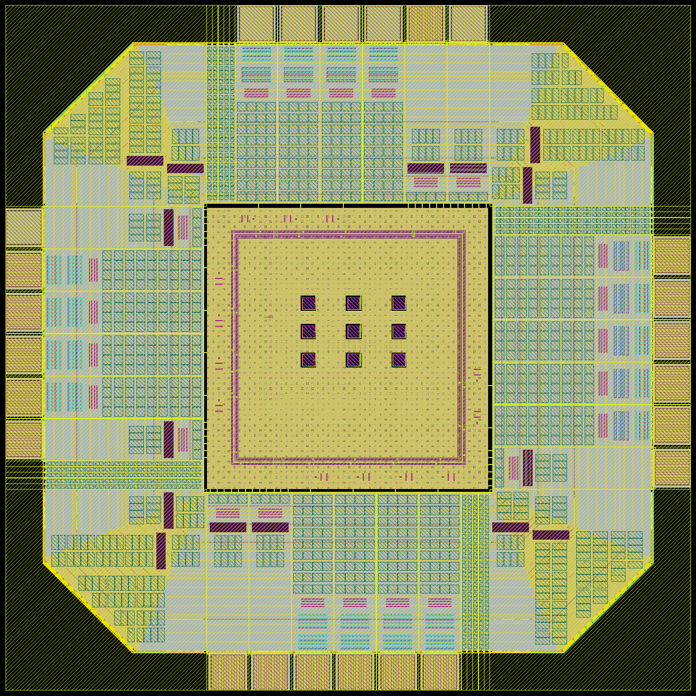

# Filled 3×3 demonstrator: density and antenna checkpoint

Recorded **2026-09-19 03:15 PDT**.

**Central dummy fill regenerated. Density/antenna: 0 violations; main KLayout DRC: 0 violations; device LVS: unique match; physical connectivity: 4566 checks, PASS.**



## Changes and checks

The approved 24-pad routed layout is preserved as a separate input. This revision adds floating poly and M1–M5 dummy fill inside the central 498 × 498 µm region. No new vias or connections are added. The generator verifies that no existing geometry on the filled layers was removed, and that the added fill stays clear of functional shapes and all nine 26 × 26 µm optical keepouts. Poly fill also avoids active diffusion. The independent physical metal checker repeats the 4,566 supply, pad, core and isolation checks without joining nets by label.

Thirteen protected functional signals and seven supply/ground pads remain connected. P10–P12 and P15 remain disconnected from the internal diagnostic nodes. New fill can change capacitance even though it does not change device connectivity; no post-fill electrical performance is claimed.


## Density before and after

These percentages use the current GDS bounding extent, approximately 1.210 mm square including the macro overhang. This is a working layout envelope, **not a selected shuttle die outline**.

| Layer | Before fill | After fill | Installed deck minimum |
|---|---:|---:|---:|
| Poly2 | 23.50% | 27.47% | 14% |
| M1 | 35.49% | 42.64% | 30% |
| M2 | 48.18% | 54.55% | 30% |
| M3 | 59.08% | 65.81% | 30% |
| M4 | 59.14% | 66.05% | 30% |
| M5 (top) | 60.76% | 67.43% | 30% |

The routed input already exceeded these whole-layout minima; the new fill restores central coverage around its routes. This does not establish that this amount of fill is electrically optimal.

The installed `density.rb` checks whole-layout minimum coverage (14% poly, 30% metal). It does not establish compliance with any additional local-window or maximum-density requirements a chosen run may impose. The antenna deck evaluates the installed process connectivity and ratio rules; its zero-marker result is distinct from electrical/ESD qualification.

## Verification

| Check | Result | Scope |
|---|---|---|
| Density + antenna | 0 markers | `decks=density,antenna`; installed GF180MCU D rules |
| Main KLayout DRC | 0 markers | `all,-antenna,-density,-cup`; rerun on the filled GDS |
| Device LVS | Unique match | Flat device extraction versus the same independent assembly reference |
| Physical connectivity | PASS | 4566 checks on the filled GDS |
| Optical keepout exclusion | Pass | Added fill only; does not certify passivation or package optical access |
| Magic DRC | Not rerun on this revision | Earlier routed layout passed; filled revision uses the new KLayout result above |
| Full-chip post-fill RC/electrical tests | Not qualified | Prior simulator stop rule remains active |
| CUP / run-specific manufacturing checks | Open | No selected run, slot, bonding provider or approved final die/seal ring |

The main DRC completed and wrote its zero-item XML report. A subsequent shell-wrapper error, caused by editing the running script, overwrote that command’s console log; `runner-error.log` preserves the error. The XML report remains the main DRC evidence. Extraction/LVS was then run separately. The saved runner is corrected; no shell exit code is being used as a substitute for a DRC/LVS result.

Density/antenna categories: `{}`. Main DRC categories: `{}`.

GDS SHA-256: `6e24ca965e7a8328d6f6169556f331f14cff125ef9b033ea400cf289b7402f01`.

## Next steps and input needed

1. Review the existing clamp-model reproducer with an appropriate ngspice/GF180 expert; resolve the documented model issue before resuming full-chip electrical qualification. The package is prepared but has not been sent. Further simulator parameter sweeps remain stopped.
2. Once the extracted model is accepted, include the final fill's coupling/parasitics and repeat startup, repeated frames, PVT and the selected off-chip ADC load.
3. Select a run and wire-bond/optical packaging route, then confirm die outline, seal ring, bond openings, optical access and all required sign-off decks. The current custom pad ring is not assumed compatible with wafer.space's default chip-on-board offering.
4. Complete carrier/controller/ADC design and independent release review before fabrication.

No additional user input was needed for this physical checkpoint. Final manufacturing closure requires the selected provider's requirements. No external contact, purchase, submission, or new simulator sweep was made.

## Reproduce and restore

```sh
bash scripts/run-tools.sh python3 layout/fill-routed-demonstrator.py
bash scripts/run-tools.sh bash scripts/check-filled-demonstrator.sh
bash scripts/run-tools.sh klayout -b -r scripts/render-filled-demonstrator.py
python3 scripts/report-filled-demonstrator.py
bash scripts/run-tools.sh python3 scripts/build-overview.py
```

The [checkpoint manifest](../checkpoints/filled-demonstrator/manifest.json) records input/output hashes and a checked evidence archive. Unpack into a separate directory to inspect or restore; avoid overwriting an active workspace. The archive includes the routed input, placement/routing metadata, independent reference, scripts, reports and images. Use the pinned Docker image in `scripts/run-tools.sh` for its PDK and tools. This is a reproducible engineering checkpoint, not a fabrication release.
