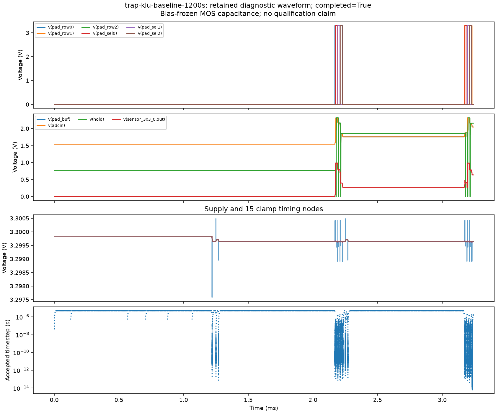
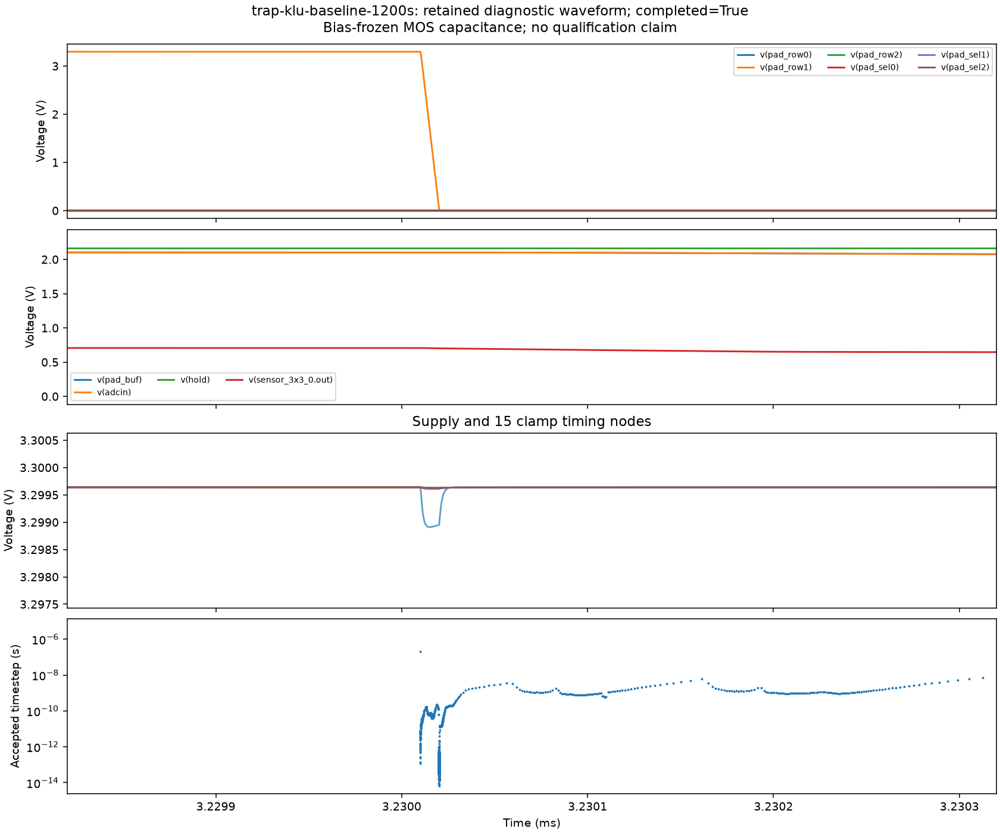

# Row-switching transient diagnostic

**The unchanged KLU/trapezoidal candidate completes the 3.24 ms diagnostic.** It crosses the previously reported 3.23002 ms row-switching stall in 1,166.94 seconds, without changing the circuit, timestep limit or tolerances. This establishes passage through the targeted edge, not a complete nine-pixel frame. The slowdown is severe but traversable within the longer watchdog.

The diagnostic preserves the complete bias/history from time zero and streams accepted points to disk. It retains the frozen-MOS-capacitance candidate; it does not establish startup, ESD, distributed wire resistance, ADC accuracy or fabrication readiness.

## Capture and controls

`scripts/diagnose-functional-camera.py` derives its circuit from the saved `frame-5000ns/test.spice` and copies the exact saved model. The baseline circuit prefix and model are byte-identical to that source. It retains 27 °C, typical models, trapezoidal integration, 5 µs maximum timestep and the original tolerances. Only the diagnostic end time (3.24 ms) and output mechanism change. This window extends past the previously reported second-row turn-off at approximately 3.23002 ms.

The capture includes all previous voltage outputs and MOS-capacitor terminal voltages, all row/reset/column source and pad controls, acquisition/reset controls, bond current and both behavioral sampling-switch currents. `run stream.raw` writes raw records as the analysis proceeds, as documented in the [ngspice manual](https://ngspice.sourceforge.io/docs/ngspice-manual.pdf). KLU is selected inside the control block after circuit load. A watchdog terminates the individual ngspice process; the parser recovers complete binary records and discards an incomplete last record. A partially filled output buffer may lose the most recent points, so the final retained time is a lower bound on progress.

The matched slew control changes only the three row-source rise/fall times from 10 ns to 100 ns. Finite external driver slew is a physically meaningful sensitivity check. It is not an accepted controller specification or numerical fix; all other clocks and device models remain unchanged. Timings measured from the end of an edge can shift under this control.

Runs use distinct directories and refuse reuse, preserving earlier failed decks. Concurrent runs are not a performance benchmark; their wall-clock deadlines may cover different amounts of simulated time.

## Reproduction

With the existing generated functional-model evidence available:

```sh
bash scripts/run-tools.sh python3 scripts/diagnose-functional-camera.py new-baseline --timeout 1200
bash scripts/run-tools.sh python3 scripts/diagnose-functional-camera.py new-slew --control row-slew-100ns --timeout 1200
bash scripts/run-tools.sh python3 scripts/report-functional-diagnostic.py new-baseline
bash scripts/run-tools.sh python3 scripts/report-functional-diagnostic.py new-slew
```

The separate `sample-off` control is available for follow-up isolation. It holds the sampling conductance at its original off-state value and leaves the reset switch intact; it cannot establish normal acquisition behavior.

## Setup checks

- `trap-stream-baseline`: the initial 180-second capture check mistakenly placed `set klu` in the initialization file. ngspice rejected it before circuit load and used SPARSE 1.3. It retained 7,616 points through 2.243156 ms. This is explicitly excluded from matched KLU conclusions.
- `trap-klu-baseline`: a non-login Docker command could not find ngspice on PATH; no simulation started. The runner now checks the executable before creating a run directory.
- The corrected KLU run is `trap-klu-baseline-v2`; the log confirms its solver. Truncation testing against captured data verifies that incomplete trailing records are excluded while complete values remain identical.

## Ten-minute capture results

| Run | Stop classification | Last retained time | Retained points |
|---|---|---:|---:|
| `trap-klu-baseline-v2` | 600 s watchdog | 3.22702002784 ms | 14,326 |
| `trap-row-slew-100ns` | 600 s watchdog | 3.22702001081 ms | 14,253 |

Both retained all six samples from rows 0 and 1, with the expected darker-to-brighter voltage ordering within each row. The largest difference between the two runs' corresponding held samples is **0.0782 µV**. These are partial-frame observations, not acquisition accuracy or DC-transfer validation. The baseline's maximum simultaneous hold-minus-ADC difference at those sample instants is about **0.939 µV**; it is not a DC settling error.

The baseline supply spans **3.297579–3.300488 V**. Its 15 clamp timing nodes span **3.299612–3.299839 V** across the retained window. No supply collapse is observed. Captured sampling/reset currents agree with independently evaluated behavioral terminal equations to **2.78 × 10⁻¹⁷ A** maximum absolute residual. Their brief peak magnitudes are about 16.97 and 17.63 mA; these are local switch currents, not steady supply current.

The baseline retains 8,302 timesteps below 100 ps, with a minimum of about 44 fs. Many tiny-step clusters occur at edges that the solver subsequently crosses. The locally inspected ngspice-46 `src/frontend/outitf.c` prints the reference value with `% 12.5e`: near 3 ms, adjacent displayed values are 10 ns apart. Accepted timesteps can be more than 200,000 times smaller. Repeated rounded timestamps in the progress log alone therefore do not prove persistent stagnation. The final retained event in both ten-minute runs is the third column's turn-off at 3.22702 ms, before the reported row turn-off at 3.23002 ms. Neither ten-minute result tests passage through that later edge.

Separate unchanged-baseline and matched-slew runs with 1,200-second watchdogs are justified by this observed forward progress. It preserves the ten-minute attempts and keeps the same 3.24 ms diagnostic endpoint; The longer deadline does not change any circuit parameter or acceptance threshold.

All 16 MOS-capacitor terminal pairs in the ten-minute captures remain in the high-bias saturated region of the supplied C(V) equation. The largest computed relative change from the frozen-bias capacitance is 4.44 × 10⁻¹⁶ (floating-point scale), below the existing 1 ppm screen **for the retained interval only**. This does not validate the missing third row, startup or other operating conditions.

## Completed unchanged baseline

`trap-klu-baseline-1200s` retains **17,253 points** from time zero through 3.24 ms, exits normally, and reports no simulation error. Its first **14,326 points match every saved value of the ten-minute baseline exactly**, including their adaptive times. The longer watchdog is the only run-setting change between those two attempts; their deck and model hashes match.

The slow row-turn-off region is real: direct wall-time observations show only tens of picoseconds of simulated progress per minute while the row pad discharges. Nevertheless, the solver eventually leaves it. The minimum accepted timestep is about **6.77 fs**. A total of **2,264 accepted points** share the rounded progress label `3.23002e-03`, while spanning about 9.943 ns of actual simulated time. Rounded log messages hid this movement; they must not be used alone to declare a permanent stall.

The 3.24 ms endpoint deliberately excludes the third-row readout. The six retained held samples have the expected brightness ordering, but DC-reference settling error, tighter-step agreement and repeated frames remain untested. No timing change or full-chip pass is promoted.





## Final matched control and interpretation

| Run | Watchdog | Outcome | Last time | Points |
|---|---:|---|---:|---:|
| Unchanged baseline | 1,200 s | Completed normally in 1,166.94 s | 3.240000 ms | 17,253 |
| 100 ns row edges | 1,200 s | Watchdog stop | 3.23020012107 ms | 18,989 |

For the baseline, the row falling edge ends at 3.23002 ms. Increasing both rise and fall times from 10 ns to 100 ns shifts its endpoint by **180 ns**, to 3.23020 ms. The observed slow region follows this shift. The control remains only about **121 ps** beyond that endpoint when its watchdog stops. This ties the slowdown to the row turn-off transition, but does not identify a particular device or numerical-model defect. It does not justify a physical layout change.

The slower row edges do not establish an improvement within the tested bound, and are **not promoted**. The unchanged baseline's successful diagnostic does not require that timing modification. Concurrent wall times are not a calibrated performance benchmark.

**Next:** run one unchanged nominal frame through 4.25 ms with streaming capture and a 3,600 s watchdog. Then validate all nine samples, the complete capacitor-voltage ranges, matched DC-reference settling, and timestep/tolerance agreement. Repeated frames, PVT/load, startup/protection, wire resistance and board/ADC qualification remain separate gates. If further isolation is needed, capture internal core row/column gates and select-device terminals; those internal nodes are not in this capture.

The checksummed [diagnostic checkpoint](../checkpoints/functional-camera-diagnostic/README.md) retains the exact inputs, raw waveforms, setup failures, watchdog stops, plots and machine-readable analysis. Archive restoration and complete-file hashes are verified before this checkpoint is reported.
