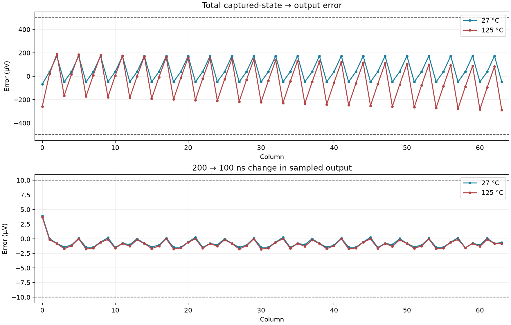

# Full readout on the row power grid — 2026-09-24

The full 64-column readout on the physical upper-metal power grid **passes the retained nominal/hot accuracy and timestep checks**. Each condition includes all 64 output samples and independently settled references at the common optical capture state.

| Device temperature | Worst total output error (µV; limit 500) | Largest 200→100 ns difference (µV; limit 10) | Sampled controls | Combined result |
|---|---:|---:|---|---|
| 27 °C | 173.457 | 3.897 | Pass | Pass |
| 125 °C | 289.658 | 3.703 | Pass | Pass |

## What was checked

All four simulations begin at time zero, reset/integrate, enable the row at 1.2 ms, capture at 1.4 ms, turn the row off and reset its pixels, then read all 64 stores sequentially until 2.7 ms. The 40 pF stores, 500 kΩ BIAS, 12.4 kΩ PREF, 10 µs acquisition, 20 µs slots, generic 100 pF board/20 pF ADC load and 2 Ω source impedance are unchanged.

The independent references first freeze all diode states immediately before common capture and solve the settled column targets. Each output reference clamps the stores to those targets, not to their already imperfect captured voltages. The reported total error therefore includes acquisition error, capture-switch disturbance, retention and output settling. All references must have ADCIN–HOLD residual below 10 nV. Finite waveforms, full stop time and all 64 samples are required. Sampled capture/mux/ADC/row-reset states are checked independently.

The capture targets and selected first/last/worst output references are independently checked with twice the DC settling duration (200→400 µs), requiring agreement within 10 nV. Brightness ordering and reverse-biased capture diode states are also checked; these deterministic checks do not characterize optical performance or noise.

The physical model retains 4,378 extracted resistors and 2,353 capacitors from the checked M5-grid layout. No equivalent-network reduction or relaxed accuracy tolerance is used. The SPARSE solver is used consistently for the new-grid transient comparisons. Previous short controls established the original-rail SPARSE/KLU peak agreement. The isolated breakpoint fixture used to resolve the earlier power pulse is removed; a deck audit verifies that the chip/capture circuit and stimuli are otherwise identical.

## Scope and next stage

This qualifies the tested single-row readout fixture, not the full camera or tapeout. Storage capacitors, readout devices/interconnect and control drivers remain schematic. Both temperature tests retain nominal extracted wire RC; metal temperature coefficients and process/interconnect corners remain open. There is no startup, noise/mismatch, optical/package, repeated/multirow or full 64×64 qualification here.

Next, physically implement the capture/readout tile with actual capacitors, shared supply and clock routing; re-extract it and check repeated/multirow operation. Retain the separate full-chip startup and manufacturing gates. The release GDS and carrier are unchanged.

The [physical tile implementation plan](capture-tile-plan.md) inventories the tested devices and separates capacitor, shared-routing and real-driver implementation checks.

## Evidence

- `build/grid-readout-20260924`: four complete transients, exact commands/runners, two sets of 64 matched DC output references and control/power analyses.
- `build/row-power-grid-20260924`: the unchanged layout/extraction from the preceding [power-grid investigation](row-power.md).
- `simulations/grid-readout.json`: complete per-column results, limits and provenance.
- `scripts/qualify-grid-readout.py`, `finish-column-capture.py`, `report-grid-readout.py`: reproducible workflow; always use fresh output directories.

Earlier power-grid and array-recovery checkpoints remain unchanged.

The nominal reference batch was deliberately stopped after its successful early solves to increase concurrency from 3 to 12 independent workers. Its completed references were reused only after exact normalized-deck matching; partial solves were recomputed in `27-100-matched-parallel`. The original attempt and supervisor stop are preserved and excluded from the final qualification. No circuit or numerical settings changed.
