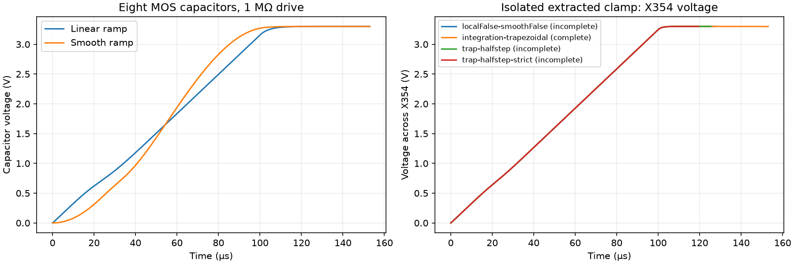

# Isolated MOS-capacitor branch diagnosis

Recorded **2026-09-19 01:49 PDT**. First-chip target: **3×3 demonstrator**.

**24/24 simple capacitor transients complete; 0/4 initial isolated-clamp transients complete. Integration follow-up: 1/2 complete; refinement: 0/2 pass.** This is a diagnostic reduction, not full-corner or camera qualification.



## What was isolated

The reported device is `X354 a_56346_55631# DVSS_B.t335 cap_nmos_06v0 c_width=25u c_length=10u`. Its foundry model is a voltage-dependent capacitor. The model equations and installed PDK are unchanged.

First, 24 small fixtures exercise one or eight parallel copies, 1 Ω / 1 kΩ / 1 MΩ source resistance, direct or local E/V/F connections, and linear or half-cosine supply ramps. Both ramps reach 3.3 V at 100 µs; runs continue to 153 µs. These are diagnostic excitation choices, not extracted source impedances. The smooth source uses a zero-volt series current sensor; its current sign differs from the linear voltage source, so current comparisons use matching ramp types only.

Second, graph traversal starts from X354 and follows device connections through non-rail resistor-connected nets. This selects **144 device records** and omits 214 other devices. The original rail wiring and all 127 explicit wiring capacitors are retained; resistor-only elimination leaves **22,575 resistors**. This is a smaller extracted clamp group, not a one-device approximation or a full-corner equivalent. Omitted semiconductor groups and their loading limit interpretation.

Three seeded terminal-voltage checks per retained resistor component verify the second reduction. Maximum relative current error: **9.15e-14**. One-terminal resistor-only dangling components have identically zero port admittance. These checks do not validate omitted semiconductor loading.

The local interface is applied only to MOS-capacitor devices, referenced to each capacitor's own bottom terminal. It enforces the same differential voltage and returns current to the original terminals. It is a simulation formulation, not a physical buffer or a change to the PDK.

## Simple-fixture comparisons

All comparisons below interpolate both adaptive traces onto their union of time points. They are measured differences, not a timestep-refinement or PVT qualification.

| Capacitors | Source R (Ω) | Smooth ramp | Maximum ΔV (V) | Maximum ΔI (A) |
|---:|---:|---|---:|---:|
| 1 | 1 | False | 1.332e-15 | 4.441e-16 |
| 1 | 1 | True | 2.22e-15 | 8.882e-16 |
| 1 | 1000 | False | 1.776e-15 | 1.301e-18 |
| 1 | 1000 | True | 3.584e-08 | 2.902e-13 |
| 1 | 1000000 | False | 3.109e-15 | 2.965e-21 |
| 1 | 1000000 | True | 3.896e-11 | 3.469e-17 |
| 8 | 1 | False | 5.773e-15 | 5.329e-15 |
| 8 | 1 | True | 6.972e-14 | 5.326e-15 |
| 8 | 1000 | False | 7.994e-15 | 6.505e-18 |
| 8 | 1000 | True | 1.62e-08 | 9.728e-13 |
| 8 | 1000000 | False | 3.286e-14 | 3.261e-20 |
| 8 | 1000000 | True | 4.222e-12 | 4.112e-18 |

## Extracted-clamp outcomes

| Fixture | Completed | Last saved time (µs) |
|---|---|---:|
| clamp-localFalse-smoothFalse | False | 127.352 |
| clamp-localFalse-smoothTrue | False | 0.001 |
| clamp-localTrue-smoothFalse | False | No saved trace |
| clamp-localTrue-smoothTrue | False | 0.001 |

- **clamp-localFalse-smoothFalse**: `['doAnalyses: TRAN:  Timestep too small; time = 0.000127352, timestep = 1.25e-19: trouble with node "e.x171.ec_moscap#branch"', 'tran simulation(s) aborted']`.
- **clamp-localFalse-smoothTrue**: `['doAnalyses: TRAN:  Timestep too small; time = 1e-09, timestep = 1.25e-19: trouble with node "e.x354.ec_moscap#branch"', 'tran simulation(s) aborted']`.
- **clamp-localTrue-smoothFalse**: `Command '['ngspice', '-b', 'test.spice']' timed out after 179.99996181897586 seconds`.
- **clamp-localTrue-smoothTrue**: `['doAnalyses: TRAN:  Timestep too small; time = 1e-09, timestep = 1.25e-19: trouble with node "bdrive#branch"', 'tran simulation(s) aborted']`.

## Integration-only follow-up

These runs retain the direct linear-ramp fixture and change only Gear to first order (backward Euler), or Gear to trapezoidal integration. Devices, parasitics and tolerances are unchanged.

- **integration-backward-euler**: completed=False; last saved time=No saved trace. Command '['ngspice', '-b', 'test.spice']' timed out after 179.9999288119725 seconds
- **integration-trapezoidal**: completed=True; last saved time=153 µs. 

## Trapezoidal refinement

The completed 100 ns trapezoidal run is compared with 50 ns runs at the original tolerances and at `reltol=1e-7`, `abstol=1e-14`. A 10 µV rail-difference screen is applied over 150–153 µs, including load edges, using the union of adaptive time points. This is a local numerical screen, not ADC accuracy qualification.

- **trap-halfstep**: completed=False; rail comparison pass=False. ['doAnalyses: TRAN:  Timestep too small; time = 0.00012533, timestep = 6.25e-20: trouble with node "e.x354.ec_moscap#branch"', 'tran simulation(s) aborted']
- **trap-halfstep-strict**: completed=False; rail comparison pass=False. ['doAnalyses: TRAN:  Timestep too small; time = 0.000119488, timestep = 6.25e-20: trouble with node "e.x354.ec_moscap#branch"', 'tran simulation(s) aborted']

## Interpretation and next acceptance gate

The standalone MOS capacitor does not reproduce the full-corner startup failure under these tested conditions. The extracted clamp's smooth-ramp case does reproduce the reported X354 branch abort. A smoother supply waveform alone is therefore not an established fix. A simulator's named trouble node identifies where its numerical test failed; it does not prove that device's physical model is defective.

Trapezoidal integration is a candidate because it completes the isolated-clamp load test without circuit changes. Its refinement outcomes above determine whether this local result is numerically repeatable. The 50 ns run at the original tolerances aborts, so the candidate is not accepted even though the 100 ns run completes. Next, use this smaller reproducer to investigate linear-solver conditioning and the internal behavioral-capacitor equations, preserving the foundry model and netlist as the reference. Require repeatable timestep/tolerance checks before returning to the full corner; the isolated group omits other semiconductor loading and cannot qualify the full corner by itself. Preserve failed and timed-out attempts as non-passes. Then repeat the full-corner comparison and integrated 3×3 ADC-load verification. No new layout, DRC/LVS, PVT, optical or fabrication qualification is claimed here.

## Reproduce

```sh
bash scripts/run-tools.sh python3 scripts/diagnose-moscap-branch.py
bash scripts/run-tools.sh python3 scripts/check-moscap-integration.py
bash scripts/run-tools.sh python3 scripts/refine-moscap-trapezoidal.py
bash scripts/run-tools.sh python3 scripts/report-moscap-branch.py
bash scripts/run-tools.sh python3 scripts/build-overview.py
```

Requires the charge-reduction checkpoint and its PDK/container prerequisites. The checkpoint archive includes decks, logs, traces, selection/reduction evidence, scripts and this report.
