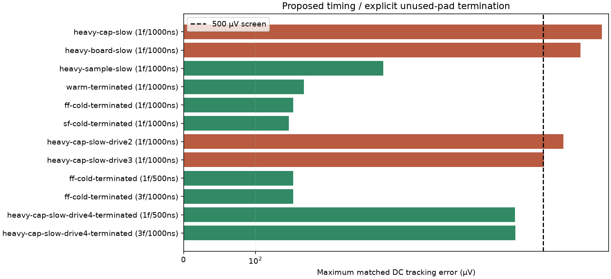

# Readout timing and cold unused-pad follow-up — 24 September 2026

These tests address two specific results from the [load/corner screen](camera-operating-corners.md): insufficient acquisition time under larger capacitive loads, and a cold DC convergence problem at unconnected protected pads. They preserve the chip's extracted records and use explicit testbench/interface changes. A passing terminated-pad result applies to that changed interface; it does not retroactively qualify the unconnected-pad circuit or the existing carrier.

## Results

| Batch / case | Samples | Max matched DC error (µV) | Frame 2→3 (µV) | Selected screen |
|---|---:|---:|---:|---|
| slower-acquisition-20260924 / heavy-cap-slow | 9/9 | 759.288 | — | screen fail |
| slower-acquisition-20260924 / heavy-board-slow | 9/9 | 651.440 | — | screen fail |
| slower-acquisition-20260924 / heavy-sample-slow | 9/9 | 277.719 | — | PASS |
| unused-pad-termination-20260924 / warm-terminated | 9/9 | 167.519 | — | PASS |
| unused-pad-termination-20260924 / ff-cold-terminated | 9/9 | 152.542 | — | PASS |
| unused-pad-termination-20260924 / sf-cold-terminated | 9/9 | 146.190 | — | PASS |
| heavy-load-drive-20260924 / heavy-cap-slow-drive2 | 9/9 | 577.699 | — | screen fail |
| heavy-load-drive-20260924 / heavy-cap-slow-drive3 | 9/9 | 503.210 | — | screen fail |
| cold-terminated-refine-20260924 / ff-cold-terminated | 9/9 | 152.544 | — | PASS |
| cold-terminated-three-frames-20260924 / ff-cold-terminated | 27/27 | 152.650 | 5.336 | PASS |
| combined-interface-refine-20260924 / heavy-cap-slow-drive4-terminated | 9/9 | 461.126 | — | PASS |
| combined-interface-three-frames-20260924 / heavy-cap-slow-drive4-terminated | 27/27 | 461.383 | 5.620 | PASS |

Screens retain <500 µV HOLD/ADCIN tracking error against matched DC charge-state references, correct brightness ordering and control states, sampled bias agreement within 1%, and the 0.1% in-trajectory MOS-capacitance approximation bound. Three-frame cases additionally require <50 µV frame-two/three change. Single-frame completion is not repeated-frame qualification.

## Slower acquisition proposal

The [combined heavy-load interface proposal](readout-interface-proposal.md) records the resistor, pad and controller changes needed for physical adoption. The proposed timing uses 50 µs column slots and 30 µs acquisition instead of 18 µs / 5 µs. Row selection starts at 2.060 ms (then every 1 ms), and the first acquisition runs from 2.075 to 2.105 ms. Three columns finish before row selection ends at about 2.220 ms, ahead of the next row reset at 2.250 ms. Reset and illumination history remain unchanged; readout occurs earlier, so this is a different exposure schedule. Each DC reference uses the actual captured nine-pixel charge state, not the old schedule's output voltages. The wider column spacing increases intra-row exposure skew, which matters for larger arrays.

This generic sample/hold proposal is not an ADS1115 conversion sequence or a validated large-array frame rate.

## Explicit unused-pad termination proposal

Four added external 100 kΩ resistors connect NC_P10, NC_P11, NC_P12 and NC_P15 to ground. They are present in the stock DC calculation, capacitor recalculation, frozen DC calculation, imaging transient and matched DC references. All original semiconductor records remain. This is a physical boundary condition with a straightforward DC path, not a relaxed simulator tolerance or an invisible numerical resistor.

The [physical termination proposal](unused-pad-termination-proposal.md) maps each resistor to its die pad. The current carrier leaves these pads unconnected. Adopting this condition requires a reviewed bond/board or on-chip termination implementation, followed by the affected electrical/physical checks. The original cold failures remain preserved. This does not qualify nonlinear power-up/protection.

- slower-acquisition-20260924 / heavy-board-slow: stock/frozen DC diagnostics {'stock-op': {'singular_warning': False, 'transient_op_fallback': False}, 'frozen-op': {'singular_warning': False, 'transient_op_fallback': False}}.
- slower-acquisition-20260924 / heavy-cap-slow: stock/frozen DC diagnostics {'stock-op': {'singular_warning': False, 'transient_op_fallback': False}, 'frozen-op': {'singular_warning': False, 'transient_op_fallback': False}}.
- slower-acquisition-20260924 / heavy-sample-slow: stock/frozen DC diagnostics {'stock-op': {'singular_warning': False, 'transient_op_fallback': False}, 'frozen-op': {'singular_warning': False, 'transient_op_fallback': False}}.
- unused-pad-termination-20260924 / sf-cold-terminated: stock/frozen DC diagnostics {'stock-op': {'singular_warning': False, 'transient_op_fallback': False}, 'frozen-op': {'singular_warning': False, 'transient_op_fallback': False}}.
- unused-pad-termination-20260924 / warm-terminated: stock/frozen DC diagnostics {'stock-op': {'singular_warning': False, 'transient_op_fallback': False}, 'frozen-op': {'singular_warning': False, 'transient_op_fallback': False}}.
  Maximum first-frame sample difference from the original warm unterminated camera: 0.228 µV.
- unused-pad-termination-20260924 / ff-cold-terminated: stock/frozen DC diagnostics {'stock-op': {'singular_warning': False, 'transient_op_fallback': False}, 'frozen-op': {'singular_warning': False, 'transient_op_fallback': False}}.
- heavy-load-drive-20260924 / heavy-cap-slow-drive3: stock/frozen DC diagnostics {'stock-op': {'singular_warning': False, 'transient_op_fallback': False}, 'frozen-op': {'singular_warning': False, 'transient_op_fallback': False}}.
- heavy-load-drive-20260924 / heavy-cap-slow-drive2: stock/frozen DC diagnostics {'stock-op': {'singular_warning': False, 'transient_op_fallback': False}, 'frozen-op': {'singular_warning': False, 'transient_op_fallback': False}}.
- cold-terminated-refine-20260924 / ff-cold-terminated: stock/frozen DC diagnostics {'stock-op': {'singular_warning': False, 'transient_op_fallback': False}, 'frozen-op': {'singular_warning': False, 'transient_op_fallback': False}}.
- cold-terminated-three-frames-20260924 / ff-cold-terminated: stock/frozen DC diagnostics {'stock-op': {'singular_warning': False, 'transient_op_fallback': False}, 'frozen-op': {'singular_warning': False, 'transient_op_fallback': False}}.
- combined-interface-refine-20260924 / heavy-cap-slow-drive4-terminated: stock/frozen DC diagnostics {'stock-op': {'singular_warning': False, 'transient_op_fallback': False}, 'frozen-op': {'singular_warning': False, 'transient_op_fallback': False}}.
- combined-interface-three-frames-20260924 / heavy-cap-slow-drive4-terminated: stock/frozen DC diagnostics {'stock-op': {'singular_warning': False, 'transient_op_fallback': False}, 'frozen-op': {'singular_warning': False, 'transient_op_fallback': False}}.

## External bias and power tradeoff

The stronger-drive candidates change only the external PREF resistor from 49.9 kΩ to 24.9 kΩ 16.5 kΩ or 12.4 kΩ, in addition to the slower timing. These increase reference/output current and alter the buffer transfer curve. Matched DC references account for the changed transfer curve; this does not establish a reused optical/ADC calibration. Supply figures below are initial DC values, not peak or average frame power, and exclude external controller/ADC consumption.

| Case | PREF resistor (kΩ) | Initial supply (µA) | Initial source power (mW) | Sample HOLD range (V) |
|---|---:|---:|---:|---|
| heavy-board-slow | 49.9 | 80.401 | 0.265323 | 1.867395–2.320433 |
| heavy-cap-slow | 49.9 | 80.401 | 0.265323 | 1.867501–2.320438 |
| heavy-sample-slow | 49.9 | 80.401 | 0.265323 | 1.867027–2.320417 |
| sf-cold-terminated | 49.9 | 83.937 | 0.276991 | 1.689515–2.123740 |
| warm-terminated | 49.9 | 80.401 | 0.265323 | 1.859440–2.318737 |
| ff-cold-terminated | 49.9 | 96.481 | 0.347331 | 1.787242–2.283821 |
| heavy-cap-slow-drive3 | 16.5 | 200.102 | 0.660336 | 1.981411–2.430782 |
| heavy-cap-slow-drive2 | 24.9 | 144.354 | 0.476370 | 1.934620–2.385678 |
| heavy-cap-slow-drive4-terminated | 12.4 | 248.259 | 0.819254 | 2.016942–2.464641 |

## Numerical refinement

- ff-cold-terminated: unused-pad-termination-20260924 → cold-terminated-refine-20260924: 0.300 µV maximum sample difference; frames compared: 1; <10 µV screen: True.
- ff-cold-terminated: cold-terminated-three-frames-20260924 → cold-terminated-refine-20260924: 0.300 µV maximum sample difference; frames compared: 1; <10 µV screen: True.
- heavy-cap-slow-drive4-terminated: combined-interface-three-frames-20260924 → combined-interface-refine-20260924: 0.278 µV maximum sample difference; frames compared: 1; <10 µV screen: True.

The settled-bias MOS-capacitor approximation is recomputed and checked at each condition; distributed wiring resistance, nonlinear startup and a full corner cross-product remain unqualified. See [tapeout readiness and scaling](tapeout-readiness.md) for the separate larger-array and manufacturing gates.

[Machine-readable results](../simulations/readout-followup.json) contain each configuration, sample, reference and approximation bound. Exact models, decks, full waveforms, operating points, logs and executed runner snapshots remain in the named `build/camera-operating-corners/` directories.

