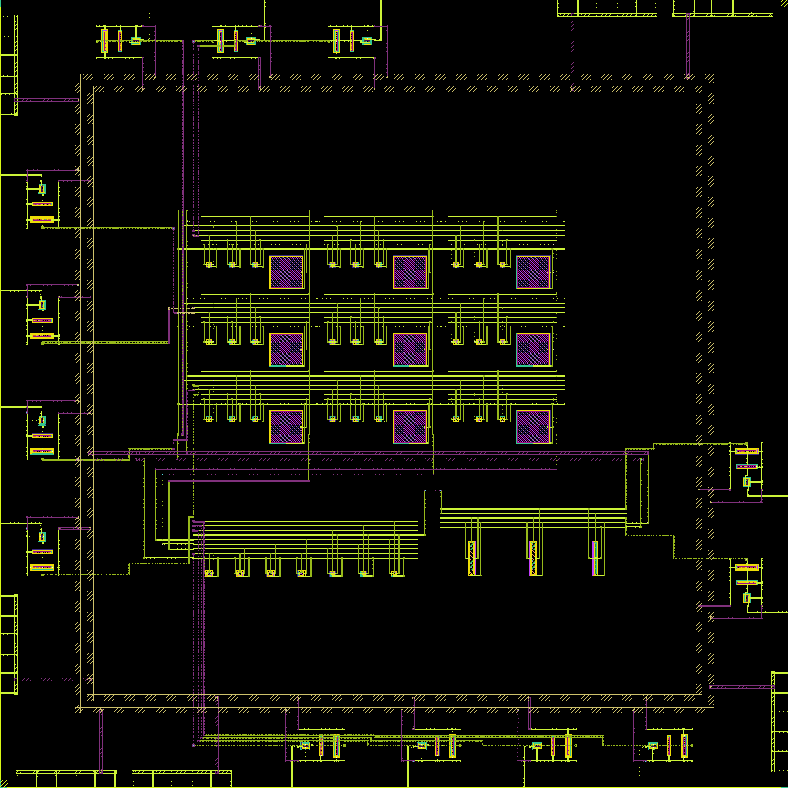

# Routed 3×3 demonstrator working layout

Recorded **2026-09-19 02:57 PDT**. The user approved proceeding with the 24-pad working arrangement without a selected shuttle or bonding provider. Manufacturing/optical requirements remain open.

**13 functional signal paths routed through local protection; seven supply/return pads connected. Metal connectivity: 4566 checks, PASS. Main KLayout DRC: 0 markers. Magic DRC: 0. Device LVS unique match: True.**


## What changed

- Routed all 13 functional signal pads through copies of the existing local secondary protection cell to the corresponding core terminals.
- Connected three VDD and four GND pads to two separate internal supply rings and the sensor core. Protection-cell supplies connect to those rings.
- Retained four diagnostic pads (P10–P12 and P15) but left their signal paths disconnected from COL2/COL1/COL0 and OUT. Their primary pad diodes remain connected to the rails. This avoids adding those pads' signal loading to the unbuffered core nodes.
- Used the saved functional core geometry and omitted its old dummy fill so new routes can occupy that space. The functional device geometry is preserved; the resulting layout is a new revision, not the earlier filled-core GDS. Central dummy fill and density qualification remain to be completed.
- New top-level metal is checked against the nine existing 26 × 26 µm optical keepout boxes. This geometric check does not establish passivation or package optical access.
- Added top-level bond labels and an independent [hierarchical reference](../circuits/demonstrator-routed.spice). External functional pins use a `PAD_` prefix to distinguish the bond side from the core side of each physical series resistor. The four disconnected diagnostic bonds are `NC_P10`, `NC_P11`, `NC_P12`, and `NC_P15`.



[Working bond-net CSV](routed-pad-map.csv) lists actual external names and the disconnected diagnostic pads. Coordinate references are still macro labels, not approved bond landing centers.

## Verification evidence and limits

| Check | Result | Scope |
|---|---|---|
| Physical metal/via tracing | True (4566 checks) | No name-based net joining; distinct core nets, signal-to-protection paths, no metal resistor bypass, supply stripes and disconnected diagnostic bonds |
| KLayout main DRC | 0 markers | Installed GF180MCU D deck, `all,-antenna,-density,-cup` |
| Magic DRC | 0 | Installed GF180MCU D technology checks |
| Netgen device LVS | Unique match = True | New assembly reference versus extracted devices; see raw logs |
| New metal versus optical keepouts | Pass | Top-level route geometry only |
| Density / antenna / CUP / full-run precheck | Not performed for this revision | Final fill, die outline, seal ring, chip ID and process/package requirements remain open |
| Full assembled electrical simulation | Not qualified | Earlier simulator investigation remains stopped pending expert review |

The first combined runner was stopped after Magic printed its zero-error DRC count because an unconditional empty detail listing was taking extra time. A hierarchical extraction attempt (`extraction.log`) was also stopped before completion. Final device-only flat extraction/LVS uses `extract-flat.tcl`, `extraction-flat.log` and `lvs.log`; the reproduction script now uses that flat flow and skips the detail listing when the DRC count is zero. Neither stopped attempt is counted as passing LVS.

The first LVS reference had the DVSS macro supply arguments reversed. Correcting its call to `VDD GND VDD gf180mcu_fd_io__dvss` (the established stock-macro interface) resolved the mismatch without any layout edit. The initial failed comparison is retained as `lvs-initial-reference.log`; the final comparison is `lvs.log`.

KLayout marker categories: `{}`.

Initial route attempts had shorts. Independent tracing identified an obstacle-map hole-handling bug; it was repaired and all routes were rebuilt. Stage-by-stage tracing now checks separation after every functional route. The final evidence above, not an early route image or process exit code, determines the checkpoint status.

The power/ground distribution here is a functional candidate, not a qualified ESD return design. The prior protection cell's local checks do not establish adequate clamp voltage/current for the whole chip. These 24 pads/corners/fillers differ from the earlier power-only vehicle and need fresh electrical qualification.

## Next steps

1. Close any reported main DRC/LVS findings before adopting this revision.
2. Regenerate central dummy fill with route and optical exclusions; run density and antenna checks on the assembled geometry, then repeat affected DRC/LVS checks.
3. Review the supply/protection network, actual bond openings, pad numbering and optical package when the run/provider are selected.
4. Use external expert feedback to resolve the separately documented extraction/simulation issue; qualify the final assembled model across startup, PVT, repeated frames and a selected ADC load.
5. Complete run-specific die/seal/ID/precheck and independent release review before fabrication.

No new solver sweep or manufacturing submission was made. No additional input is needed to continue local physical verification; final manufacturing approval will need the provider's rules.

## Reproduce

```sh
bash scripts/run-tools.sh python3 layout/route-demonstrator.py
bash scripts/run-tools.sh bash scripts/check-routed-physical.sh
bash scripts/run-tools.sh klayout -b -r scripts/render-routed-demonstrator.py
python3 scripts/report-routed-demonstrator.py
bash scripts/run-tools.sh python3 scripts/build-overview.py
```

Dependencies are identified by hashes in `routing.json`: the earlier pad placement, functional core and local protection GDS. The checkpoint includes these three inputs, routed output, source, independent reference, reports and screenshots.
