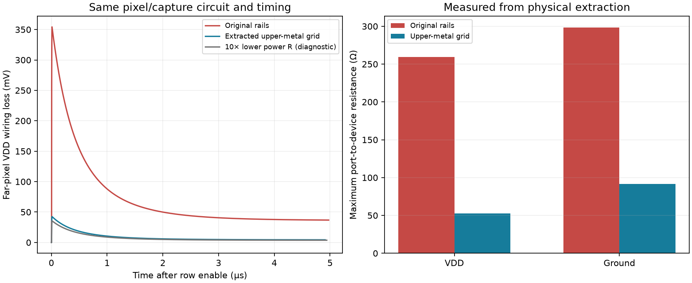

# Row power-feed investigation — 2026-09-24

**Completed follow-up:** Full nominal/hot readout and numerical refinement now pass on this grid. See the [64-column readout qualification](grid-readout.md). The measurements below describe the preceding power-grid investigation.

The original row-enable dip is reproducible and strongly sensitive to supply-wire resistance. A physical upper-metal grid has been built and passes both layout checkers and both connectivity checks. The physical-grid row-enable transient completes: worst local VDD loss **42.574 mV**. This is a turn-on measurement, not capture/readout accuracy qualification.

## Controlled electrical diagnosis

The accepted 27 °C, typical-process 64-column capture deck is preserved from time zero, including reset, illumination, 40 pF stores, transistor switches, bias, 2 Ω source impedance and control timing. New short runs stop at 1.22 ms, 20 µs after row enable. A disconnected PWL source forces steps of at most 1 ns, then 0.5 ns, around turn-on; actual accepted spacing is checked from each raw waveform. No device, capacitor, signal-wire resistance or solver tolerance changes in this pair.

| Measurement | Result |
|---|---:|
| Original maximum local VDD wiring loss | 354.350159 mV |
| Peak time after enable | 11.005081 ns |
| Minimum local VDD–ground rail | 2.923341 V |
| First downward crossing of 100 mV loss after the worst pixel's peak | 0.863392 µs |
| Maximum per-pixel peak change at 1→0.5 ns | 0.003305 µV |
| Maximum threshold crossing change | 0.000152 ns |
| Peak with only VDD/GND extracted resistors multiplied by 0.1 | 35.596084 mV |

The resistance-only intervention changes 2808 audited resistor records; every capacitor/device record stays unchanged. Its ~90% reduction in peak loss supports supply-path resistance as the main lever. It does not identify all switching/coupling currents or constitute a manufacturable resistance-only layout. The 100 µV / 1 ns comparison limits above are numerical diagnostic screens, not a chosen hardware supply-drop budget. The original peak is brief and recovers well before capture; the earlier full-row circuit already passed its sampled output checks.

## Physical candidate

Two 8 µm-wide M5 straps connect VDD and ground through 3×3 via arrays (M2→M3→M4→M5) at the source, every fourth pixel, and the final pixel. Existing 2 µm M2 rails remain. The source remains at the left; this is distributed on-row feeding, not ideal supplies independently clamped at every column.

| Check | Result |
|---|---|
| Magic DRC | 0 errors |
| KLayout main process DRC | 0 items (antenna, density and CUP excluded) |
| Direct device LVS and resistor-collapsed LVS | Unique matches |
| New metal over drawn photodiode junctions | 0 µm² across 64 junctions |
| Other polygon geometry | Unchanged |
| Maximum VDD path resistance | 259.554 → 52.869 Ω |
| Maximum ground path resistance | 298.508 → 91.715 Ω |
| Extracted resistors / capacitors | 4378 / 2353 |
| Negative extracted capacitances | 0 |

## Numerical status and next gate

The new meshed extraction takes unusually small steps before row enable with the original KLU/trapezoidal solver. The initial pair and the grid's Gear pair were deliberately stopped with partial traces retained; the compact KLU control timed out during operating-point initialization. Independent SPARSE runs completed on the full, unreduced extraction. No accuracy tolerance was relaxed. Incomplete runs are neither electrical failures nor passes. The compact network's algebraic boundary-current audit alone is not transient qualification. Two watchdog-extension records document bounded external supervision; both original supervisors resumed and exited.

The physical-grid row-enable transient completes: worst local VDD loss **42.574 mV**. This is a turn-on measurement, not capture/readout accuracy qualification.

The original-rail SPARSE/KLU peak comparison differs by at most **3.012953 µV** across pixels.

The physical-grid peak changes by at most **0.000257 µV** across pixels at 1→0.5 ns edge spacing.

The full time-zero history also completes through common capture:

| Condition | Peak loss (mV) | Capture loss (mV) | Minimum rail at capture (V) | Maximum store acquisition error vs DC target (µV) |
|---|---:|---:|---:|---:|
| 27 °C | 42.574 | 4.091 | 3.279218 | 329.203 |
| 125 °C | 34.516 | 4.093 | 3.279673 | 398.914 |

Store acquisition error is measured before the capture switch opens, relative to independently settled columns at the same diode state. It excludes switch-opening injection, hold droop and serial output error; it cannot replace the existing full-readout acceptance tests.

The nominal physical-grid turn-on refinement is complete. Before promoting the grid, repeat the full 64-column captured-state/output checks at 27 °C and 125 °C with the existing 500 µV output-error and 10 µV refinement limits. Physical peripheral capacitors/clocks/supplies, multiple-row operation, broader corners, nonlinear startup and complete 64×64/tapeout gates remain open. The release GDS and carrier are unchanged.

Temperature checks vary the transistor/diode models while retaining the same nominal extracted wire R+C. Interconnect process corners and metal resistance temperature coefficients are not swept here. This remains a typical-process fixture with schematic periphery and behavioral control drivers.

## Evidence and reproduction

- `build/row-power-edge-20260924`: completed original-rail refinement and resistance-only intervention.
- `build/row-power-grid-20260924`: physical GDS, extraction, both LVS, both DRC, geometry and resistance audits.
- `build/row-power-grid-*`: separate solver controls, exact per-run decks, runner snapshots and outcomes.
- `simulations/row-power.json`: machine-readable measurements and run classifications.
- `checkpoints/row-power/`: stage archive and read-back verification manifest; earlier checkpoints are preserved.
- `scripts/diagnose-row-power.py`, `prepare-array-strips.py`, `audit-row-power-geometry.py`, `report-row-power.py`: reproducible helpers. Always use fresh output directories.

Earlier accepted capture results and `checkpoints/array-recovery` are unchanged. This stage does not supersede their accuracy evidence.
