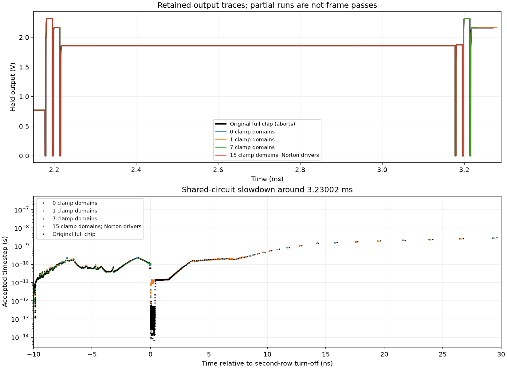
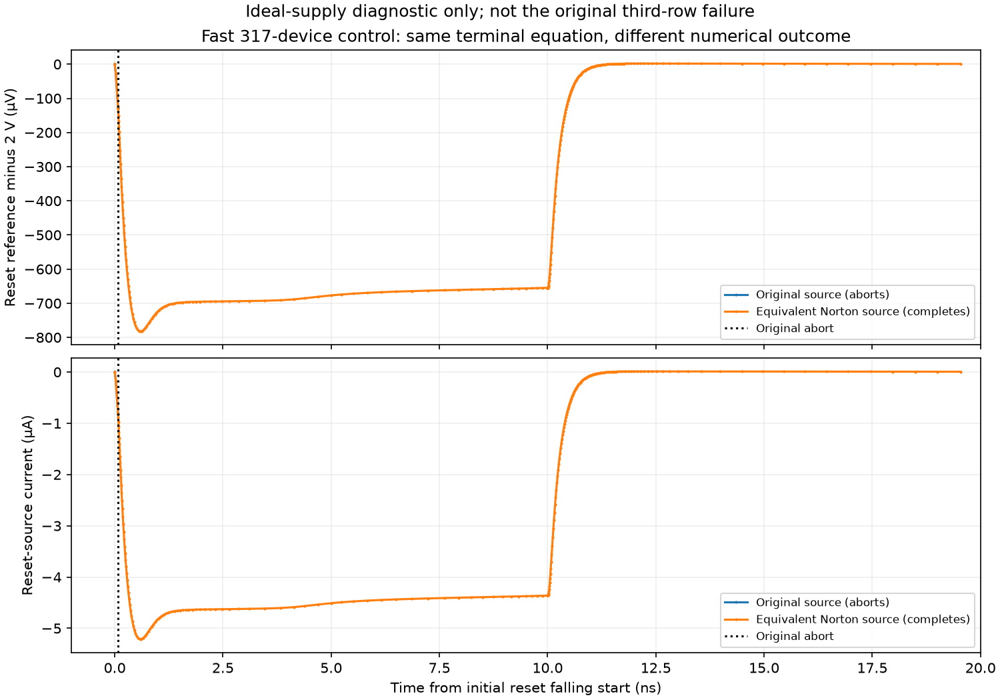

# Shared-circuit investigation — 2026-09-20

**The restored three-row camera crosses the third-row reset with zero or one
supply-clamp domain. Larger cases remain numerically difficult. A separate,
fast ideal-supply control now demonstrates a failure that disappears under an
electrically equivalent reset-source formulation. The original full-chip
third-row failure is not resolved or minimized yet.**

No chip layout, PDK model, original baseline or qualification gate changed.

## Restore the shared circuit

Starting from the preserved final-chip normal-operation candidate, the new
runner partitions semiconductor/resistor connectivity while excluding global
VDD/ground rails. It retains all three rows, column bias/multiplexer, output
buffer, signal-pad protection, unused pads and rail diodes. The complete original
external testbench and its time-zero stimuli remain in place.

There are fifteen separate clamp timing domains, each with 136 device/resistor
records. These are electrical partitions identified by `PEX_SAFE_0` through
`PEX_SAFE_14`, not a new count of physical pad cells. Removing all these domains
leaves 317 semiconductor/resistor records. Restoring all domains reproduces the
original model **byte for byte** (SHA-256 recorded in the results).

For omitted domains, capacitors connecting to retained circuitry keep their
values but have remote plates held at AC ground. Capacitors wholly within the
omitted/grounded circuitry are removed. Every substitution is listed in
`partition.json`. The zero-clamp case has 225 substituted and 643 removed
capacitor records. This changes loading and charge history; the reduced model
is a diagnostic, not an accepted replacement for the complete chip.

| Original 2 Ω supply, original drivers | Result | Runtime |
|---|---|---:|
| Shared camera, no clamp domains | Completes to 3.28 ms | 47.05 s |
| Add domain 0 | Completes to 3.28 ms | 63.02 s |
| Add domains 0–6 | Watchdog stop at 3.23002000688 ms | 300.01 s |
| Original full model, earlier preserved run | Explicit abort at 3.27002000014 ms | 1,217.47 s |

The seven-domain case remains incomplete, not a demonstrated permanent stall.
It captures six samples before its watchdog stop. The zero-, one- and
seven-domain retained sample differences from the original are at most 0.101,
0.069 and 0.225 µV respectively. These are comparisons of already captured
samples, not validation of a missing third row or the removed clamp circuitry.
Some jobs overlap; runtimes are diagnostic records, not controlled benchmarks.



## A fast numerical control

Making VDD ideal creates a **different failure**, at the start of the initial
all-row reset release, approximately 1.220000078 ms. This is not the original
third-row reset endpoint at 3.27002 ms. We do not propose an ideal supply as a fix.

| Ideal-supply control | Result | Runtime |
|---|---|---:|
| All domains, working ngspice 46 | Aborts at 1.22000007787 ms | 12.27 s |
| All domains, archived local ngspice 46 build | Same 254 points, exact waveform match | 11.57 s |
| Domain 0 only | Aborts at 1.22000007787 ms | 1.47 s |
| No domains, 317 records | Aborts at 1.22000007792 ms | 0.87 s |

Thus supply clamps are not required for this **new** early failure. The local
ngspice 46 comparison provides a matched unmodified build for future solver
instrumentation; it does not prove the cause of the original-supply failure.

### Change the equation representation, not its terminal behavior

The reset reference is a 2 V source in series with 1 Ω. Its current flowing
from the pad toward ground satisfies:

```text
I = (V(PAD_VRESET, GND) - 2 V) / 1 Ω
```

Replacing the source/resistor pair with that behavioral current equation
removes an internal ideal-voltage-source current variable. The terminal law,
voltage, resistance, timing, chip model and solver tolerances are unchanged.
The private `RESETDRV` node has no other connections, which the generator checks.
This is a Thevenin-to-Norton transformation of the testbench.

| Same ideal-supply circuit with equivalent reset source | Result |
|---|---|
| All domains retained | Completes to 1.23 ms in 12.69 s |
| No domains, 317 records | Completes to 1.23 ms in 0.62 s |

The selected supply/reference/pixel voltages agree over the shared captured
interval to within 0.0018 µV in the smaller pair; the all-domain pair agrees
more closely. This comparison uses interpolation between accepted points and
covers only the interval before the failing trace ends. It does not establish
post-failure equivalence or a full-frame accuracy result.

The smaller failing case names `bdrive_row2#branch`, yet changing only the
reset-reference source makes it complete. That is further reason not to identify
a defective device from the error's branch name alone.



**This is evidence of numerical representation sensitivity in the short
control.** The exact solver residual/conditioning mechanism and its relationship
to the original third-row failure remain unproven. Neither the ideal supply nor
this source representation has been accepted for camera qualification.

## Separate nine-driver control: inconclusive

The nine reset/row/column logic drivers each use a controlled voltage source and
100 Ω series resistance. Their equivalent pad-to-ground current is:

```text
I = (V(PAD, GND) - V(CTL) * V(VDD, GND)) / 100 Ω
```

The recorded original trace satisfies this terminal relationship within
1.415 nA, or 0.142 µV when multiplied by 100 Ω. The small residual reflects the
computed trace; algebraic terminal equivalence is exact for this model.

A run with all chip domains, the original 2 Ω supply and only these nine
drivers transformed reached 3.19800404613 ms before its 300-second watchdog.
Four retained held samples differ from the original by at most 0.151 µV. It
did not reach the failing third-row event and supplies **no evidence of a cure**.
Its reset-reference source remained in its original form.

## What the branch error means

The local ngspice 46 `src/maths/ni/niconv.c` compares successive solution values;
for a non-voltage unknown it uses absolute/relative current tolerances and records
the first failed entry. `src/spicelib/analysis/ckttroub.c` reports the stored
trouble-node name. `dctran.c` can exhaust the minimum step after nonconvergence
or truncation rejection. A named ideal-source `#branch` therefore describes a
recorded solver unknown; it is not a physical wiring diagnosis or necessarily
the current cause of the final step rejection. These inspected source files and
their hashes accompany the checkpoint.

## Next experiment

Use the sub-second 317-record failed/completed pair to instrument the matched
local solver: record Newton residuals, rejected-step reason and relevant device
convergence flags near 1.22 ms. Preserve the original arithmetic and verify the
instrumented build reproduces the unmodified failure before interpreting logs.
Seek a smaller explanation of the numerical sensitivity, then test the supported
change on the original finite-supply, full-chip third-row event. Do not continue
blind clamp-count or tolerance sweeps, infer a pad defect, or promote a timeout
as successful validation.

Full-frame completion through 4.25 ms, nine matched references, timestep/tolerance
refinement, repeated frames, PVT/load and the other qualification gates remain
open. No simulation is left running after this batch.

## Reproduction and evidence

Use distinct run names; existing directories are never overwritten.

```sh
# Restore shared readout without supply clamp domains:
bash scripts/run-tools.sh python3 scripts/diagnose-shared-circuit.py camera-new
# Fast failed/completed pair:
bash scripts/run-tools.sh python3 scripts/diagnose-shared-circuit.py short-fail-new --supply ideal --stop-ms 1.23 --timeout 60
bash scripts/run-tools.sh python3 scripts/diagnose-shared-circuit.py short-control-new --supply ideal --reset-driver norton --stop-ms 1.23 --timeout 60
# Audit exact full-model reconstruction without running:
bash scripts/run-tools.sh python3 scripts/diagnose-shared-circuit.py audit-new --all-clamps --prepare-only
```

`simulations/shared-circuit.json` retains all ten outcomes, classifications,
hashes and comparisons. Exact models/decks, raw traces and substitutions are in
`build/shared-circuit/`. `scripts/report-shared-circuit.py` regenerates the
published figures and summary using the archived run names.
`checkpoints/shared-circuit/evidence.tar.gz.part-*` and its verified manifest preserve
the evidence. Restore into an empty scratch directory before selectively copying
missing build artifacts; do not unpack over current source files.
