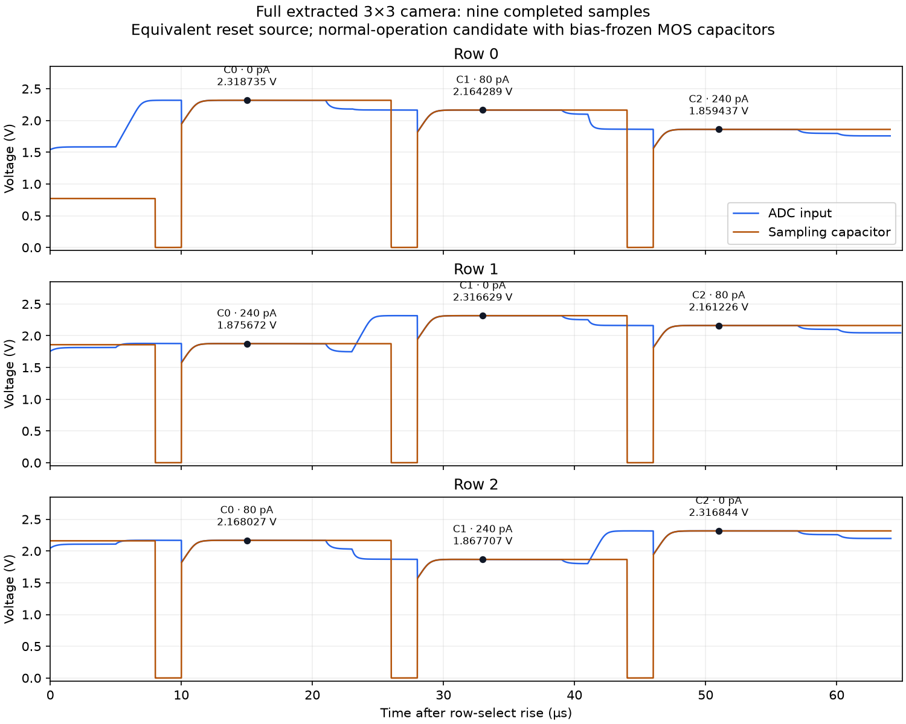

# Staged camera integration — 2026-09-21

**The original full extracted 3×3 camera now completes its first full frame after an electrically equivalent reset-source rewrite.** All nine pixels have the expected brightness ordering; the first six agree with the original failure trace within 0.060 µV. The chip model is byte-identical. This is a normal-operation candidate with bias-frozen MOS capacitors, not full electrical or fabrication qualification.

The preceding shared readout, output buffer, ADC sampling and finite supply stages also complete frames on both 3×3 and 4×4 arrays. Adding the extracted signal-pad devices completes a 3×3 frame.

The first explicit failure in this staged series appears after adding rail diodes. The smaller paired control completes after replacing the reset source with its identical terminal-current equation. That result led to the same controlled source rewrite on the original full camera. The successful frame supports a numerical workaround; it does not show a physical pixel-wiring defect or fully explain the solver's internal failure.

| Array | Cumulative stage / control | Outcome | Last simulated time (ms) | Pixel samples |
|---|---|---|---:|---:|
| 3×3 | Array control with camera scan timing | Frame complete | 4.250000 | 9 |
| 3×3 | Shared column bias and multiplexer | Frame complete | 4.250000 | 9 |
| 3×3 | Output buffer | Frame complete | 4.250000 | 9 |
| 3×3 | ADC acquisition load | Frame complete | 4.250000 | 9 |
| 3×3 | 2 Ω supply / 1 Ω reset reference | Frame complete | 4.250000 | 9 |
| 4×4 | 2 Ω supply / 1 Ω reset reference | Frame complete | 5.250000 | 16 |
| 3×3 | Extracted signal-pad protection | Frame complete | 4.250000 | 9 |
| 3×3 | Unused pads and rail diodes | Solver abort | 2.180003 | 0 |
| 3×3 | All fifteen clamp domains + frozen MOS caps | Watchdog timeout | 2.178010 | 0 |
| 3×3 | Signal pads + rail diodes only | Solver abort | 2.180003 | 0 |
| 3×3 | Stage 6 with equivalent reset-source equation | Frame complete | 4.250000 | 9 |
| 3×3 | Signal pads + unused pads only | Frame complete | 4.250000 | 9 |

The ADC sampling-capacitor error against its input at acquisition end is below 1 µV in the completed readout/protection cases. Adding unused pads and rail diodes with the equivalent source changes the nine sampled voltages relative to the signal-pad-only stage by at most **0.0187 µV**. That amplitude agreement supports the small-control numerical diagnosis; it is not a tolerance or accuracy qualification.

## What was restored

Stages 0–4 use the previously verified unfilled array-core C-only extraction, with its exact extracted devices and all wire capacitances. Stage 0 reruns that array under the camera's initial reset and sequential column schedule. Stage 1 replaces independent column resistor loads with the shared bias mirror and column mux, with a fixed 1 pF / 1 TΩ output measurement load. Stage 2 adds the schematic PMOS buffer and a 1 MΩ / 1 pF load; stage 3 replaces that buffer load with the existing bondwire, board and ADC sample/reset-switch model. Stage 4 restores the 2 Ω supply and 1 Ω reset-reference impedance. Control drivers are 100 Ω throughout, with the existing 100 kΩ pulls.

The 4×4 run uses the complete stage-4 chain and a 78 µs row-select window to fit four column samples. Each run covers one frame, with startup reset released at 1.22 ms, then sequential row resets and acquisitions. This does not establish multiframe steady state or corner behavior.

Stage 5 adds all 143 extracted signal-pad device/resistor records, preserving their dimensions and connectivity. Stage 6 adds the remaining 128 non-clamp records: 96 rail diodes and 32 diodes on four unused pads. Separate controls distinguish those additions. Stage 7 restores all 2,040 clamp-device records and the same 1,680 frozen MOS capacitors used by the normal-operation candidate. It times out before completing a frame; this is not an explicit timestep abort.

These staged coupons omit pad, clamp and shared-readout **wiring** PEX and density-fill capacitance. The added protection devices retain their intrinsic model capacitance. The clamp MOS capacitors remain bias-frozen approximations. None of these is a newly routed full-camera layout or distributed-R extraction.

## Equivalent reset-source control

The original source/resistor pair is `Vreset RESETDRV 0 2` followed by `Rreset RESETDRV PAD_VRESET 1`. Its external terminal current is exactly `I=(V(PAD_VRESET)-2)/1`; the Norton form uses that equation directly. No device, voltage, resistance, timing or tolerance changes in the stage-6 paired test. The internal `RESETDRV` node has no other connections. The stage-6 model file is byte-identical between failed and completed cases.

Stage 6 aborts at about 2.180003 ms, during the **first ADC acquisition edge**. The rail-only control also aborts there; the unused-pad-only control completes. Both failed logs name `vreset#branch`, but an error-node name alone is not a causal diagnosis.

## Original full-layout follow-up

The follow-up retains the full original model byte for byte, all fifteen clamp domains, original 2 Ω supply, nine original control drivers, original timing and tolerances. Only the 2 V / 1 Ω reset reference is written in Norton form. The stop target is extended to 4.25 ms so all nine samples can be checked.

This run **completed a full frame**, reaching **4.250000000 ms**, with **9/9 samples**. It retains 6 samples in common with the original failure trace; maximum difference is 5.97446550010261e-08 V. The full run crosses the original 3.27002 ms failure and reaches the final row's readout. No protection domain or wire capacitor was removed. Acquisition-end HOLD versus ADCIN error is 0.938 µV maximum. The frozen-capacitor plate voltages remain between 3.297579 and 3.300488 V over the captured frame; this is the settled high-bias range of the approximation, not a startup validation.

A **1 µs maximum-step refinement** completes the frame, retaining 9/9 samples. Maximum held-voltage difference from the 5 µs run is 2.777833421951925 µV. The refinement changes only the transient step settings; its full chip model and all other deck lines are identical.

The staged coupons use Gear integration, a 200 ns maximum step, SPARSE 1.3 and default compatibility. The full-layout follow-up deliberately retains the original Trap settings, 5 µs maximum step, KLU and hsa compatibility. It is a controlled comparison against the archived **full-layout** run, not a one-factor comparison against stage 7.

## Remaining gates

Run repeated full-chip frames and check stability, establish the DC transfer/settling reference, then test load and process/voltage/temperature variation. Startup with nonlinear MOS capacitors and distributed wiring resistance remains unqualified. The 4×4 success uses array-core PEX plus schematic readout; a larger full camera still needs its own routed/extracted layout.



## Evidence and reproduction

[Machine-readable results](../simulations/staged-integration.json) retain sampled voltages, outcomes, source/deck/include hashes, errors and timeouts. Exact decks, layouts' extracted models, traces and logs are archived under `checkpoints/staged-integration/`.

Run inside the tools container, using fresh output paths:

```sh
python scripts/stage-array-readout.py --output /foss/designs/build/<new-readout-run>
python scripts/stage-array-protection.py --output /foss/designs/build/<new-protection-run>
python scripts/stage-array-protection.py --output /foss/designs/build/<new-controls-run> --cases 6-rails 6-unused 6-reset-norton
python scripts/diagnose-shared-circuit.py <new-full-run> --all-clamps --reset-driver norton --stop-ms 4.25 --timeout 300
```

The protection script intentionally uses the archived named stage-4 baseline; the report script consolidates the named runs from this investigation. Existing results are never overwritten by a simulation runner.
