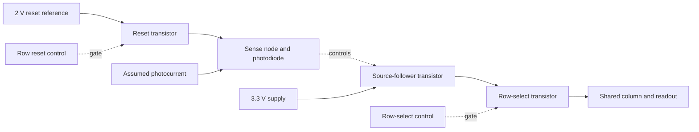
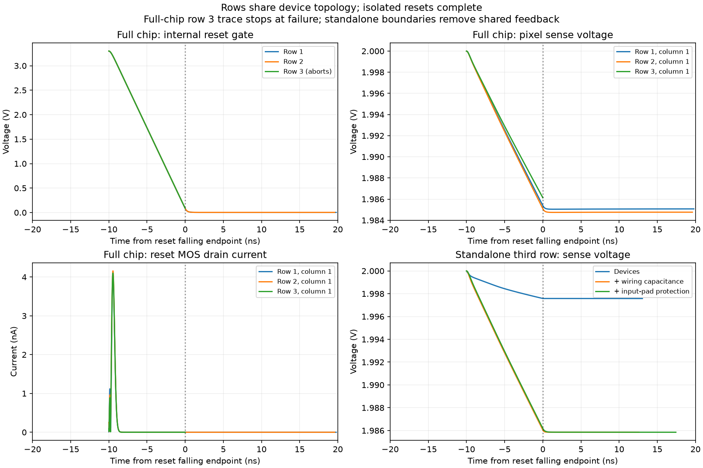

# Standalone row investigation — 2026-09-20

**All three rows have identical local device topology and dimensions. All 12
isolated tests complete across the reset edge. The full-chip failure remains
unresolved; no row wiring change or model correction is justified yet.**

## How one pixel works

Each row contains three copies of this three-transistor pixel:



1. Reset connects each pixel's sense node to the approximately 2 V reference.
2. Reset turns off. The sense node stores charge; assumed photocurrent then
   discharges it. Switching also causes a small immediate voltage change through
   transistor and wiring capacitances.
3. The source follower converts the sense voltage into a readout signal.
4. Row selection connects that signal to a shared column. The column multiplexer
   and output buffer serve all three rows.

The failing full-chip event is step 2 for the third row, at 3.27002 ms. Its row
selection does not begin until 4.17 ms. The branch named by ngspice belongs to
the second row's external driver and does not by itself identify the cause.
Scripts use row indices 0, 1 and 2; this page's first/second/third refer to those
rows respectively.

## Step 1: compare the actual extracted circuits

The topology audit starts with the final-chip pixel map and verifies the
drain/gate/source/bulk connectivity of every reset, source-follower and select
MOS, plus the photodiode connections. It follows semiconductor/resistor
connections to the two control pads, stopping at VDD, ground, reset reference
and shared columns. It does not traverse coupling capacitors.

Each isolated row contains **34 identical device/resistor records** after local
node and instance renaming: nine MOS transistors, three photodiodes, twenty
input-protection diodes and two pad-to-core resistors. All nine pixel MOS
transistors per row are `nfet_03v3`, W=1 µm and L=0.5 µm, with matching extracted
junction geometry. The photodiodes have 400 µm² area and 80 µm perimeter.

The physical wiring capacitances are different:

| Sum of extracted capacitances incident on node | First row | Second row | Third row |
|---|---:|---:|---:|
| Internal reset gate | 75.384 fF | 73.894 fF | 82.821 fF |
| Internal row-select gate | 85.007 fF | 70.044 fF | 74.923 fF |
| Reset pad | 1,290.001 fF | 1,290.195 fF | 1,289.825 fF |

These are incident linear-capacitance sums, not effective operating-point
capacitances; MOS/diode intrinsic capacitances are additional. Illumination is
also permuted across the rows: 0/80/240, 240/0/80 and 80/240/0 pA. Reset endpoints
occur at 1.27002, 2.27002 and 3.27002 ms, so shared circuit history differs.

## Step 2: inspect the internal full-chip capture

The instrumented run reproduces all 17,764 points across the 56 shared vectors
of the earlier failed run exactly. It adds 52 vectors, including gate/terminal
voltages, MOS drain currents and external driver currents.

Near reset turn-off, pixel sense voltages move from approximately 2 V toward
1.985–1.987 V. Captured reset MOS drain currents peak at a few nA, with no obvious
large excursion in those signals. The third row's internal reset gate has
reached approximately 86.5 mV when the solver stops. Its post-edge settling is
missing; it must not be compared as a settled endpoint against earlier rows.
MOS `id` is a drain-current diagnostic, not a complete accounting of all
terminal displacement currents. These observations do not establish causality.



## Step 3: isolate each row and add loading

| Diagnostic | Rows tested | Result |
|---|---|---|
| Pixel devices and two pad-to-core resistors | All three | 3/3 complete |
| Add all 485 linear capacitors incident on the row's ten local nodes | All three | 3/3 complete |
| Add the twenty input-protection diodes | All three | 3/3 complete |
| Third row, pad/cap case, 100 ns maximum step instead of 5 µs | Third | Complete |
| Third row, pad/cap case, original 3.3 V source and 2 Ω supply resistor | Third | Complete |
| Same finite-supply case at 100 ns maximum step | Third | Complete |

Every case starts with its own DC solve at time zero, retaining the original
row reset/control timing, photocurrent, PDK models, temperature, trapezoidal
integration and tolerances. The end is 9.98 µs after that row's reset endpoint;
the third-row cases reach 3.28 ms. Baseline isolated cases take 0.2–0.4 s each;
the fine cases take about 4.3 s. No full-frame readout is attempted.

At a checkpoint 1 µs after reset, changing the maximum step from 5 µs to 100 ns
changes the third row's sense voltages by less than 0.06 µV, for both ideal and
finite supply cases. This is **only an isolated sense-node comparison**, not the
pending full-chip 10 µV ADC-sample refinement test or a tolerance refinement.

### What isolation changes

- VDD, VRESET and columns are ideal DC boundaries at the recorded initial bias,
  except in the explicitly identified finite-supply control. Column voltages
  are approximately zero initially and immediately before the full-chip reset.
- All 485 incident linear capacitors are retained. For 380 cross-boundary
  capacitors, the remote plate is held at AC ground. Every substitution is
  recorded in the case's `run.json`; coupling from omitted circuitry is absent.
- The other rows, shared column circuitry, output buffer, supply clamps and
  sample/hold load are omitted. The finite-supply control restores only the
  source and 2 Ω resistor; it does not restore the whole shared supply network.
- The original stimuli run from time zero, but the changed boundary conditions
  mean the pixel charge history is not an exact replay of the complete chip.

Thus, these runs show that the extracted row can cross reset under the stated
conditions. They do not prove the row cannot participate in a full-chip
interaction, or that all physical wiring is correct.

## Next experiment

Keep the failing full-chip baseline and these fast isolated controls. Restore
the shared columns/readout and then shared supply/pad-clamp environment in
explicit stages, documenting the boundary changes. Seek the smallest circuit
that reproduces the failure before proposing a solver, model or circuit change.
Use unchanged timing and tolerances first. A completed nine-pixel frame,
references, refinement, repeated frames and fabrication gates remain open.

## Reproduction and evidence

Use unique output names; the runner refuses to overwrite an existing directory.

```sh
bash scripts/run-tools.sh python3 scripts/diagnose-standalone-row.py isolation-new
bash scripts/run-tools.sh python3 scripts/diagnose-standalone-row.py fine-new --rows 2 --stages pads --max-step-ns 100
bash scripts/run-tools.sh python3 scripts/diagnose-standalone-row.py finite-new --rows 2 --stages pads --supply finite
bash scripts/run-tools.sh python3 scripts/diagnose-standalone-row.py finite-fine-new --rows 2 --stages pads --supply finite --max-step-ns 100
```

The runner uses `build/functional-camera-diagnostic/reset-edge-internal-20260920`
as its archived source. `scripts/report-standalone-row.py` regenerates the
published report data/plot from the four recorded run names. Machine-readable
results: `simulations/standalone-row.json`. Exact decks, raw traces, topology
audits and input hashes: `build/standalone-row/`. Preserved evidence:
`checkpoints/standalone-row/evidence.tar.gz` and its verified manifest. Restore
the archive to an empty scratch directory before selectively restoring missing
build inputs; do not unpack over current source files.
