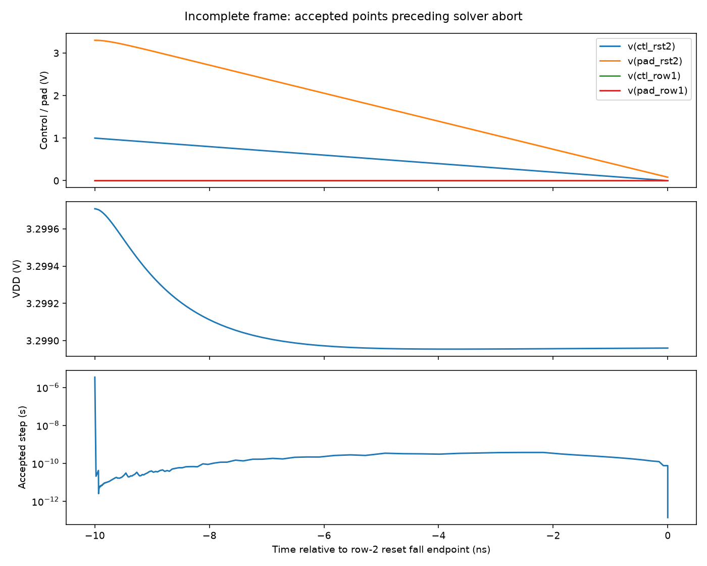
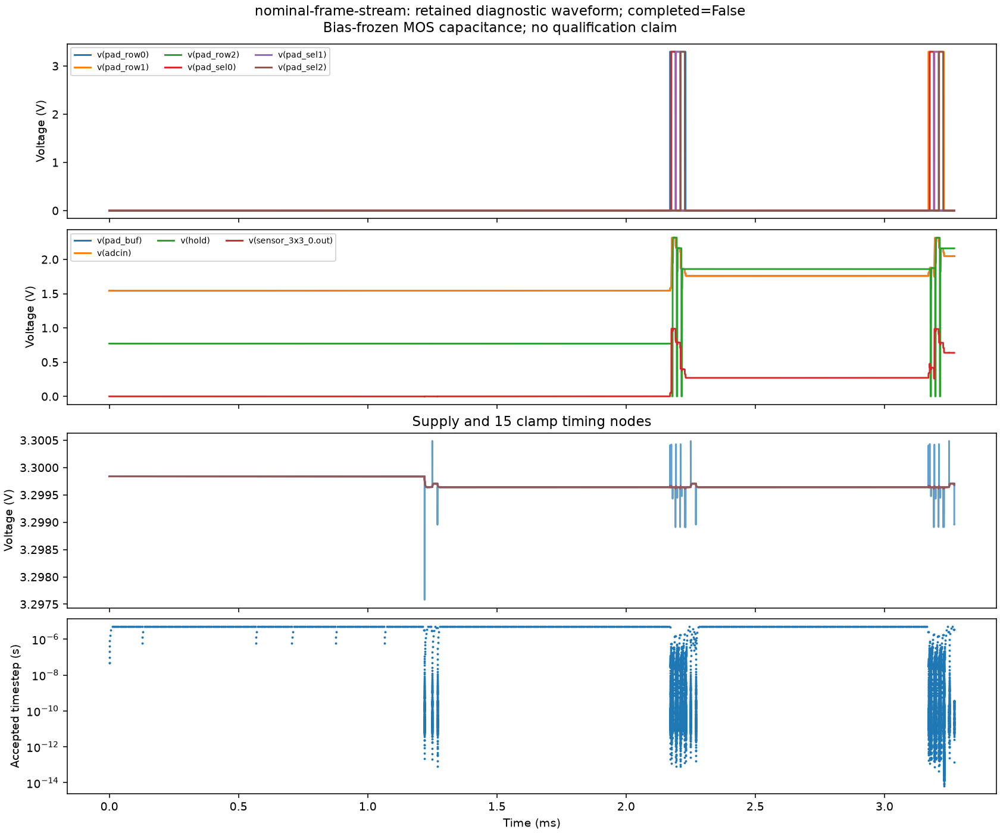

# Nominal nine-pixel frame with streaming capture

<!-- FRAME_RESULTS_START -->
## Recorded result — 2026-09-20 01:15 PDT

**Nominal nine-pixel frame remains incomplete. Nominal accuracy checks are not all verified.**

Run `nominal-frame-stream` retained 17,764 accepted points through 3.27002000014 ms in 1263.39 seconds. Watchdog stop: False. The circuit and model are unchanged from the earlier baseline; only the transient endpoint and watchdog are extended.

**Solver failure:** doAnalyses: TRAN:  Timestep too small; time = 0.00327002, timestep = 6.25e-18: trouble with node "bdrive_row1#branch" run simulation(s) aborted

The third row is missing. The failure coincides with the row-2 reset falling-edge endpoint at 3.27002 ms, although ngspice names bdrive_row1#branch. The reported branch alone does not establish the cause. Next: isolate this transition with internal gate/device capture before another full-frame attempt.

| Row | Column | Assumed light | Held voltage | Held − DC reference |
|---:|---:|---:|---:|---:|
| 0 | 0 | 0 pA | 2.318735 V | not checked |
| 0 | 1 | 80 pA | 2.164289 V | not checked |
| 0 | 2 | 240 pA | 1.859437 V | not checked |
| 1 | 0 | 240 pA | 1.875672 V | not checked |
| 1 | 1 | 0 pA | 2.316629 V | not checked |
| 1 | 2 | 80 pA | 2.161226 V | not checked |





**Not a full-chip qualification pass.** Timestep/tolerance refinement (10 µV sample-difference screen), three repeated frames, PVT/load, startup/protection, distributed wire resistance, board/ADC timing and optical/manufacturing qualification remain open.
<!-- FRAME_RESULTS_END -->

This experiment extends the unchanged KLU/trapezoidal candidate from the completed 3.24 ms diagnostic toward **4.25 ms**, intended to cover all nine sample times. The run starts from time zero and keeps the same circuit, 27 °C typical models, finite-impedance supply, pad-side controls, output load, 5 µs maximum timestep and solver tolerances. It uses an explicit 3,600-second watchdog and retains accepted raw points if stopped.

The model still freezes 1,680 MOS capacitors at their measured bias and uses final-layout lumped wiring capacitance. This is not startup, distributed wire resistance, PVT, optical or ADC-specific qualification. The sample/hold fixture is not an ADS1115 model.

## Matched static transfer reference

For each captured sample, the reference calculation:

1. Retains the exact candidate chip model, supply impedance, bias networks, pad-side driver impedances and output load.
2. Holds the eleven external row/reset/column/acquisition control sources at their captured sample-time values. It checks that exactly the intended row and column are selected, all pixel reset controls are low, acquisition is high and sample reset is low.
3. Adds nine explicitly named ideal voltage sources at the photodiode sense nodes, fixed to their captured voltages. These sources represent stored pixel-charge state for a **static reference calculation only**, and are not proposed physical devices.
4. Solves DC with the original tolerances and KLU, checks all nine forced voltages, and compares the transient ADC and held outputs with their corresponding settled reference values.

Fixing the sense voltages is necessary because a DC solve with photocurrent alone does not preserve the charge accumulated during integration. The sources supply the continuing photocurrent/leakage during the reference calculation; their currents are saved for inspection. This method tests the readout transfer and settling at the captured state. It does not independently validate the integration law or optical response.

Before applying the method to the full frame, three samples from the completed two-row diagnostic were checked. The dark pixel (row 0, column 0) has 0.006622 mV held-minus-reference error. The two bright probes (row 0, column 2; row 1, column 0) have 0.166919 and 0.167639 mV errors. Probe results remain separately archived; they are not substitutes for the final nine references.

## Screens declared before the final comparison

- All nine samples and a normally completed transient through 4.25 ms.
- Correct darker-to-brighter voltage ordering within each row.
- All 16 MOS-cap terminal-pair C(V) ranges within the existing 1 ppm approximation screen.
- Absolute hold-minus-ADC tracking error below 0.5 mV.
- Absolute held-output error against the matched static reference below the same 0.5 mV nominal sampling budget.
- Sampled supply, BIAS and PREF within 1% of their corresponding static values.

The static-reference screen measures more than instantaneous hold-minus-ADC tracking. Neither metric replaces the pending **10 µV timestep/tolerance refinement screen**, repeated frames or other qualification gates. The analyzer keeps `accepted_full_chip: false` even if every listed nominal screen passes.

## Reproduction

Use distinct run names; existing directories are preserved.

```sh
bash scripts/run-tools.sh python3 scripts/diagnose-functional-camera.py nominal-frame-stream --stop-ms 4.25 --timeout 3600
bash scripts/run-tools.sh python3 scripts/report-functional-diagnostic.py nominal-frame-stream
# Only after the source transient completes:
bash scripts/run-tools.sh python3 scripts/reference-streamed-frame.py nominal-frame-stream nominal-frame-dc --samples 0:0 0:1 0:2 1:0 1:1 1:2 2:0 2:1 2:2
bash scripts/run-tools.sh python3 scripts/analyze-streamed-frame.py nominal-frame-stream --reference nominal-frame-dc
```

The final analyzer rejects incomplete frames, missing or duplicate samples, mismatched source/model hashes, and incomplete static references. The underlying diagnostic report can still describe a partial trace without promoting it to a frame pass.

## Failure localization

The run aborts at 3.270020000138615 ms with a requested timestep of 6.25e-18 s. This coincides with the end of the **third row reset** falling edge (`Vr2`, zero-based row 2), not a new row-1 select transition: `CTL_ROW1` has been low since 3.23002 ms. ngspice names `bdrive_row1#branch`; that location is a solver diagnostic, not proof of the causal device. The saved raw trace contains external controls and pad voltages but lacks internal gate/device currents needed to localize the mechanism. No tolerance, timing or model fix has been promoted. Extending the watchdog alone cannot fix this explicit abort.

## Internal capture rerun — 2026-09-20

`reset-edge-internal-20260920` reproduced the same explicit abort at
3.270020000138615 ms in 1,217.47 seconds, without reaching its 2,400-second
watchdog. All 17,764 points across the 56 shared vectors match the preserved
`nominal-frame-stream` trace exactly. The unchanged circuit now has 52 extra
saved vectors, including internal terminal/gate voltages, 21 reset/row/column
MOS drain currents and nine driver currents. The added capture passed a short
1 µs smoke run before this diagnostic.

Results, raw trace and `baseline-comparison.json` are in
`build/functional-camera-diagnostic/reset-edge-internal-20260920/`.
This reproduces the failure with more evidence; it does not establish the
causal device or qualify a correction. Next: inspect the internal signals around
the third-row reset falling edge before choosing a numerical/testbench change.
