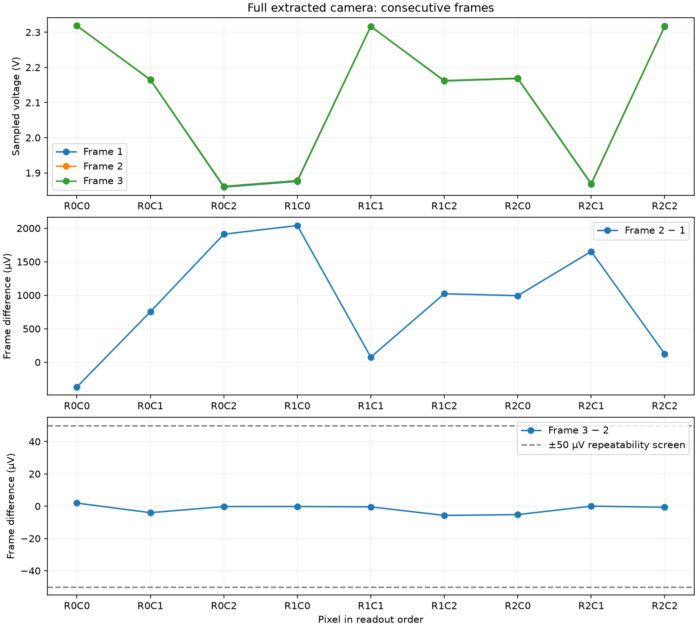

# Three consecutive full-camera frames — 2026-09-24

**All three frames complete, with 27/27 samples.** Expected brightness ordering: True. Valid reset/row/column/acquisition control states at all sample times: True. Last simulated time: 10.250000000 ms. Runtime: 1485.6 s. Watchdog timeout: False.

The full extracted 3×3 camera model is byte-identical to the successful single-frame reference. The only deck change is extending the transient stop from 4.25 to 10.25 ms; the original stimulus already contains all three frame cycles. It retains all fifteen clamp domains, the equivalent 2 V / 1 Ω reset source, the original 2 Ω supply and control timing, KLU/Trap settings and 1 µs maximum timestep. No simulator tolerance was relaxed.

| Pixel | Frame 1 HOLD (V) | Frame 2 HOLD (V) | Frame 3 HOLD (V) | Frame 3 − 2 (µV) |
|---|---:|---:|---:|---:|
| R0C0 | 2.318736823 | 2.318367524 | 2.318369434 | 1.911 |
| R0C1 | 2.164291783 | 2.165044987 | 2.165040953 | -4.034 |
| R0C2 | 1.859440061 | 1.861351121 | 1.861350869 | -0.252 |
| R1C0 | 1.875673552 | 1.877713908 | 1.877713703 | -0.205 |
| R1C1 | 2.316628802 | 2.316704596 | 2.316704168 | -0.428 |
| R1C2 | 2.161226546 | 2.162249082 | 2.162243349 | -5.733 |
| R2C0 | 2.168027531 | 2.169021026 | 2.169015796 | -5.230 |
| R2C1 | 1.867708189 | 1.869362016 | 1.869362024 | 0.008 |
| R2C2 | 2.316843551 | 2.316967913 | 2.316967238 | -0.674 |

Maximum absolute frame 1→2 change: **2040.356 µV**.

Maximum absolute frame 2→3 change: **5.733 µV**.

Frame-two/three repeatability screen (<50 µV): **True**.

First-frame agreement with the saved 1 µs reference: 0.0 µV maximum difference. Acquisition-end HOLD versus ADCIN error: 0.9397901932217678 µV maximum. This checks tracking at the selected instant, not settling against a separately established DC transfer target.

## Reset and approximation checks

Reset sense voltages are sampled 1 ns before each reset falling edge starts, after the reset pulse plateau. Maximum sense-to-reset-reference difference: 8.899827834918383 µV. This checks reset consistency; it does not simulate reset noise or prove absence of image lag under changing illumination.

Maximum reset sense difference, frame 1→2: 0.128653 µV.

Maximum reset sense difference, frame 2→3: 0.000302 µV.

All sixteen frozen-capacitor voltage pairs remain between 3.297579 and 3.300489 V. The high-bias capacitance approximation remains in its settled operating range; this is not nonlinear startup qualification.

## Scope and remaining work

These are electrical simulations with full-layout extracted wiring capacitance and the existing bias-frozen MOS-capacitor approximation. Distributed wiring resistance, nonlinear startup, process/voltage/temperature corners and optical/noise calibration remain unqualified. Constant illumination repeats across frames; changing-scene response is not tested here. The external load is the existing fast regression sample/hold fixture: 18 µs column slots, 5 µs acquisition, 100 pF board capacitance and 20 pF sampling capacitance. It is not an ADS1115 conversion model.

The retained engineering screen in [COMPLETION_PLAN.md](../COMPLETION_PLAN.md) requires frame-two/three differences below 50 µV and sample refinement below 10 µV. The earlier 5 µs-to-1 µs refinement differed by 2.778 µV. ADC tracking must also be compared against the matched DC transfer reference with its 0.5 mV screen; HOLD versus ADCIN alone does not establish that result.

[Machine-readable results](../simulations/three-frames.json) include every reset and acquisition checkpoint. Exact decks, full waveforms, logs and hashes are retained in the named build directory and under `checkpoints/three-frames/`.

## Matched static transfer reference

Completed DC references: 27/27. Tracking screen (<0.5 mV): **True**. Maximum HOLD versus DC error: 167.76638128712662 µV; maximum ADCIN versus DC error: 166.82640333054445 µV. Bias agreement within 1%: **True**, maximum relative error 6.324615178284617e-07.

Each reference pins all nine pixel sense voltages to their captured charge-state voltages and holds the control inputs at that acquisition instant, then solves DC with the unchanged chip and external load. These added voltage sources exist only in the reference calculation. They are not inserted into the imaging transient and do not represent a physical design change. Bias agreement at sample times does not qualify a supply-ramp startup.

## Preserved watchdog attempt

The first attempt was stopped by its 1200 s watchdog at 8.270122453 ms with 21 samples and no solver error. The identical deck was rerun with a 2400 s allowance. No circuit, timestep, tolerance or illumination change accompanied the retry. Both outcomes and their exact evidence are retained.

The rerun reproduces the entire saved binary trajectory of the watchdog attempt byte for byte, including every captured time point and internal vector through the earlier cutoff.

