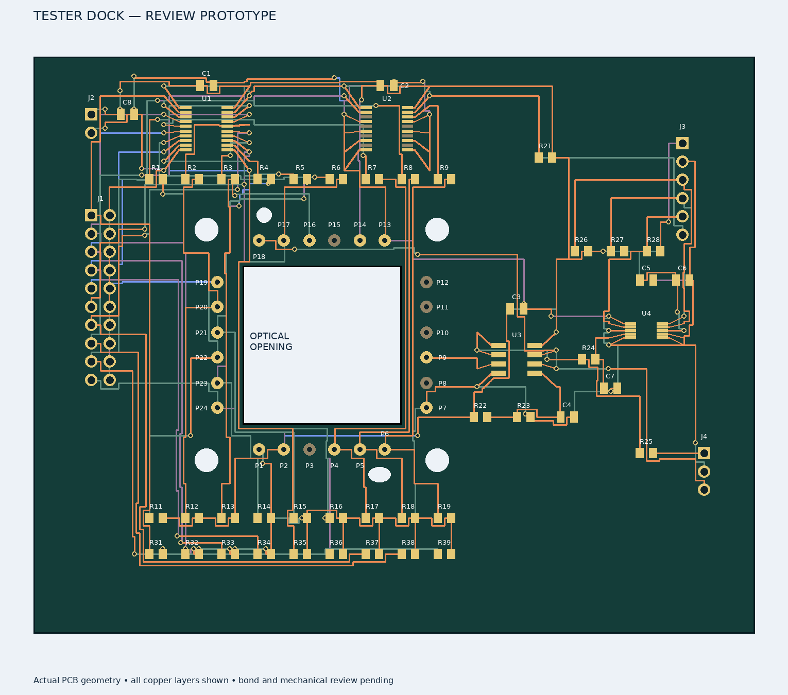
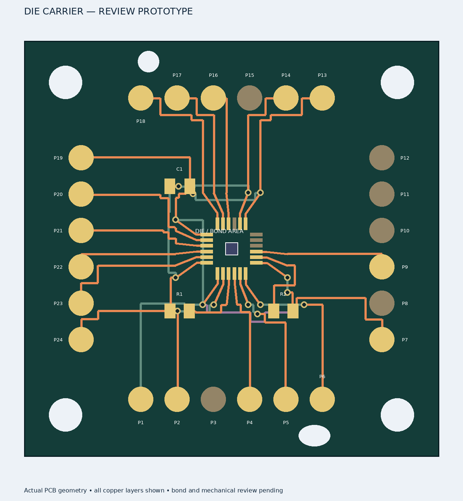

# KiCad removable sensor fixture — revision A

Prepared 19 September 2026. Two editable **KiCad 7** projects implement the provisional 40 × 40 mm carrier and a tester with an optical aperture. **Engineering review prototype; not released for fabrication.**


## Open on Windows

Your existing KiCad installation is sufficient (KiCad 7 or newer). Copy the entire `hardware/carrier` folder to Windows, or extract the accompanying `openimagesensor-kicad-review.zip`. Open these project files from KiCad's **File → Open Existing Project**:

- [Tester dock](kicad/tester_dock/tester_dock.kicad_pro) — ADC, buffers, supply input, controller headers and underside pogo contacts.
- [Removable die carrier](kicad/die_carrier/die_carrier.kicad_pro) — die bond template, contact targets and local bias components.

Then open the schematic or PCB from the project manager. Embedded schematic symbols and each project's `OIS.pretty` footprint library travel with the files. Preserve `fp-lib-table` and the footprint folders. If accessing the checkout directly from Windows, its WSL path is `\\wsl.localhost\<your-distribution>\home\njcoburn\code\OPENIMAGESENSOR\hardware\carrier`; otherwise copy/extract to an ordinary Windows folder.

## Design overview





The dock sits above the carrier; the upward-facing die is visible through a 22 × 22 mm opening. Four screws use a 32 mm square mounting pattern. A round locating hole and an asymmetrically placed slot provide registration when mating locating hardware is fitted. The drawings retain a common top-view coordinate system.

- [Assembly, mechanics and bring-up](ASSEMBLY.md)
- [ADS1115 evaluation and slow-readout proposal](ADC.md)
- [Exact mechanical coordinates](kicad/mechanical.json)
- [Die connection specification](die-connections.csv) and [controller header](controller-header.csv)
- Schematic PDFs: [dock](reports/tester_dock-schematic.pdf), [carrier](reports/die_carrier-schematic.pdf)
- Native check summary: [checks.json](reports/checks.json); full DRC: [dock](reports/tester_dock-drc.txt), [carrier](reports/die_carrier-drc.txt)

ADS1115 is included for slow measurements. It cannot follow the existing 18 µs column slots. The pixel continues integrating during its approximately 1.16 ms conversion at the highest rate; the slow acquisition sequence needs validation. J4 exposes a buffered analog path for evaluating a faster ADC. No microcontroller or firmware is selected yet.

**P03 and P08 contact positions are reserved/unconnected at the interface.** BIAS and PREF resistors reside on the carrier and connect directly to their die bond fingers. P10/P11/P12/P15 remain unused. This avoids taking the high-impedance bias node through a spring contact.

## Reproduce with Docker

Windows KiCad does not need Docker. The isolated Linux toolchain is provided to regenerate and check these files:

```bash
docker build -t openimagesensor-kicad:7 tools/kicad
bash scripts/run-kicad.sh python3 hardware/carrier/generate_kicad.py
bash scripts/run-kicad.sh python3 hardware/carrier/route_kicad.py tester_dock
bash scripts/run-kicad.sh python3 hardware/carrier/route_kicad.py die_carrier
bash scripts/run-kicad.sh python3 hardware/carrier/check_kicad.py
bash scripts/run-kicad.sh python3 hardware/carrier/clean_kicad.py
bash scripts/run-kicad.sh python3 hardware/carrier/check_kicad.py
bash scripts/run-kicad.sh python3 hardware/carrier/render_kicad.py
```

Run from the repository root. **Generation overwrites the generated projects**; preserve manual edits before using it. Routing requires freshly generated boards and deliberately refuses to overwrite existing routing. The base Ubuntu image is digest-pinned; the installed package version used here is KiCad 7.0.11. Apt packages are not snapshot-pinned, so record the version if rebuilding later.

The checker exports the actual schematic netlist, compares its pin connections with the board, and runs native KiCad DRC. It writes findings even when DRC fails; inspect the reports. KiCad 7's CLI does not supply schematic ERC here: run ERC in Windows KiCad and review the results. Net-name agreement is not a simulation or a substitute for electrical review.

## Verification checkpoint

Native KiCad 7.0.11 reports **zero DRC violations, zero unconnected pads and zero footprint errors** on both boards. The schematic/PCB pin-net comparison matches 186 connected dock pins and 44 carrier pins. Reports include the exact checked file hashes. No schematic ERC or board electrical simulation has been completed.

## Remaining release work

1. Run GUI ERC and inspect both boards in 3D; repeat native DRC after any edits.
2. Review return paths/ground planes, bypass placement, output stability, power sequencing and slow ADC timing. The current four-layer route is an initial connectivity layout, not an analog performance qualification.
3. Confirm the spring-contact drawing and full spacer/board tolerance stack, then get a wire-bond provider's approval of die attach, finger geometry, finish and loop height.
4. Select the controller, implement a timed single-pixel bench mode, and qualify the dock without a die before attaching a carrier.
5. Continue the separate chip clamp-model review. The PCB does not resolve that full-chip simulation limitation.

No Gerbers, purchasing order or fabrication release is supplied. Nothing needs to be installed on your Windows machine beyond KiCad to review this checkpoint.
